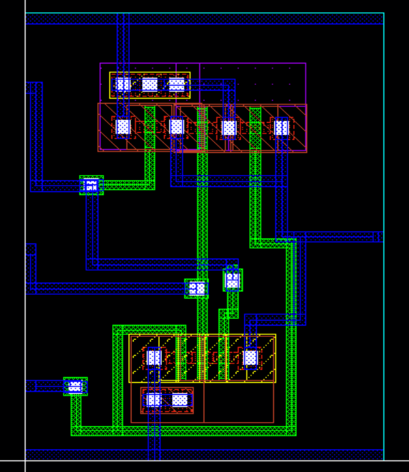

# CMOS 3-Bit NAND Gate Design in Cadence Virtuoso

This repository presents the complete implementation of a **3-bit NAND gate** using **Cadence Virtuoso**. The project includes schematic design, testbench verification, layout creation, DRC/LVS checks, parasitic RC extraction, energy analysis, and transient simulation.

---

## Table of Contents  
- [Schematic](#schematic)  
- [Symbol View](#symbol-view)  
- [Testbench](#testbench)  
- [Transient Simulation](#transient-simulation)  
- [Layout](#layout)  
- [DRC and LVS Checks](#drc-and-lvs-checks)  
- [Schematic vs Layout Matching](#schematic-vs-layout-matching)  
- [Parasitic Extraction (RCX)](#parasitic-extraction-rcx)  
- [AV Extracted View](#av-extracted-view)  
- [Energy Analysis](#energy-analysis)  
- [Tools Used](#tools-used)  
- [Author](#author)

---

## Schematic  
The 3-bit NAND gate outputs logic low only when all three inputs are high; otherwise, it outputs logic high. It is built using complementary CMOS logic.

---

## Symbol View  
A symbol was generated for the NAND gate to support hierarchical design in the testbench and layout environment.

---

## Testbench  
The testbench applies all possible combinations of 3-bit input logic to verify the NAND truth table functionality.

---

## Transient Simulation  
The output waveform confirms the correct behavior of the NAND gate. The output remains high except when all three inputs are high.

---

## Layout  
The physical layout of the 3-bit NAND gate was designed according to GPDK 90nm rules and optimized for compactness.

---

## DRC and LVS Checks

### DRC: Design Rule Check  
The layout passed all DRC checks successfully with no violations.

### LVS: Layout vs Schematic  
LVS comparison confirms that the layout matches the schematic. Netlists are consistent and verified.

---

## Schematic vs Layout Matching  
The visual matching confirms structural and net-level alignment between the schematic and layout designs.

---

## Parasitic Extraction (RCX)  
RC parasitic extraction was performed using Assura RCX to provide back-annotated simulations with realistic delays.

---

## AV Extracted View  
This view shows the extracted netlist including parasitic capacitance and resistance, used for accurate simulation.

---

## Energy Analysis  
Post-layout simulation indicates energy consumption of the 3-bit NAND gate for a single switching cycle is captured below.  
This value reflects efficient switching and good layout optimization.

---

## Tools Used  
- **Cadence Virtuoso** – Schematic and Layout Design  
- **Spectre / ADE L/XL** – Functional & Transient Simulation  
- **Assura** – DRC, LVS, and RCX Extraction  

---

## Author  
**Ram Tripathi**
