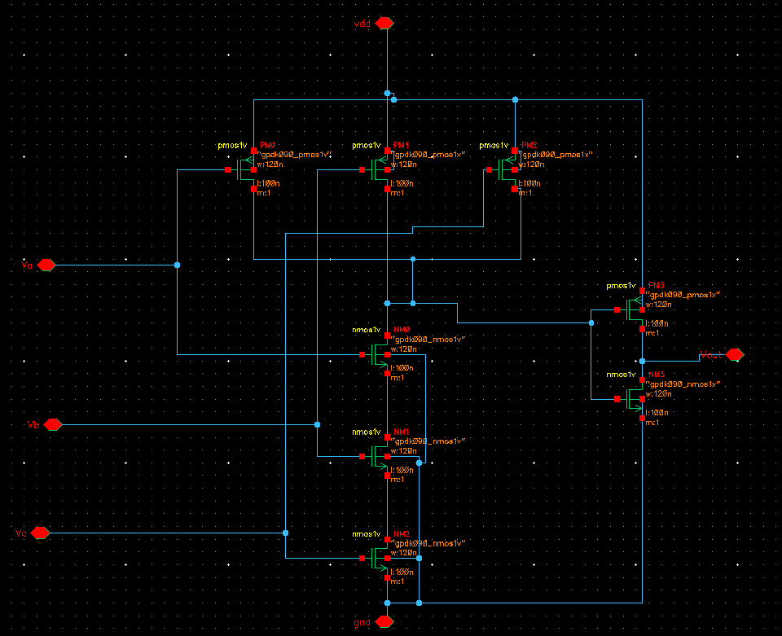
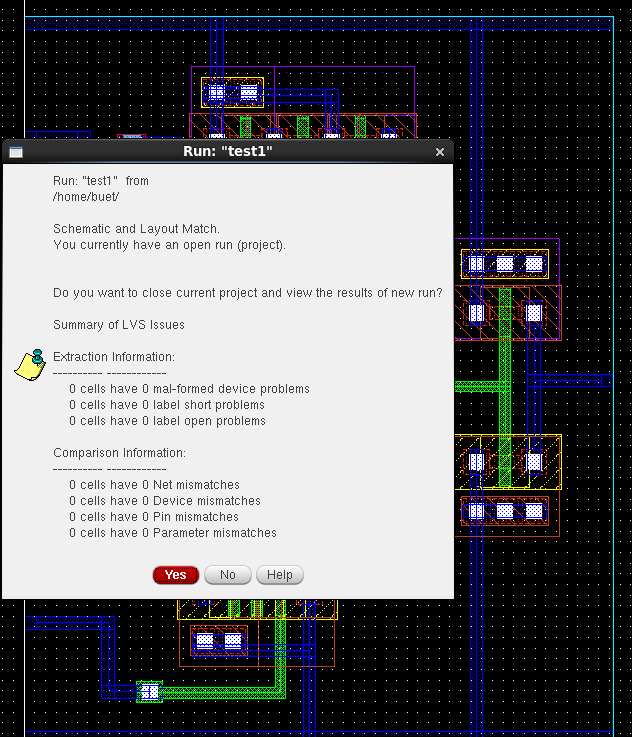

# CMOS 3-Input AND Gate Design in Cadence Virtuoso

This repository showcases the complete design flow of a **CMOS 3-Input AND Gate** using **Cadence Virtuoso**, including schematic, symbol creation, testbench setup, transient simulation, layout drawing, and verification using **Assura**.

---

## 📁 Table of Contents  
- [Schematic](#schematic)  
- [Symbol View](#symbol-view)  
- [Testbench](#testbench)  
- [Transient Simulation](#transient-simulation)  
- [Layout](#layout)  
- [DRC and LVS Checks](#drc-and-lvs-checks)  
- [Schematic vs Layout Matching](#schematic-vs-layout-matching)  
- [Tools Used](#tools-used)  
- [Author](#author)

---

## 🧩 Schematic  
The 3-input AND gate is implemented using CMOS logic with pull-up PMOS and pull-down NMOS networks.

---

## 🎛️ Symbol View  
A symbol was generated from the schematic to enable hierarchical design and testbench integration.

---

## 🧪 Testbench  
The testbench applies input combinations (`A`, `B`, and `C`) to verify functional correctness.

---

## 📈 Transient Simulation  
Transient simulation verifies the logical behavior under dynamic input changes. Output goes HIGH only when all inputs are HIGH.

---

## 🧱 Layout  
The full-custom layout was created following 90nm design rules to ensure proper transistor placement and routing.

---

## ✅ DRC and LVS Checks  

### ✔️ DRC: Design Rule Check  
No design rule violations were detected during DRC using **Assura**.

### ✔️ LVS: Layout vs Schematic  
The layout matches the schematic netlist without any mismatches.

---

## 🔍 Schematic vs Layout Matching  
A visual check confirming that the layout matches the schematic both topologically and functionally.

---

## 🛠️ Tools Used  
- **Cadence Virtuoso** – Schematic, Symbol, Layout Design  
- **Spectre** – Transient Simulation  
- **Assura** – DRC and LVS Verification  
- **ADE L** – Waveform Analysis

---

## 👤 Author  
**Ram Tripathi**
