# CMOS 4×1 MUX Implementation Using 2×1 MUX Modules in Cadence Virtuoso

This repository documents the hierarchical design, layout, and verification of a **4×1 Multiplexer** built using multiple **2×1 MUX** units. The implementation is performed in **Cadence Virtuoso**, covering schematic design, symbol creation, testbench simulation, layout drawing, verification (DRC/LVS), RC parasitic extraction, and energy analysis.

---

## Table of Contents  
- [Schematic](#schematic)  
- [Symbol View](#symbol-view)  
- [Testbench](#testbench)  
- [Transient Simulation](#transient-simulation)  
- [Layout](#layout)  
- [DRC and LVS Checks](#drc-and-lvs-checks)  
- [Schematic vs Layout Matching](#schematic-vs-layout-matching)  
- [Parasitic Extraction (RCX)](#parasitic-extraction-rcx)  
- [AV Extracted View](#av-extracted-view)  
- [Energy Analysis](#energy-analysis)  
- [Tools Used](#tools-used)  
- [Author](#author)

---

## Schematic  
The 4×1 multiplexer is implemented using **three 2×1 multiplexers** in a tree structure. This modular approach is beneficial for hierarchical and reusable digital design.

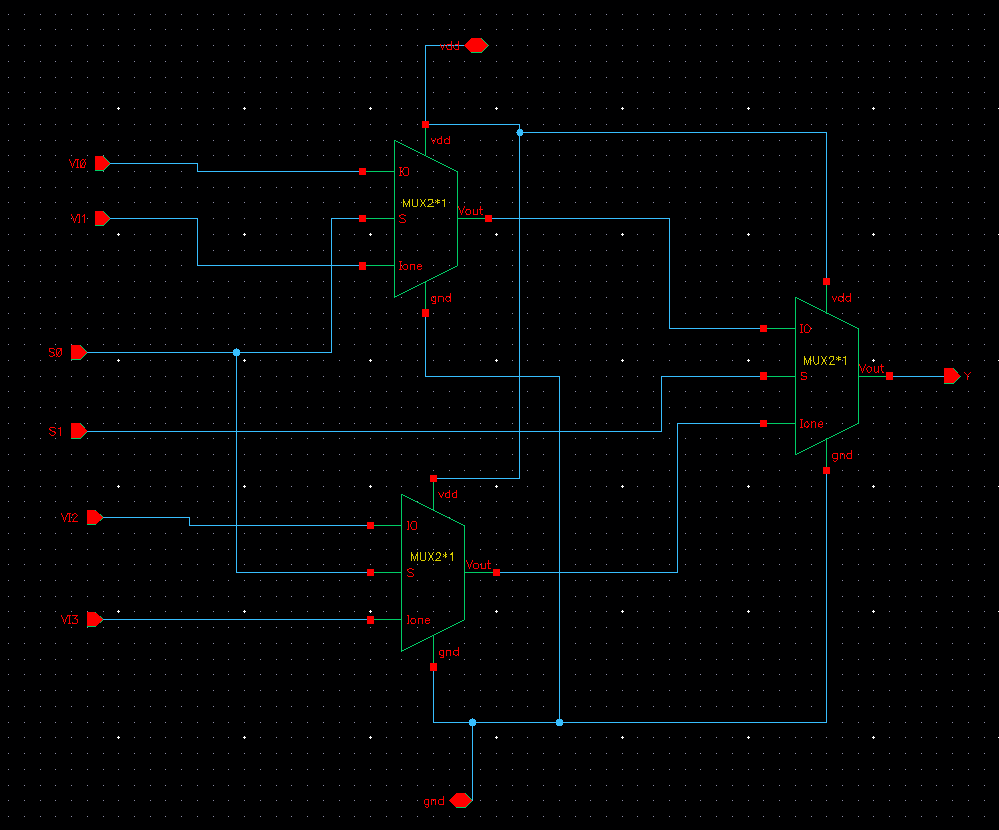

---

## Symbol View  
A symbol was generated for the 4×1 MUX to allow hierarchical connectivity in the testbench and layout.

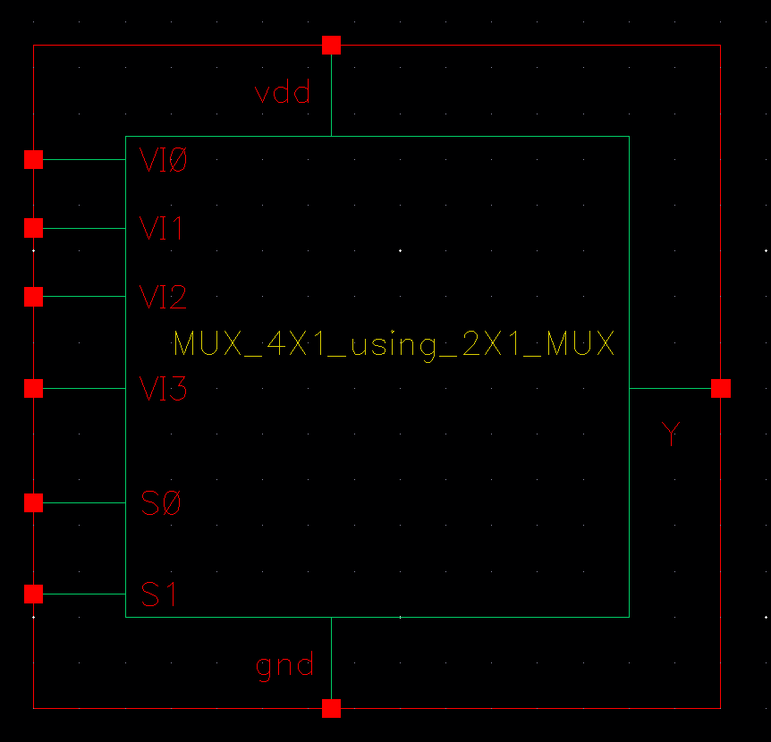

---

## Testbench  
The testbench applies all combinations of select lines and inputs to verify the MUX functionality.

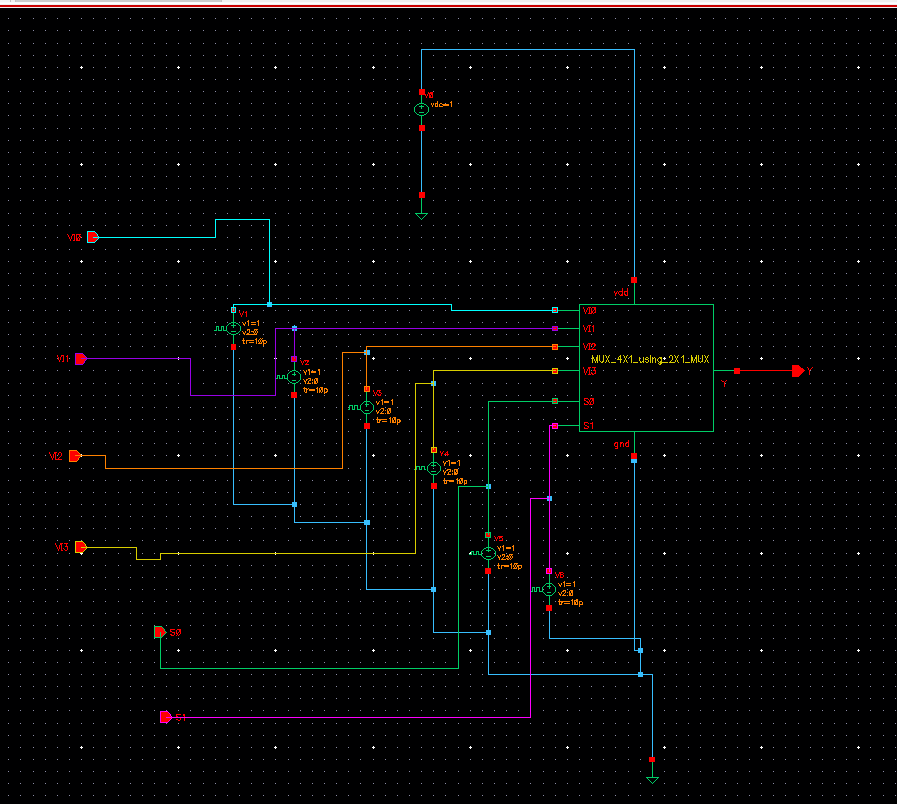

---

## Transient Simulation  
The waveform shows that the output of the 4×1 MUX correctly follows the selected input based on select signals, validating functionality.

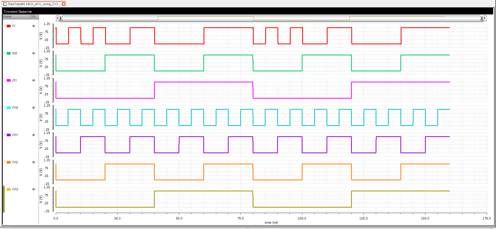

---

## Layout  
The full layout was created in Cadence Virtuoso, adhering to 90nm design rules and optimized for area and performance.

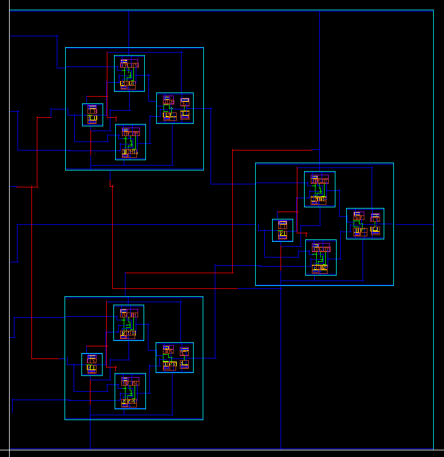

---

## DRC and LVS Checks

### DRC: Design Rule Check  
The design passed all DRC rules successfully, ensuring fabrication readiness.

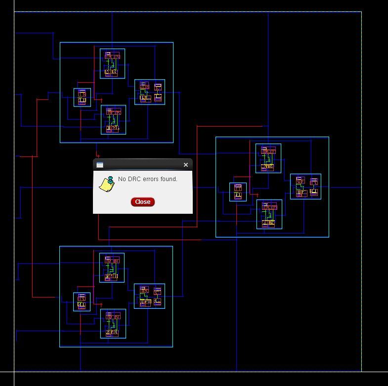

### LVS: Layout vs Schematic  
LVS verification confirms that the physical layout accurately reflects the schematic netlist.

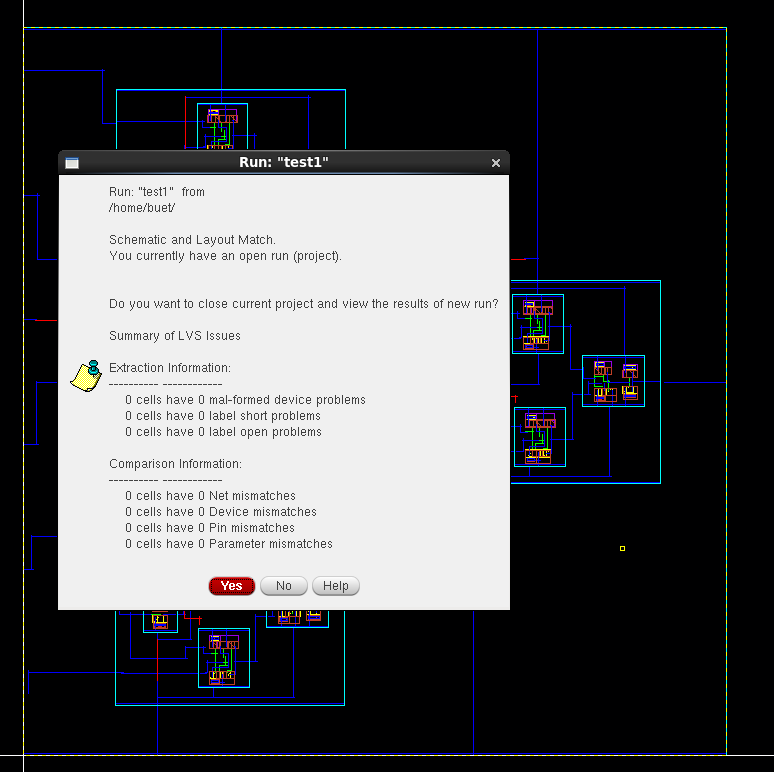  
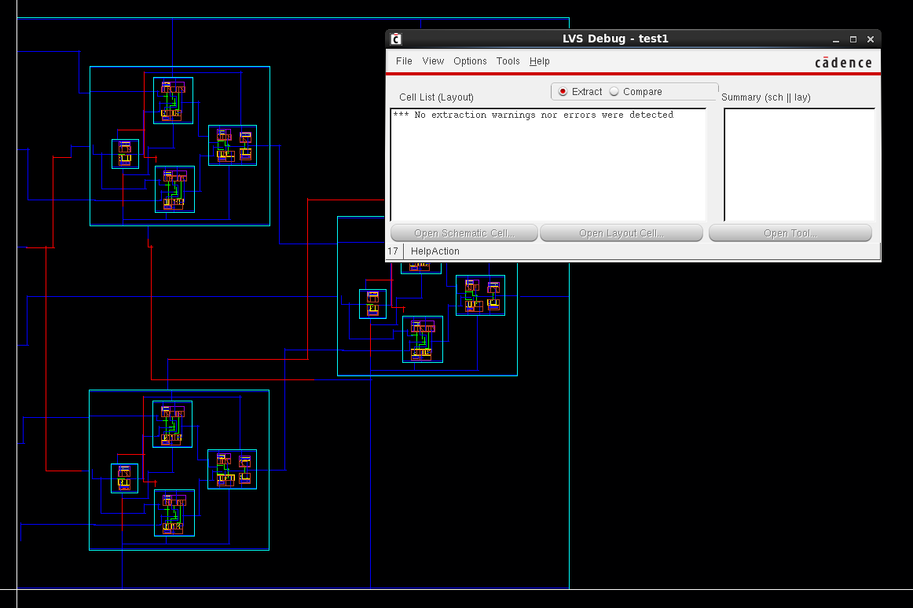

---

## Schematic vs Layout Matching  
A graphical match confirms structural alignment between schematic and layout levels.

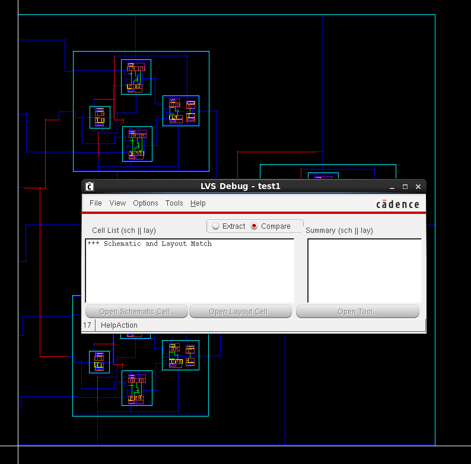

---

## Parasitic Extraction (RCX)  
RC extraction using Assura provides parasitic resistance and capacitance for accurate post-layout simulation.

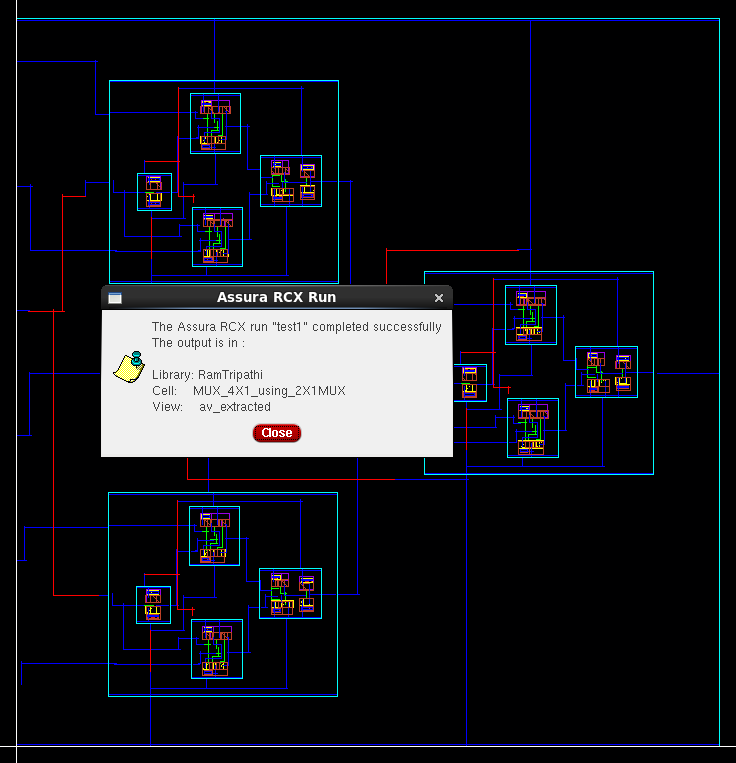

---

## AV Extracted View  
The AV view shows extracted netlists including parasitic values for back-annotation and simulation refinement.

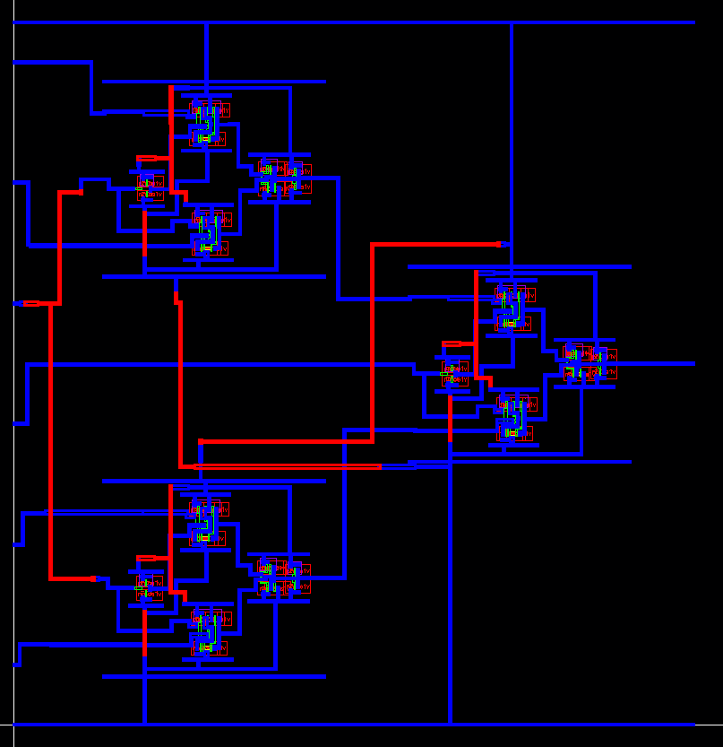

---

### Energy Analysis  
The post-layout simulation shows that the 4×1 MUX consumes approximately **75.65 femtojoules (fJ)** per switching cycle.  
This value is well within expected bounds for a design implemented in **GPDK 90nm** technology. It reflects an efficient design with minimal parasitic effects and optimized switching activity. Such low energy consumption makes this implementation suitable for low-power digital systems and educational benchmarking.

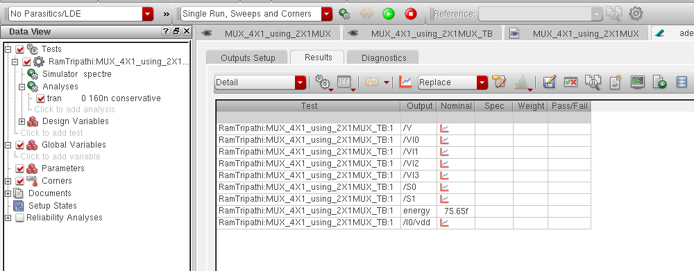

---

## Tools Used  
- **Cadence Virtuoso** – Schematic and Layout Design  
- **Assura** – DRC, LVS, and RCX Parasitic Extraction  
- **Spectre / ADE L/XL** – Transient Simulation and Energy Analysis  

---

## Author  
**Ram Tripathi**

