# CMOS 4-Bit OR Gate Design in Cadence Virtuoso

This repository documents the full design, simulation, and verification process of a **4-Bit OR Gate** implemented using **Cadence Virtuoso**. The project includes schematic design, layout drawing, DRC/LVS verification, RC parasitic extraction, and transient simulation.

---

## Table of Contents  
- [Schematic](#schematic)  
- [Symbol View](#symbol-view)  
- [Testbench](#testbench)  
- [Transient Simulation](#transient-simulation)  
- [Layout](#layout)  
- [DRC and LVS Checks](#drc-and-lvs-checks)  
- [Schematic vs Layout Matching](#schematic-vs-layout-matching)  
- [Parasitic Extraction (RCX)](#parasitic-extraction-rcx)  
- [AV Extracted View](#av-extracted-view)  
- [Tools Used](#tools-used)  
- [Author](#author)

---

## Schematic  
The 4-bit OR gate is constructed using multiple 2-input OR gates in CMOS logic. It performs a bitwise OR on two 4-bit inputs.

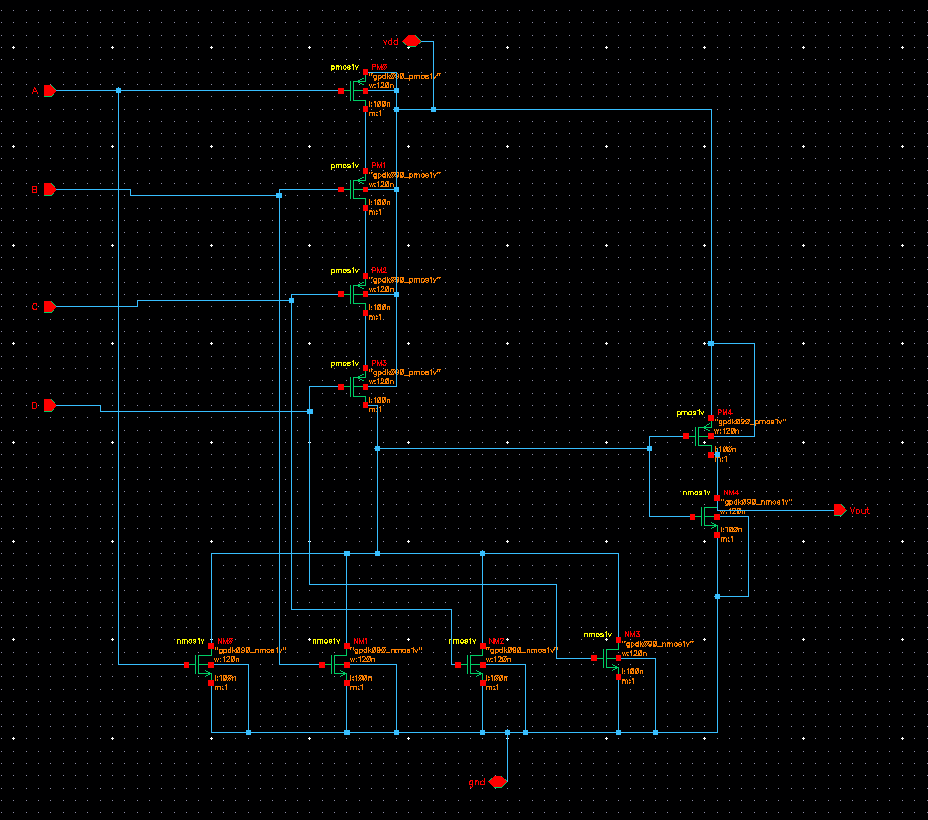

---

## Symbol View  
A symbol view was created for hierarchical design, simplifying connections in the testbench and top-level design.

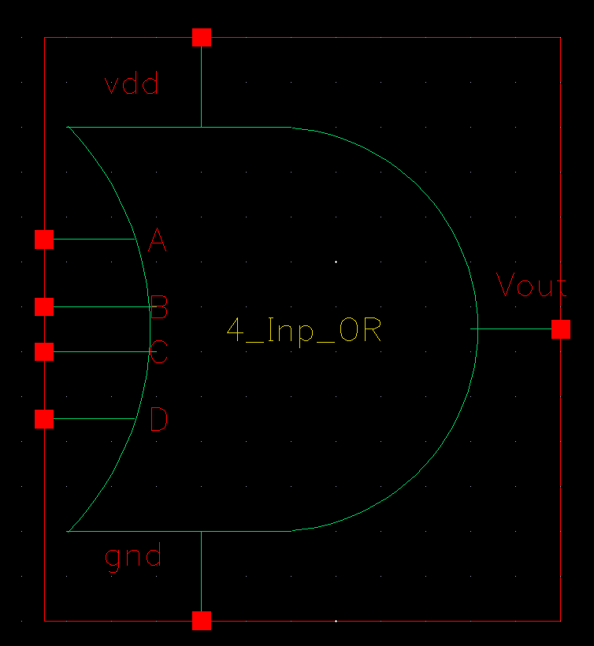

---

## Testbench  
The testbench stimulates the 4-bit OR gate with a variety of input combinations to verify its truth table.

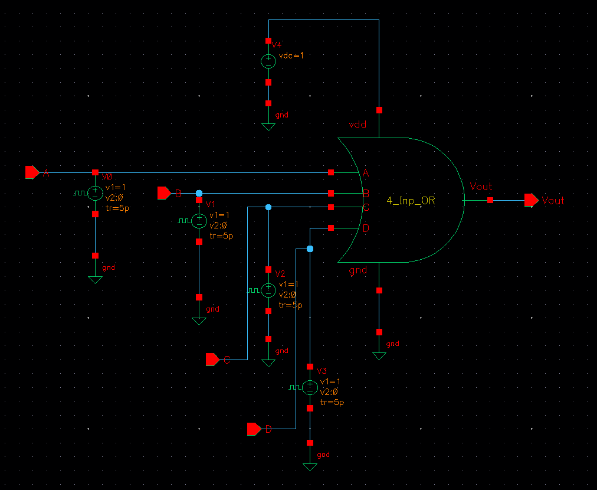

---

## Transient Simulation  
Transient analysis confirms that the 4-bit OR gate performs as expected, outputting the correct logic OR for each bit.

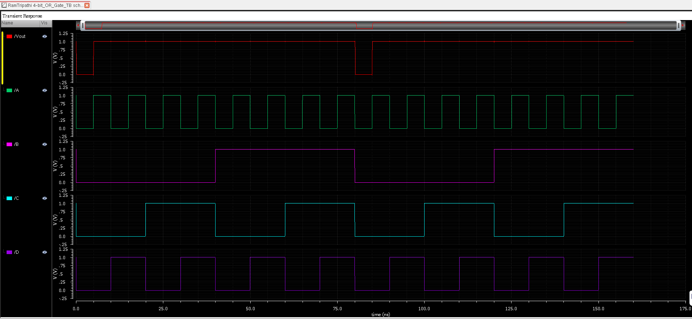

---

## Layout  
The layout of the 4-bit OR gate was created using Cadence Virtuoso layout editor while adhering to all design rules.

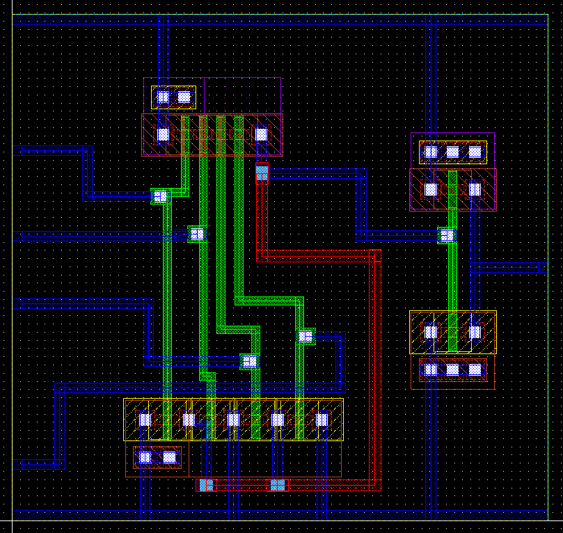

---

## DRC and LVS Checks

### DRC: Design Rule Check  
No DRC errors were found, confirming the layout complies with fabrication constraints.

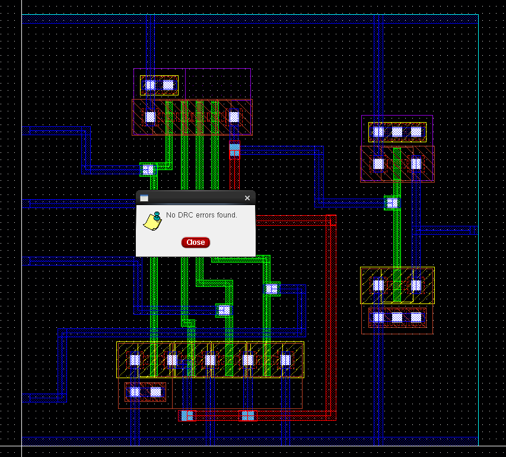

### LVS: Layout vs Schematic  
The LVS check shows the layout matches the schematic. A minor warning (non-critical) was observed during debug.

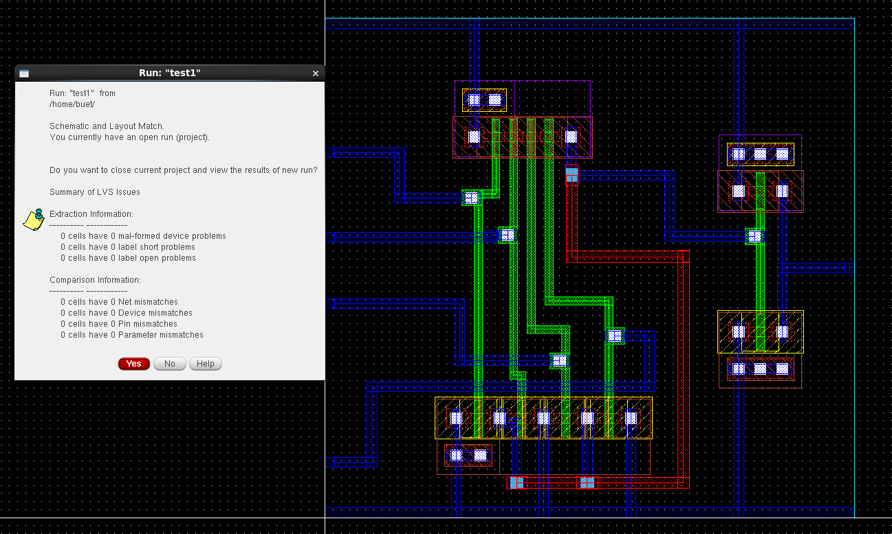  
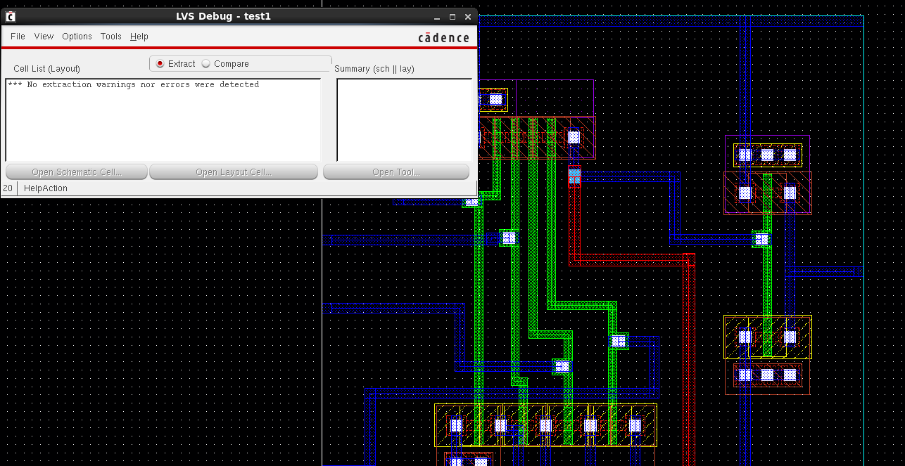

---

## Schematic vs Layout Matching  
This visual validation ensures that the physical layout matches the schematic structure and connectivity.

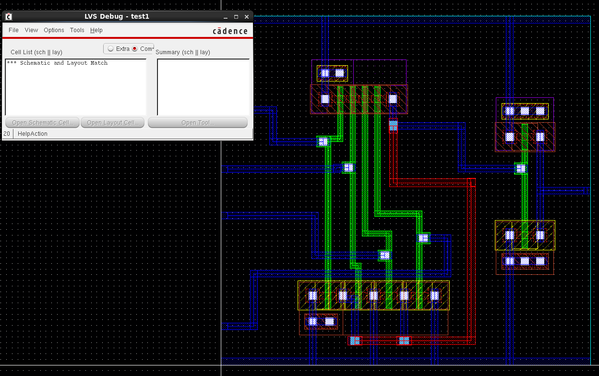

---

## Parasitic Extraction (RCX)  
RCX analysis was performed to extract parasitic resistances and capacitances from the layout for accurate timing simulations.

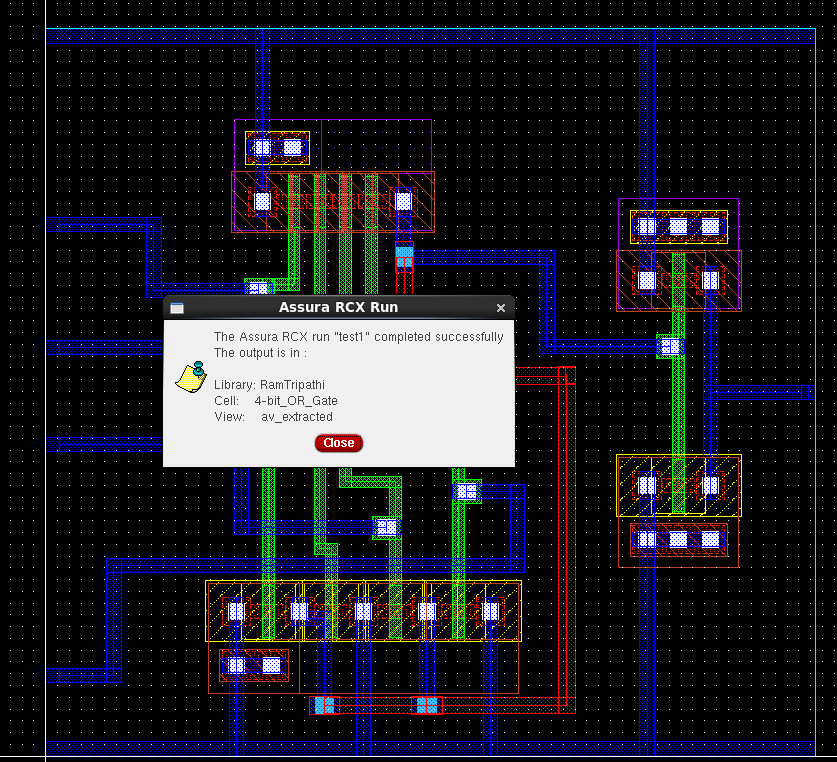

---

## AV Extracted View  
The Annotated View shows the netlist after RC extraction, including parasitics for back-annotated simulation.

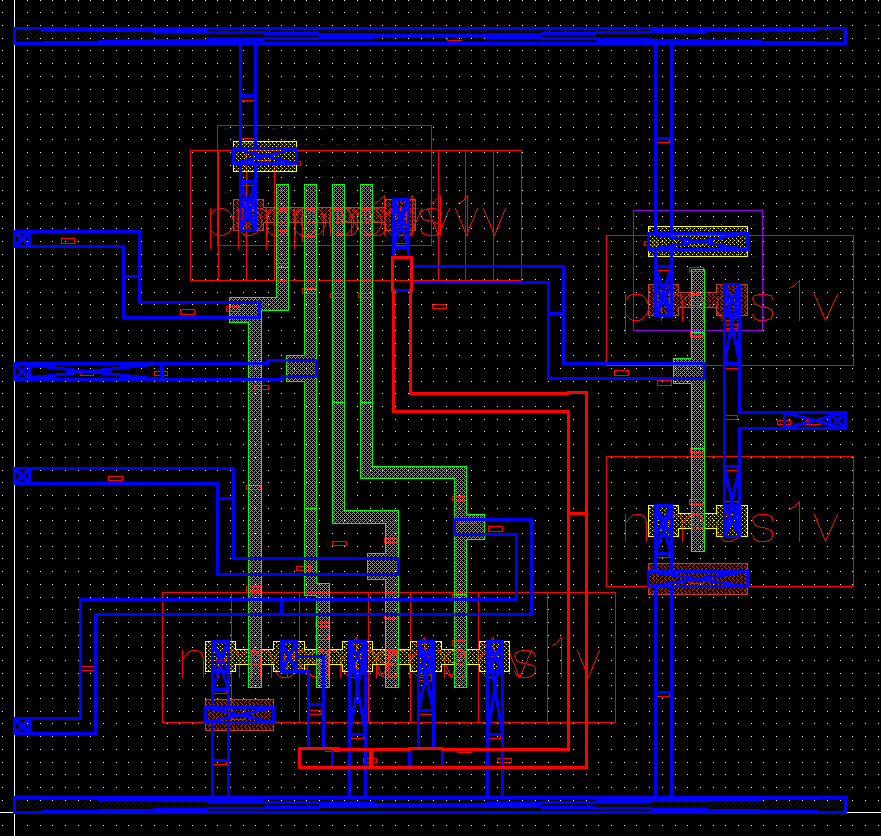

---

## Tools Used  
- **Cadence Virtuoso** – Schematic & Layout Design  
- **Assura** – DRC, LVS, and RCX Extraction  
- **Spectre / ADE L/XL** – Simulation & Waveform Analysis  

---

## Author  
**Ram Tripathi**
