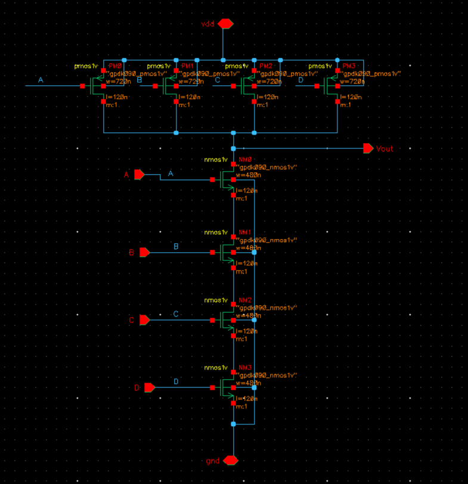
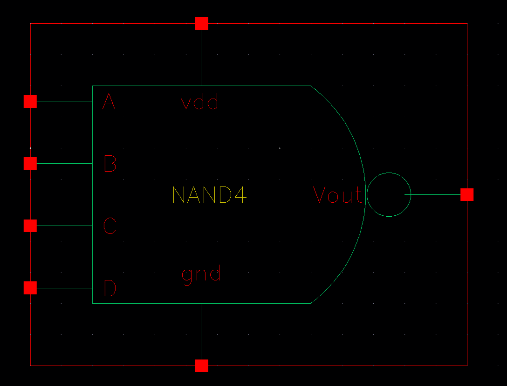
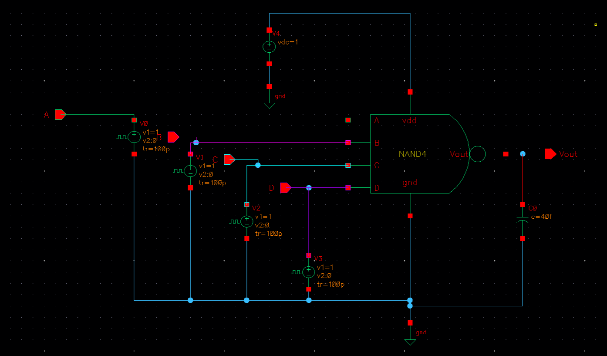
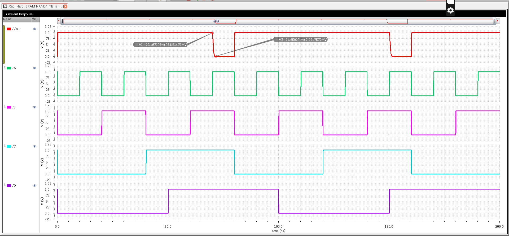
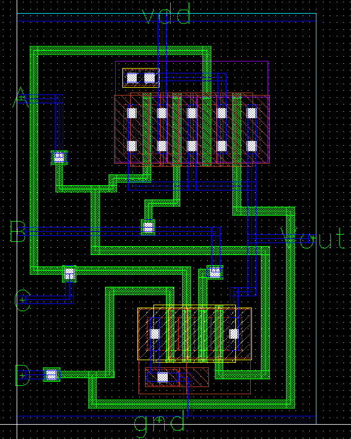
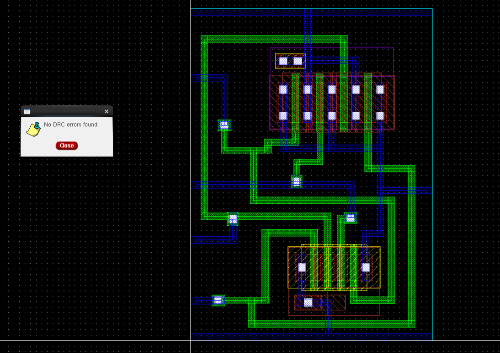
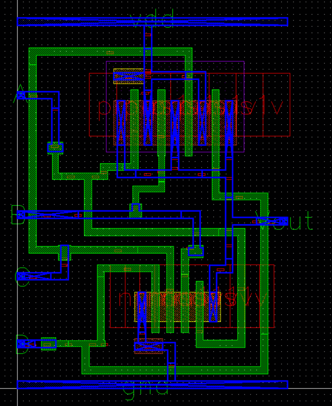
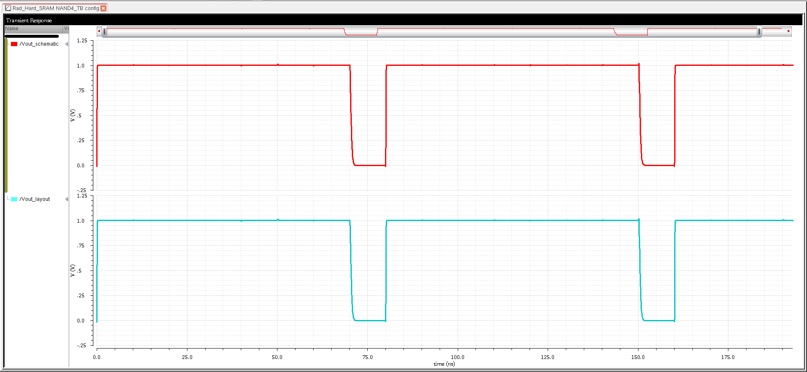
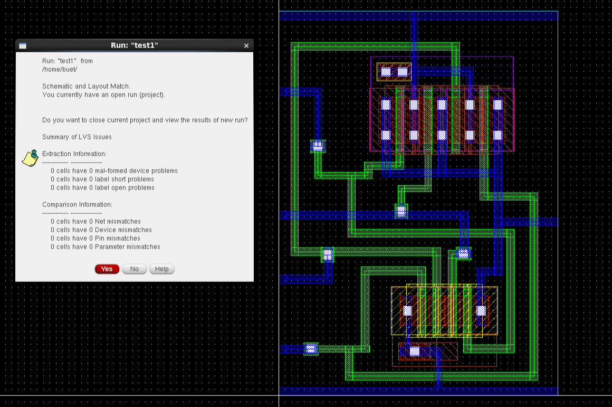
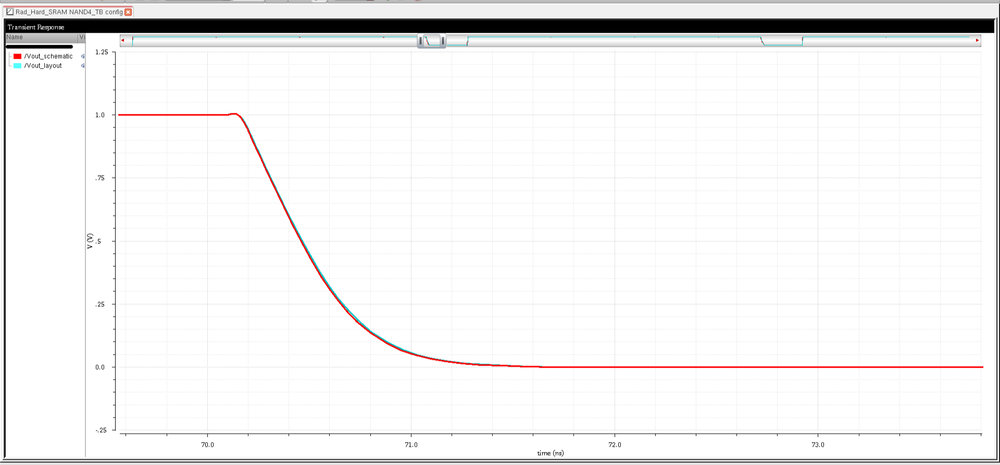

# NAND4 Gate Design in Cadence Virtuoso

This repository demonstrates the full-custom VLSI design of a **4-input NAND (NAND4) Gate** using Cadence Virtuoso.  
It includes the schematic, symbol, layout, extracted view, testbench, LVS, and verification images.

---

## Table of Contents
- [Schematic](#schematic)
- [Symbol](#symbol)
- [Testbench](#testbench)
- [Prelayout Transient](#prelayout-transient)
- [Layout](#layout)
- [DRC Clean Layout](#drc-clean-layout)
- [Extracted View](#extracted-view)
- [LVS Results](#lvs-results)
- [Tools Used](#tools-used)
- [Author](#author)

---

## Schematic
The NAND4 schematic designed in Cadence Virtuoso.

---

## Symbol
Custom symbol created for use in the testbench.

---

## Testbench
Testbench used to verify logic and transient behavior.

---

## Prelayout Transient
Prelayout transient / prelayout reference waveform.

---

## Layout
Initial layout of the NAND4 gate.

---

## DRC Clean Layout
Layout after fixing Design Rule Check (DRC) violations.

---

## Extracted View
Extracted layout used for post-layout simulation.

---

## LVS Results
Layout vs Schematic (LVS) verification and transient comparison.

### LVS Comparison Window

### LVS Match – No Mismatch

### Layout and Schematic Comparison at Switching

---

## Tools Used
- Cadence Virtuoso — schematic & layout
- Spectre — simulations
- Assura (or your DRC/LVS tool) — DRC & LVS checks

---

## Author
**Ram Tripathi (22HEL2231)**  
BSc (Hons.) Electronics — Final Year Project
