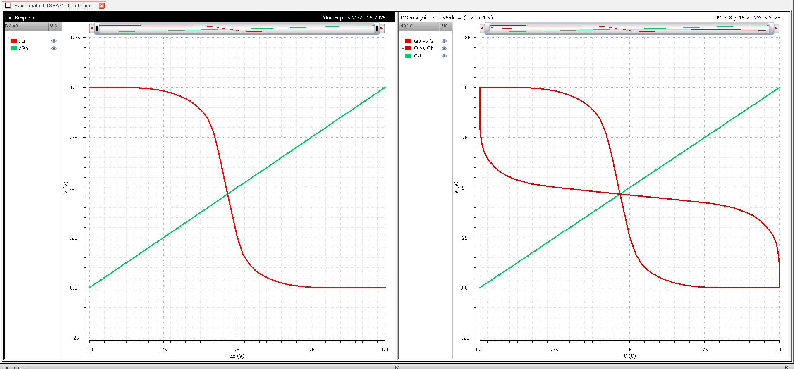

# 6T SRAM Cell Design

A complete 6T SRAM cell implementation in Cadence Virtuoso using GPDK 90nm technology, featuring schematic design, layout, and comprehensive corner analysis.

## Overview

This repository contains the design and verification of a standard 6-transistor (6T) SRAM cell, including schematic capture, layout design, and extensive simulation results across multiple process corners and supply voltages.

## Design Specifications

- **Technology**: GPDK 90nm
- **Supply Voltages**: 0.9V, 1.0V, 1.2V
- **Cell Type**: 6T SRAM (2 access transistors, 4 cross-coupled inverters)
- **Design Tool**: Cadence Virtuoso

---

## Schematic Design

### SRAM Cell Schematic
The complete 6T SRAM cell schematic showing the cross-coupled inverter pair and access transistors.

### Symbol View
Symbol representation for hierarchical design integration.

### Testbench Setup
Simulation testbench configuration for characterization.

---

## Simulation Results

### DC Response and Butterfly Curves
DC sweep analysis and butterfly curves demonstrating SRAM stability and noise margins.

### Corner Analysis

#### Multi-Voltage Corner Analysis (0.9V, 1.0V, 1.2V)
Comprehensive corner analysis across all supply voltages.

#### Corner Analysis (0.9V and 1.0V)
Detailed performance characterization at lower supply voltages.

**Process Corners Tested:**
- **SS** (Slow-Slow) - Worst case slow
- **FF** (Fast-Fast) - Worst case fast
- **NN** (Nominal-Nominal) - Typical case
- **FF High Performance** - Fast corner optimized
- **SS High Performance** - Slow corner optimized
- **NN High Performance** - Nominal corner optimized

---

## Layout Design

### Physical Layout with Extraction
Physical layout with extracted parasitic elements (R and C).

### DRC Verification
Clean layout with zero design rule violations.

---

## Verification Results

### LVS Verification
Layout vs Schematic verification showing successful match.

### Parasitic Extraction
Successful RC extraction completion for accurate post-layout simulation.

---

## Key Features

✅ DRC clean layout  
✅ LVS verified  
✅ Parasitic extraction completed  
✅ Multi-corner analysis performed  
✅ Multiple supply voltage characterization  
✅ Stability analysis through butterfly curves  

---

## Design Flow

1. **Schematic Entry** - Created 6T SRAM cell schematic with proper sizing
2. **Simulation & Analysis** - DC analysis and multi-corner characterization
3. **Layout Design** - Physical layout adhering to GPDK 90nm design rules
4. **DRC Verification** - Ensured zero design rule violations
5. **LVS Verification** - Confirmed layout matches schematic perfectly
6. **Parasitic Extraction** - Extracted RC parasitics for accurate simulation

---

## Results Summary

The 6T SRAM cell demonstrates **stable operation** across all tested corners (SS, FF, NN) and high-performance variants at supply voltages of **0.9V, 1.0V, and 1.2V**. 

Butterfly curves confirm adequate **noise margins** for reliable data retention and robust read/write operations. The design successfully passes all verification checks and is ready for integration into larger memory arrays.

---

## Tools Used

- **Cadence Virtuoso** - Schematic and layout design
- **Assura/PVS** - DRC and LVS verification
- **Spectre** - Circuit simulation and analysis
---

## Technology

**GPDK 90nm** - Generic Process Design Kit for 90nm CMOS technology

---

*Design completed and verified in Cadence Virtuoso environment*
