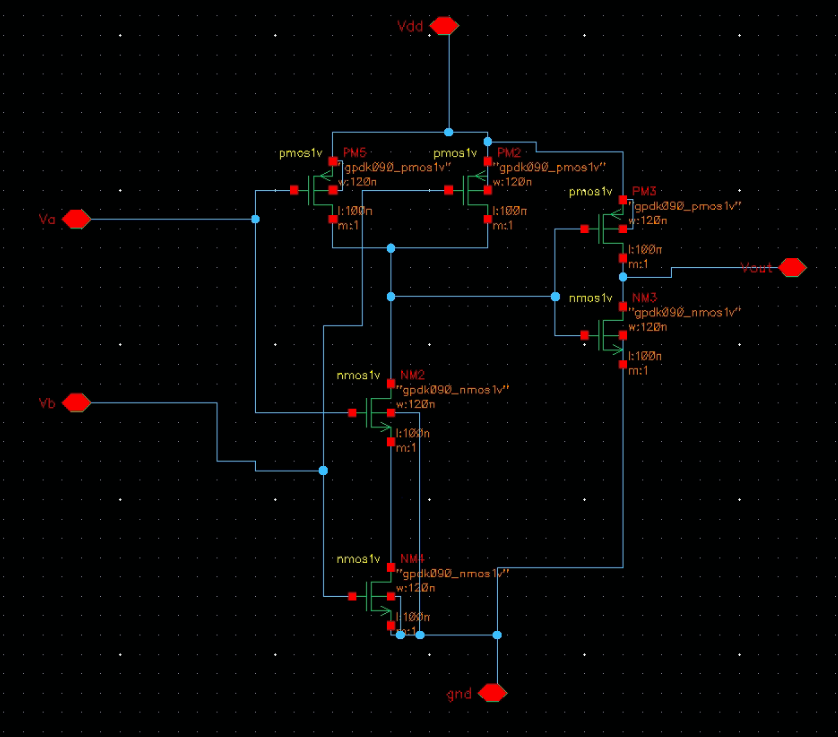
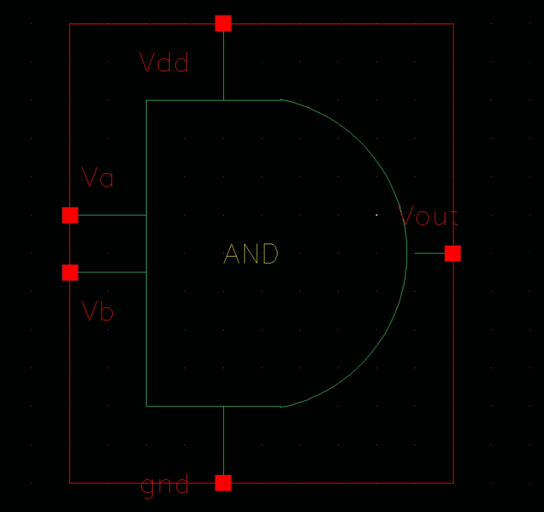
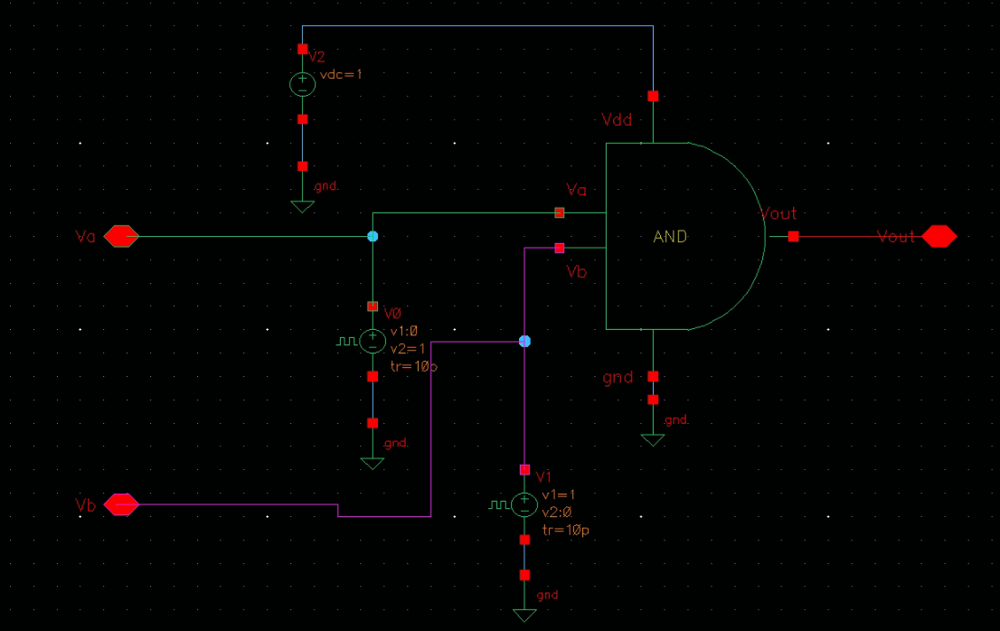
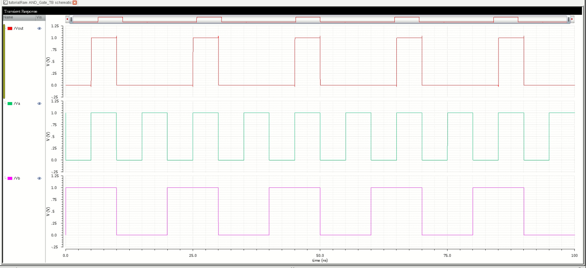
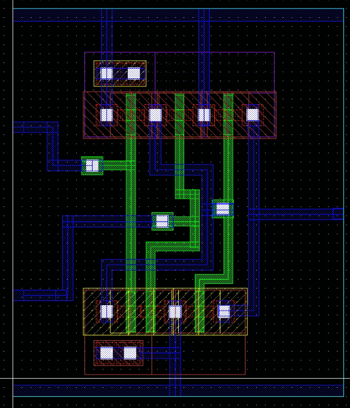
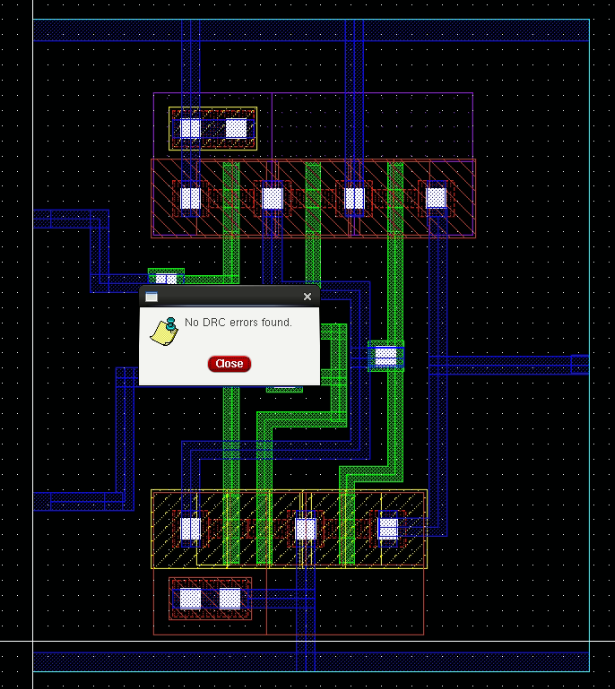
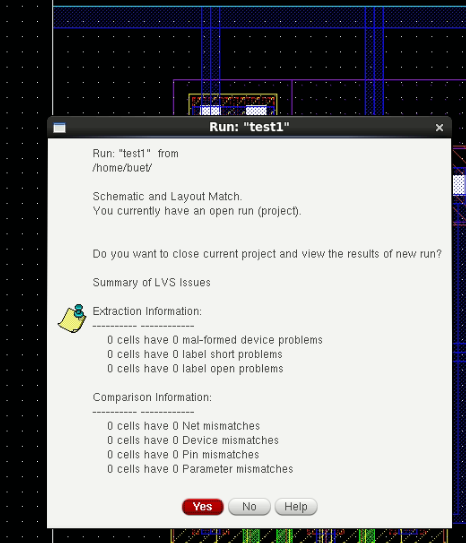
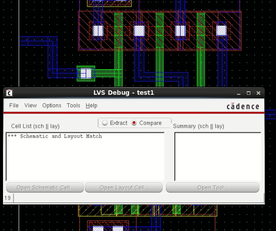
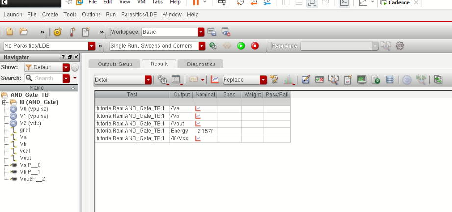

# CMOS AND Gate Design in Cadence Virtuoso

This repository documents the complete **CMOS AND Gate** design flow in **Cadence Virtuoso**, covering schematic creation, layout, simulation, verification (DRC/LVS), and power analysis.

---

## 📁 Table of Contents  
- [Schematic](#schematic)  
- [Symbol View](#symbol-view)  
- [Testbench](#testbench)  
- [Transient Simulation](#transient-simulation)  
- [Layout](#layout)  
- [DRC and LVS Checks](#drc-and-lvs-checks)  
- [Schematic vs Layout Matching](#schematic-vs-layout-matching)  
- [Energy Estimation](#energy-estimation)  
- [Tools Used](#tools-used)  
- [Author](#author)

---

## Schematic  
The AND gate is implemented using CMOS logic with pull-up PMOS and pull-down NMOS networks.

---

## Symbol View  
A symbol was generated from the schematic for hierarchical testbench connection.

---

## Testbench  
The testbench is used to provide input stimulus and observe output response.

---

## Transient Simulation  
Transient simulation validates the functionality of the AND gate under dynamic conditions.

---

## Layout  
The full custom layout of the AND gate was drawn following foundry design rules.

---

## DRC and LVS Checks

- ✅ **No DRC Errors:**  
  Verified using DRC tool — no design rule violations.

  

- ✅ **LVS Clean:**  
  The layout matches the schematic with no mismatches.

  

---

## Schematic vs Layout Matching  
A visual confirmation of netlist and connectivity matching between schematic and layout.

---

## Energy Estimation  
Post-layout transient waveform was used to estimate switching energy consumption.

---

## Tools Used  
- **Cadence Virtuoso** – Schematic, Symbol, and Layout Design  
- **Spectre** – Transient Simulation  
- **Assura/Calibre** – DRC and LVS  
- **ADE XL** – Waveform analysis and power estimation  

---

## Author  
**Ram Tripathi**