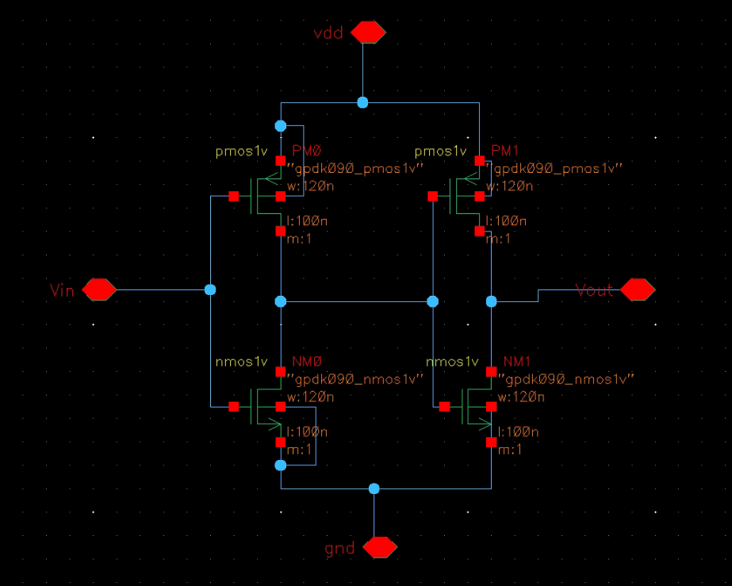
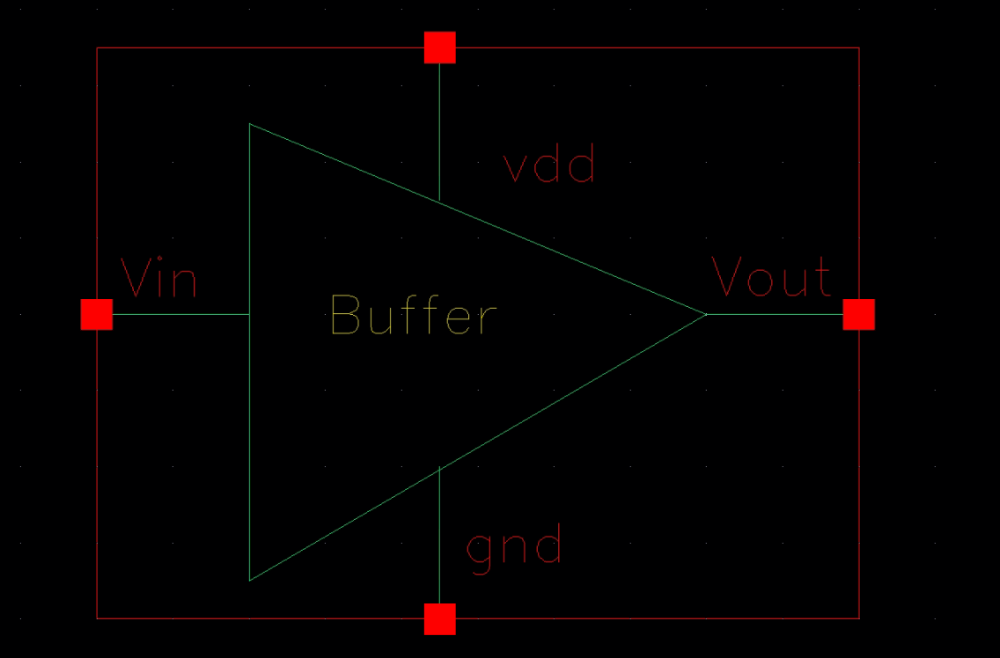
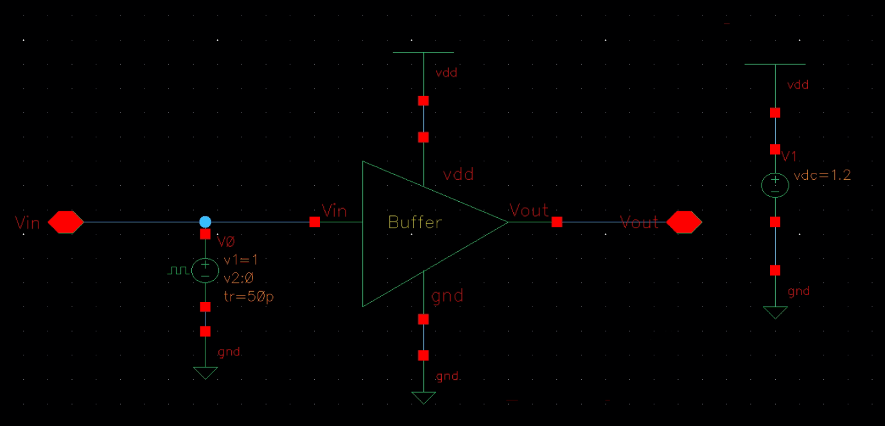
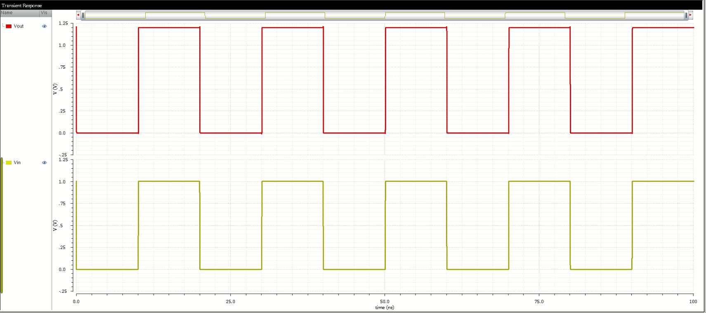
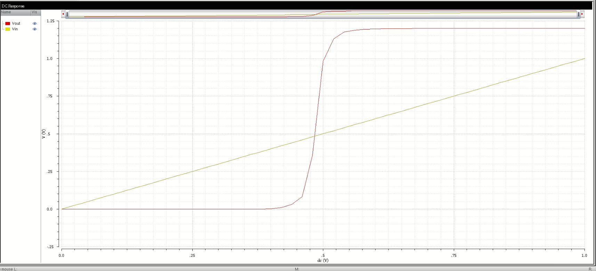
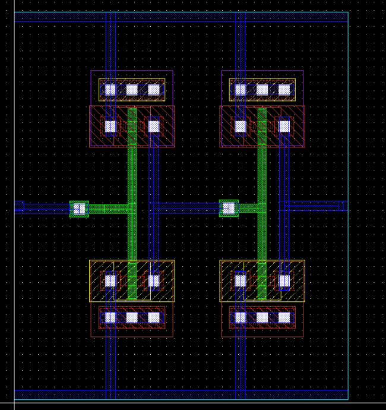
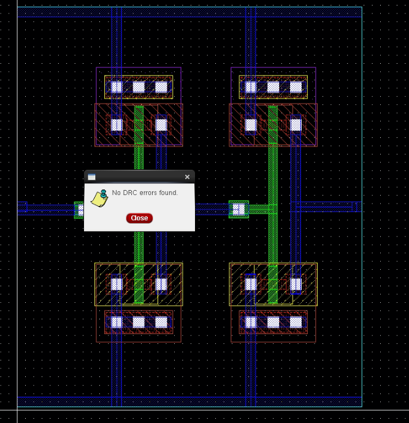
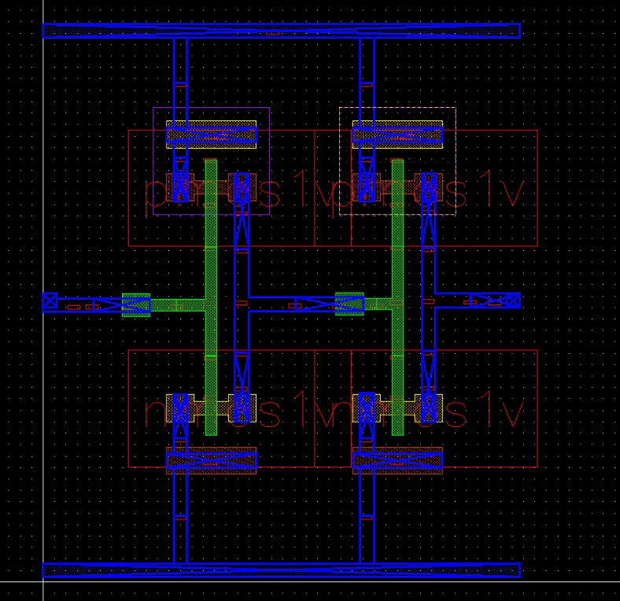
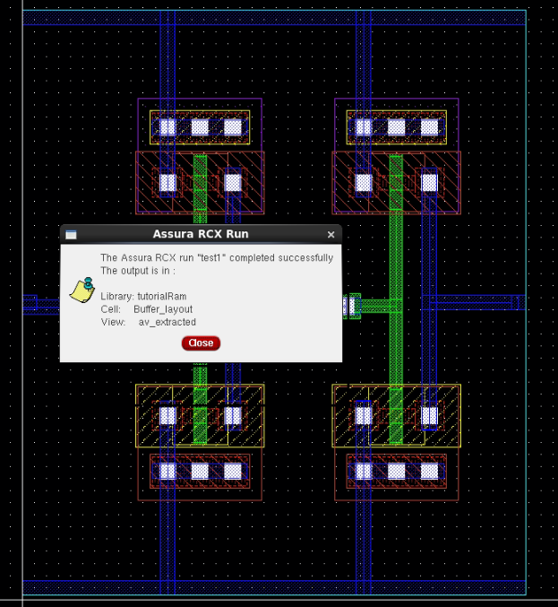

# CMOS Buffer Design in Cadence Virtuoso

This project demonstrates the complete **CMOS buffer** design using **Cadence Virtuoso**, including schematic, symbol, testbench circuit, layout, simulation waveforms, DRC/LVS checks, and post-layout extracted view.

## Table of Contents  
- [Schematic](#schematic)  
- [Symbol View](#symbol-view)  
- [Testbench](#testbench)  
- [Transient and DC Response](#transient-and-dc-response)  
- [Layout](#layout)  
- [LVS and DRC Verification](#lvs-and-drc-verification)  
- [Post-Layout (RCX) View](#post-layout-rcx-view)  
- [Tools Used](#tools-used)  
- [Author](#author)

---

## Schematic  
The CMOS buffer was designed using the **schematic editor** in Cadence Virtuoso.

---

## Symbol View  
A custom symbol was created for hierarchical design and testbench connection.

---

## Testbench  
The testbench was developed to analyze both **static and dynamic** behavior of the buffer.

---

## Transient and DC Response  

- **Transient Response:** Shows the time-domain signal propagation through the buffer.  
- **DC Response:** Indicates the voltage transfer characteristic (VTC).

  

---

## Layout  
The layout of the buffer was created following standard design rules.

---

## LVS and DRC Verification  

- ✅ **DRC Passed**: No design rule violations were found.  
- ✅ **LVS Passed**: The layout matches the schematic with no mismatches.

  

---

## Post-Layout (RCX) View  
The extracted view includes parasitic capacitance and resistance using **RCX (Parasitic Extraction)**.

  

---

## Tools Used  
- **Cadence Virtuoso** – For schematic and layout design  
- **Spectre** – For transient and DC simulations  
- **Assura/Calibre** – For DRC & LVS verification  
- **RCX** – For post-layout parasitic extraction  

---

## Author  
**Ram Tripathi**
