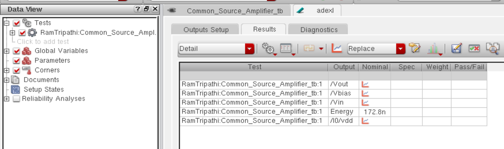

# CMOS Common Source Amplifier Design (GPDK 90nm)

This repository documents the design and analysis of a **Common Source Amplifier** implemented using **Cadence Virtuoso** with **GPDK 90nm** technology. It includes schematic capture, layout design, simulation, DRC/LVS/RCX verification, and energy and power analysis.

---

## 📁 Contents

- [Schematic](#schematic)
- [Transient and DC Analysis](#transient-and-dc-analysis)
- [Layout](#layout)
- [DRC & LVS Verification](#drc--lvs-verification)
- [Layout vs Schematic Matching](#layout-vs-schematic-matching)
- [RC Extraction](#rc-extraction)
- [AV Extracted View](#av-extracted-view)
- [Energy and Power Analysis](#energy-and-power-analysis)
- [Tools Used](#tools-used)
- [Author](#author)

---

## 📐 Schematic

The amplifier is implemented using a single NMOS transistor with a resistive load and biasing configured for mid-band gain.

---

## 📊 Transient and DC Analysis

### Transient Response

Simulation confirms gain and signal amplification behavior.

### DC Transfer Characteristics

DC sweep of input vs output highlights gain and operating point.

---

## 🧱 Layout

Full layout created and verified using DRC and LVS tools.

---

## ✅ DRC & LVS Verification

### DRC (Design Rule Check)  
All physical design rules are satisfied.

### LVS (Layout vs Schematic)

Confirms layout matches schematic netlist.

---

## 🧮 Layout vs Schematic Matching

Visual confirmation of layout and schematic net connectivity.

---

## 📉 RC Extraction

Parasitic elements are extracted to refine post-layout simulation.

---

## 🧪 AV Extracted View

The extracted netlist includes parasitics for accurate signal and power estimation.

---

## ⚡ Energy and Power Analysis

### Energy Consumption Estimation

Estimated dynamic energy per input cycle.

### Power Curve

Displays power variation over time or input.

---

## 🛠 Tools Used

- **Cadence Virtuoso** (Schematic/Layout/Simulation)
- **GPDK 90nm PDK**
- **Spectre** (Transient and DC Analysis)
- **Assura** (DRC, LVS, RCX)

---

## 👤 Author

**Ram Tripathi**
