# Common Source Amplifier (CS Amp)

This repository documents the design, layout, and analysis of a Common Source Amplifier implemented using Cadence Virtuoso. All essential verification stages — including schematic, layout, DRC, LVS, RC extraction, and simulation — are provided.

---

## 📑 Table of Contents
- [1. Schematic](#1-schematic)
- [2. Symbol](#2-symbol)
- [3. Testbench](#3-testbench)
- [4. Transient Response](#4-transient-response)
- [5. DC Response](#5-dc-response)
- [6. Layout](#6-layout)
- [7. DRC Verification](#7-drc-verification)
- [8. LVS Verification](#8-lvs-verification)
- [9. Layout vs Schematic Match](#9-layout-vs-schematic-match)
- [10. RC Extraction](#10-rc-extraction)
- [11. AV Extracted View](#11-av-extracted-view)
- [12. Power Curve](#12-power-curve)
---

## 1. Schematic
The schematic of the Common Source Amplifier circuit.

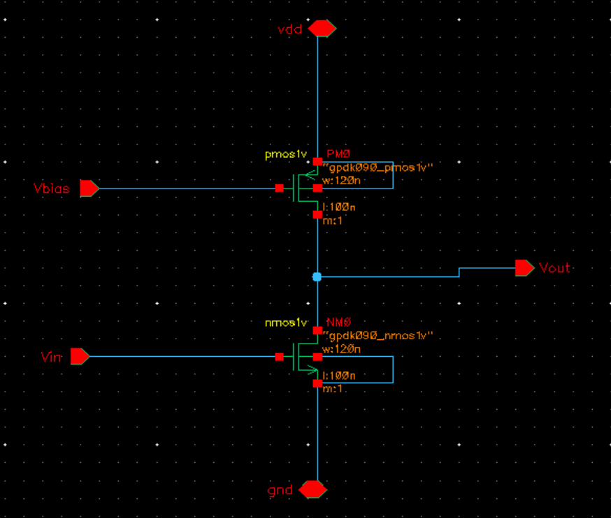

---

## 2. Symbol
The symbol used for the amplifier design.

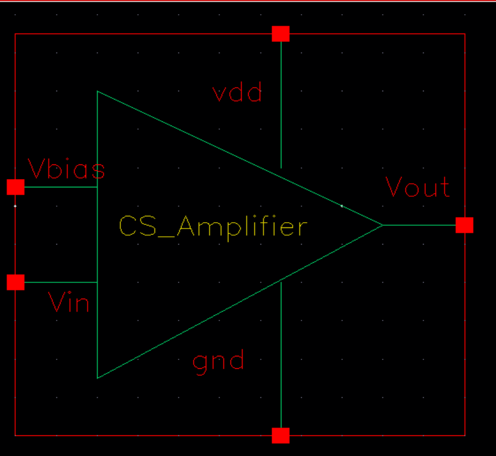

---

## 3. Testbench
The testbench used for transient and DC analysis.

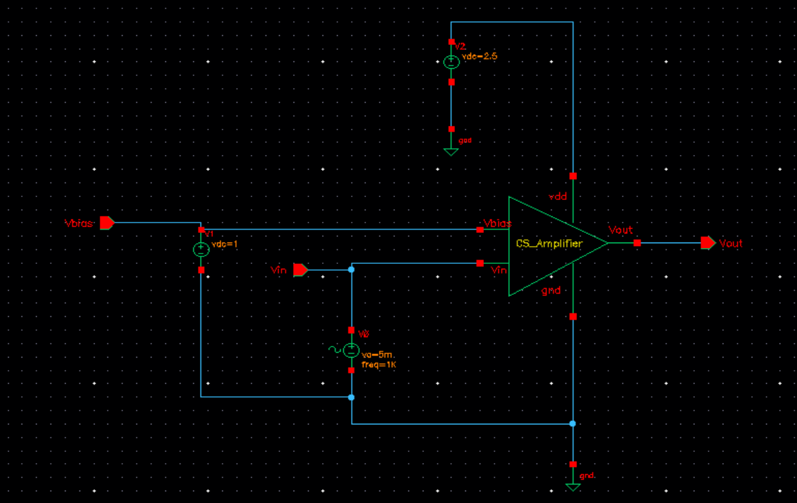

---

## 4. Transient Response
Simulated transient response of the amplifier.

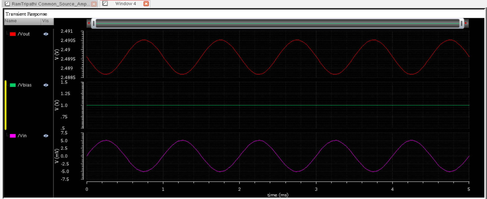

---

## 5. DC Response
DC transfer characteristics of the CS amplifier.

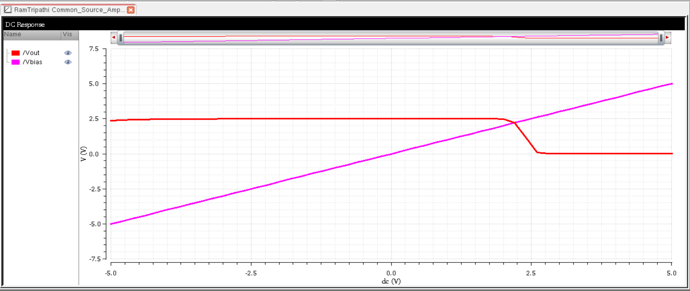

---

## 6. Layout
Layout designed in Virtuoso Layout Suite.

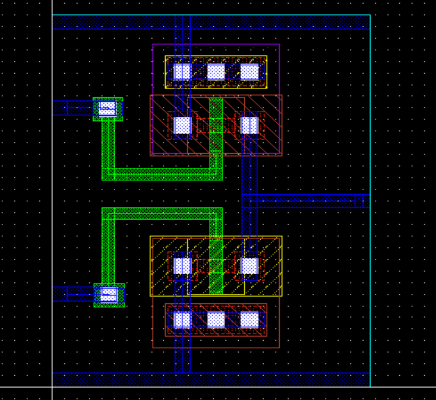

---

## 7. DRC Verification
Design Rule Check passed without errors.

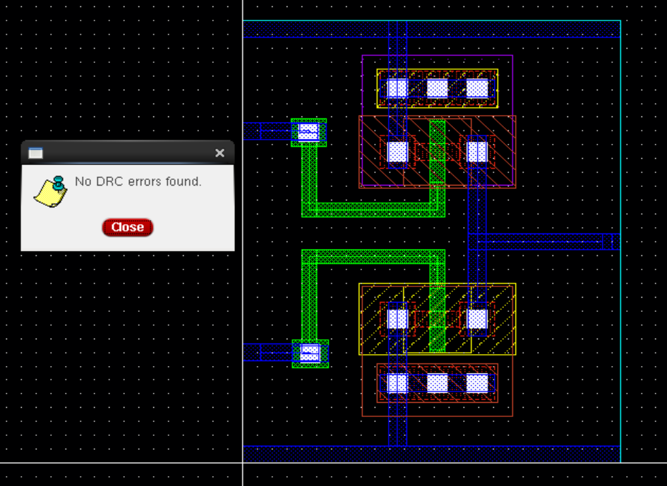

---

## 8. LVS Verification
Layout versus Schematic comparison passed.

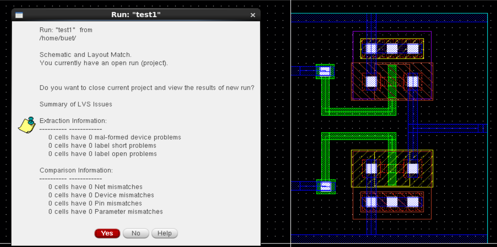

---

## 9. Layout vs Schematic Match
Graphical proof of schematic and layout match.

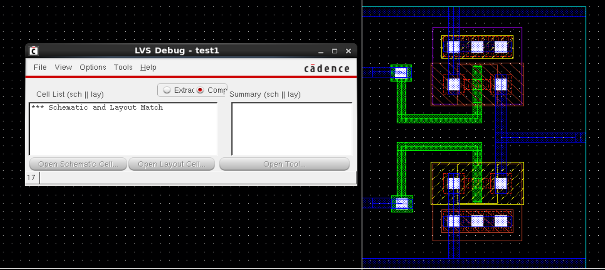

---

## 10. RC Extraction
Resistor-Capacitor parasitic extraction run.

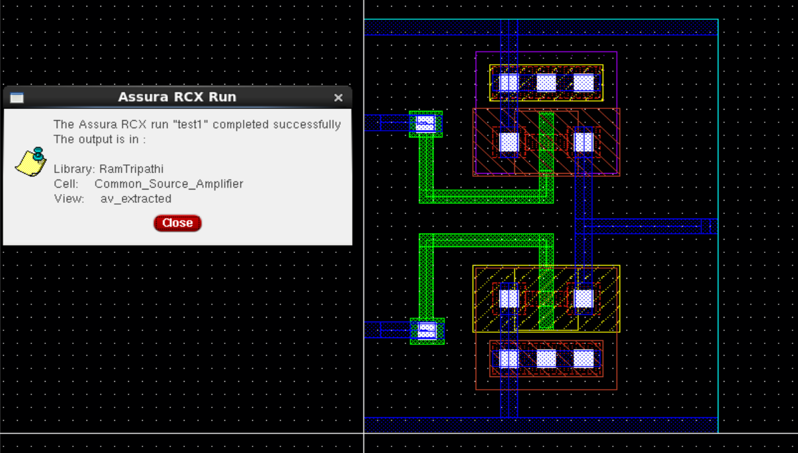

---

## 11. AV Extracted View
Post-layout AV extracted simulation view.

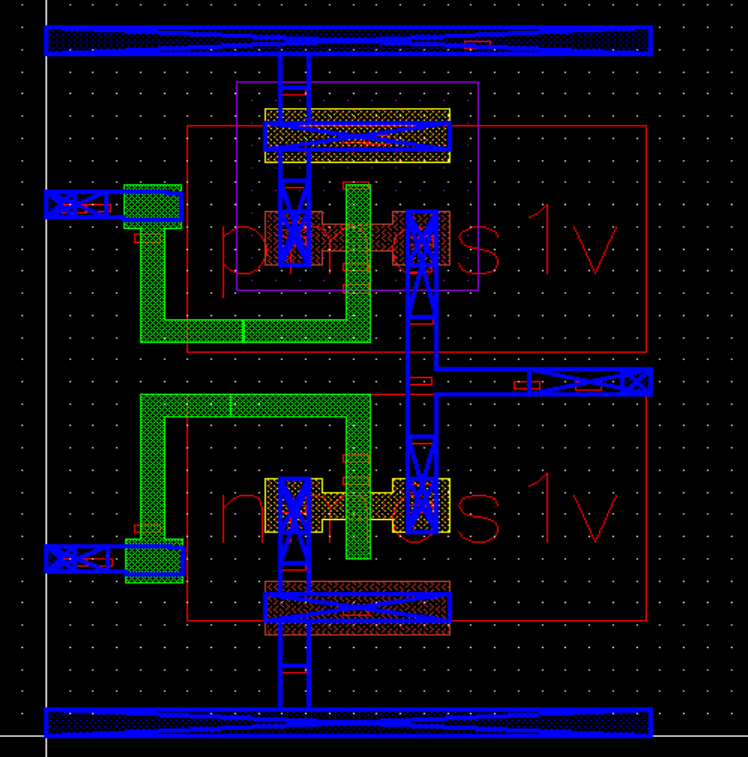

---

## 12. Power Curve
Graph showing amplifier power consumption over time.

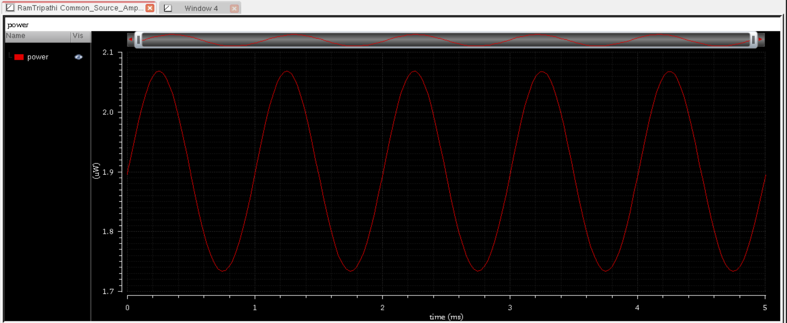

---

### 📌 Summary

This project showcases a fully verified analog amplifier design using the GPDK 90nm CMOS process. It includes complete simulation and physical design verification stages, serving as a reference for analog design workflows.

---
