# CMOS D Latch Using NAND Gates in Cadence Virtuoso

This repository presents the complete design and simulation flow for a **D Latch implemented using NAND gates** in **GPDK 90nm** technology using **Cadence Virtuoso**. The project includes schematic design, symbol creation, transient simulation, layout design, verification (DRC/LVS/RCX), and energy analysis.

---

## Table of Contents  
- [Schematic](#schematic)  
- [Symbol View](#symbol-view)  
- [Testbench](#testbench)  
- [Transient Simulation](#transient-simulation)  
- [Layout](#layout)  
- [DRC and LVS Checks](#drc-and-lvs-checks)  
- [Schematic vs Layout Matching](#schematic-vs-layout-matching)  
- [Parasitic Extraction (RCX)](#parasitic-extraction-rcx)  
- [AV Extracted View](#av-extracted-view)  
- [Energy Analysis](#energy-analysis)  
- [Tools Used](#tools-used)  
- [Author](#author)

---

## Schematic  
The D latch circuit is constructed using basic NAND logic gates, controlling the flow of data with enable input.

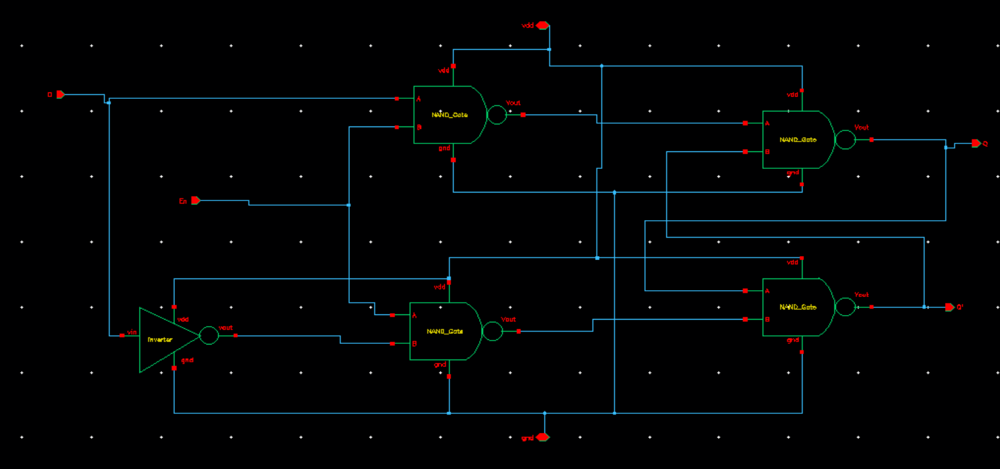

---

## Symbol View  
The symbol of the latch was created to ease testbench and hierarchical designs.

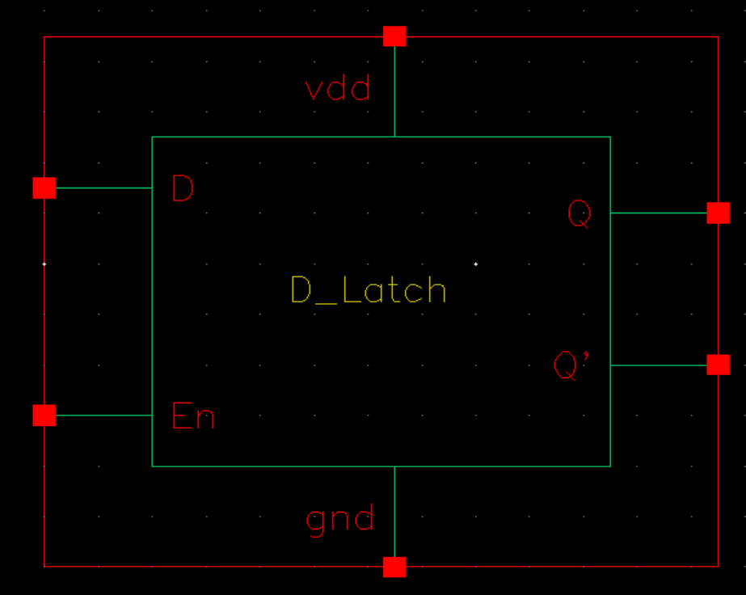

---

## Testbench  
The testbench applies a clock and data inputs to verify latch behavior.

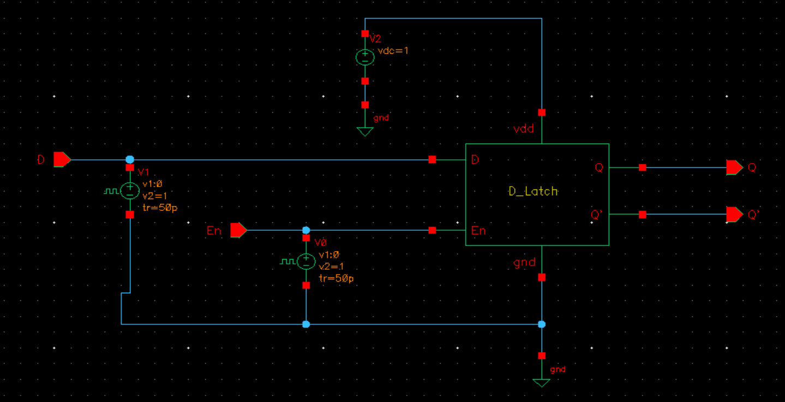

---

## Transient Simulation  
Transient response verifies correct output operation in response to D and Enable inputs.

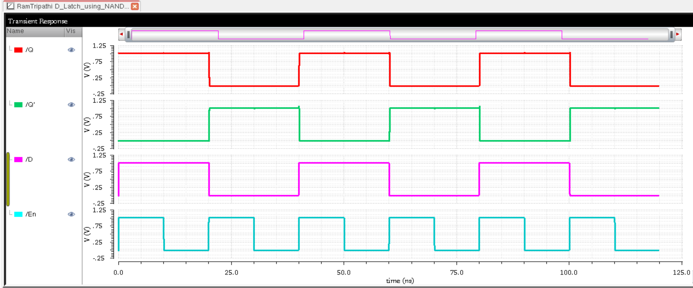

---

## Layout  
The physical layout of the D latch was created following design rules for the 90nm node.

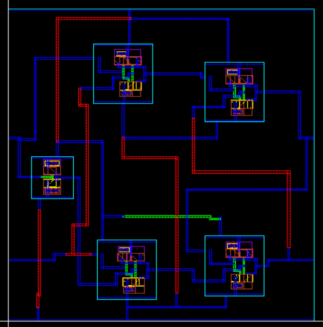

---

## DRC and LVS Checks

### DRC: Design Rule Check  
Layout is free of DRC violations.

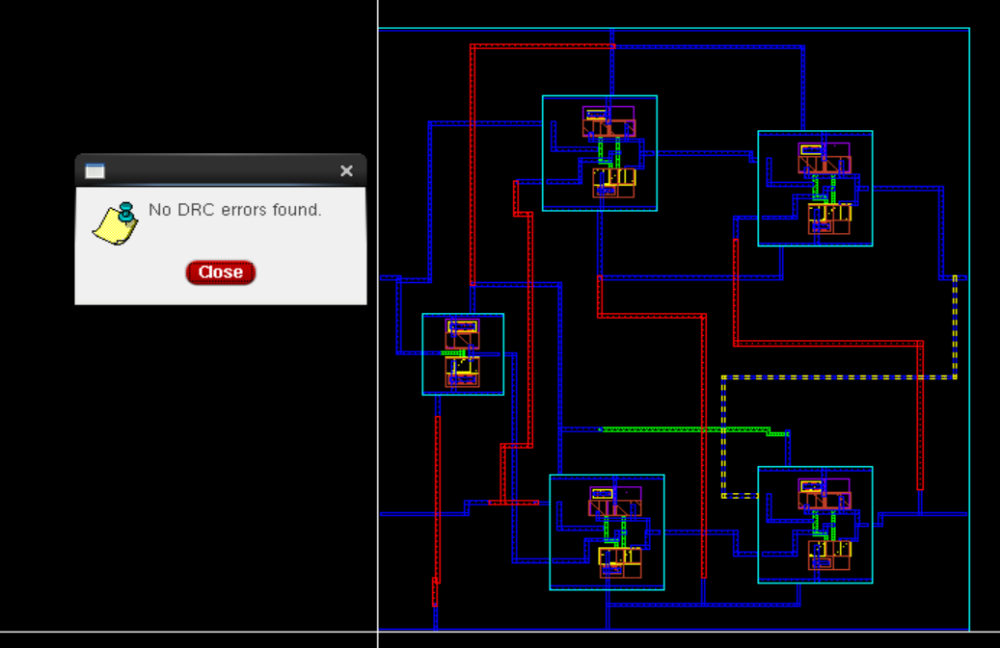

### LVS: Layout vs Schematic  
The layout netlist matches the schematic netlist.

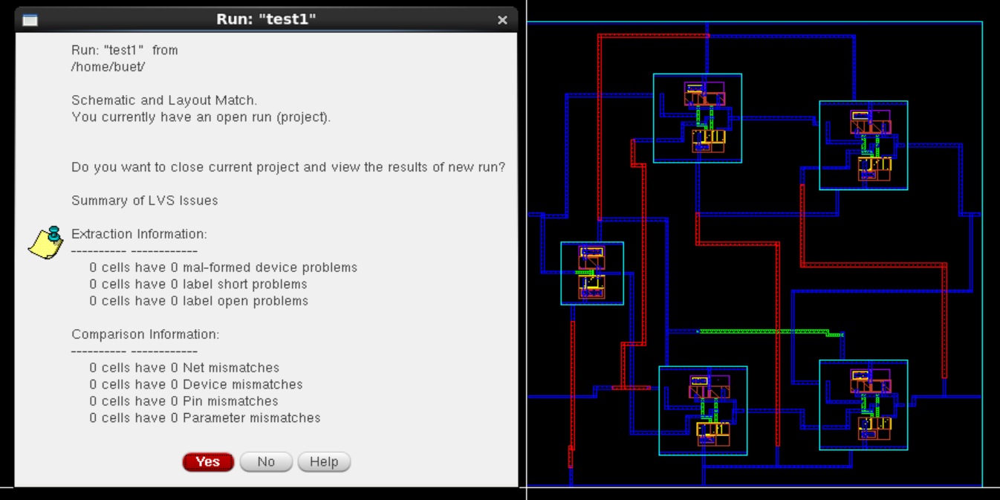

---

## Schematic vs Layout Matching  
Visual verification of schematic and layout connectivity.

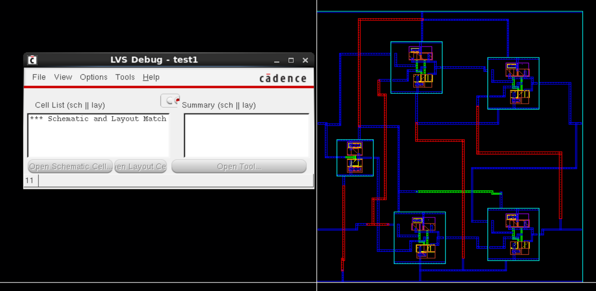

---

## Parasitic Extraction (RCX)  
RCX is performed to extract parasitic capacitance and resistance from the layout.

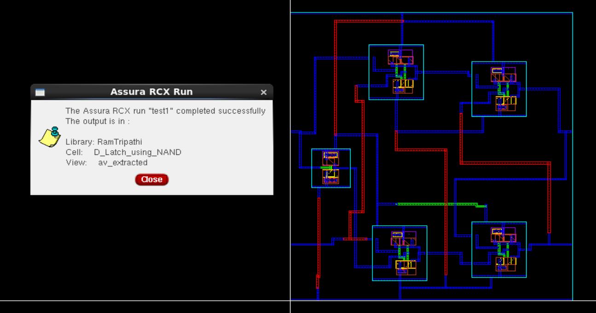

---

## AV Extracted View  
AV view includes parasitics and is used for post-layout accurate simulations.

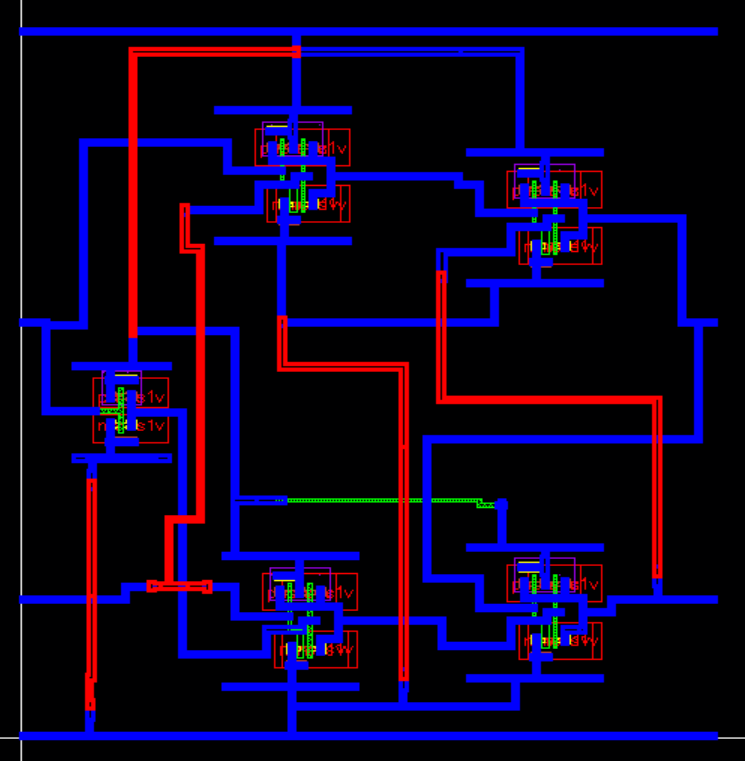

---

## Energy Analysis  
Power and energy consumption are estimated for a switching cycle.

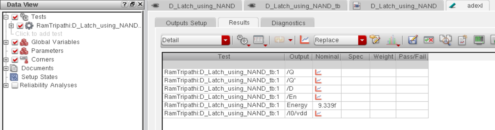

---

## Tools Used  
- **Cadence Virtuoso** (Schematic, Layout, Simulation)  
- **GPDK 90nm Technology**  
- **Assura for DRC/LVS/RCX**  
- **Spectre for Transient Analysis**

---

## Author  
**Ram Tripathi**

