# 📘 Differential Amplifier using GPDK 90nm

This repository contains the complete schematic design, layout, verification, and performance analysis of a **Differential Amplifier** implemented using the **GPDK 90nm** PDK in **Cadence Virtuoso**.

---

## 📂 Table of Contents

- [🔧 Schematic](#-schematic)
- [📐 Symbol](#-symbol)
- [🧪 Testbench](#-testbench)
- [📊 Transient Response](#-transient-response)
- [📈 DC Response](#-dc-response)
- [📉 AC Analysis](#-ac-analysis)
- [🏗️ Layout](#-layout)
- [✅ DRC Check](#-drc-check)
- [🔍 LVS Check](#-lvs-check)
- [🧩 Layout vs Schematic Match](#-layout-vs-schematic-match)
- [🧠 RCX Extraction](#-rcx-extraction)
- [📡 AV Extracted View](#-av-extracted-view)

---

## 🔧 Schematic

The schematic of the Differential Amplifier designed in Cadence Virtuoso.

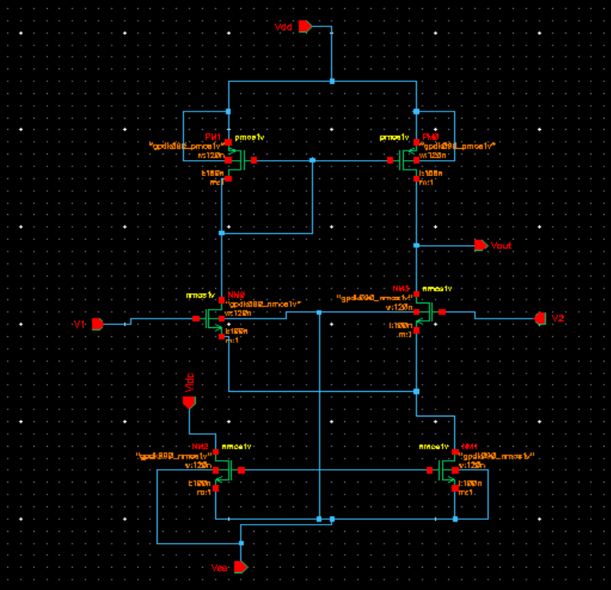

---

## 📐 Symbol

Symbol generated for the Differential Amplifier.

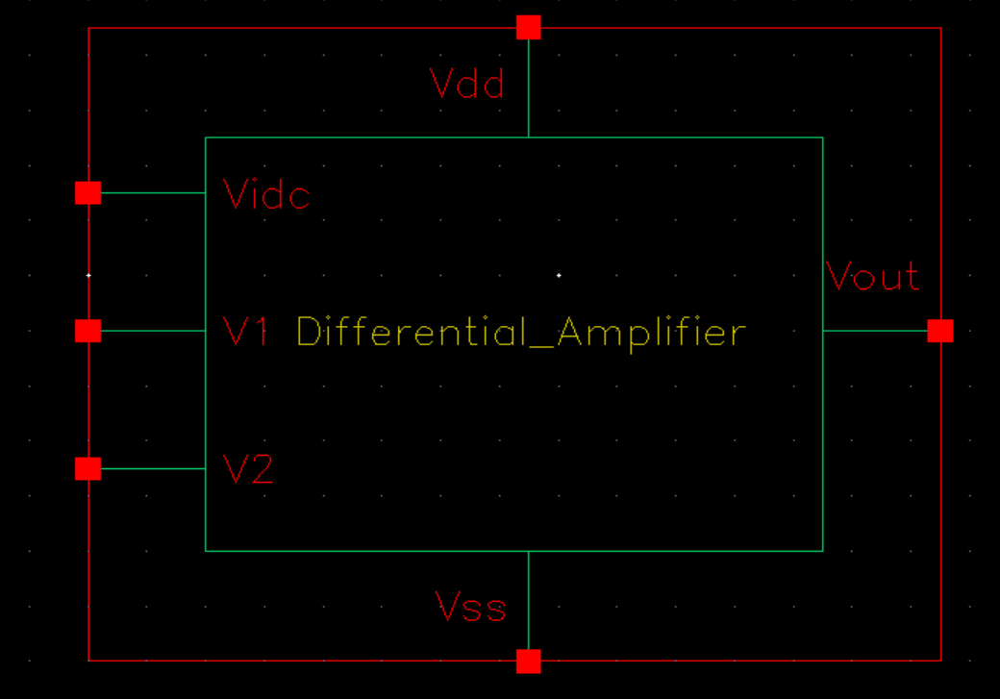

---

## 🧪 Testbench

Testbench used to simulate the amplifier’s transient and frequency behavior.

---

## 📊 Transient Response

Transient simulation result showing dynamic output behavior.

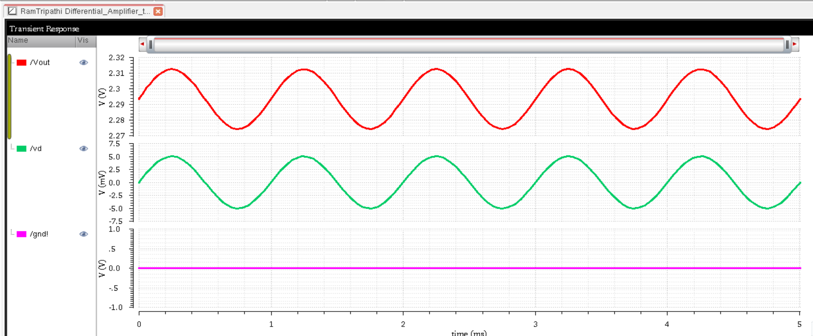

---

## 📈 DC Response

DC sweep analysis to observe the amplifier's operating point and biasing.

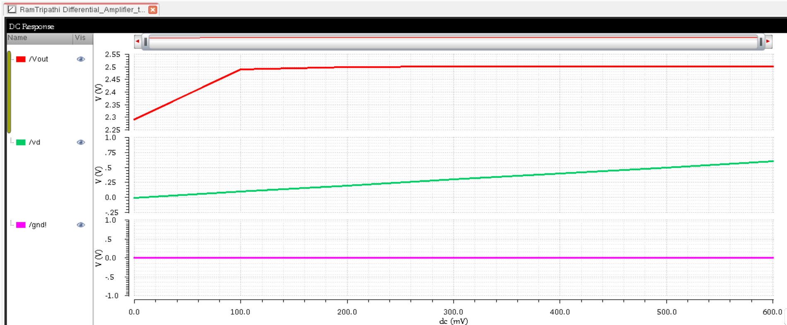

---

## 📉 AC Analysis

AC response showing gain and bandwidth characteristics.

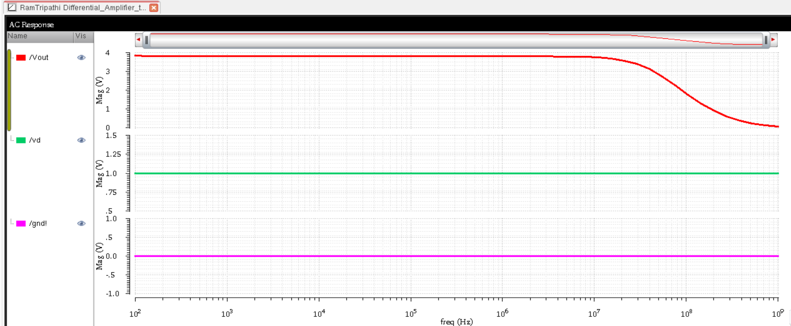

---

## 🏗️ Layout

Layout of the Differential Amplifier created in Virtuoso Layout Editor.

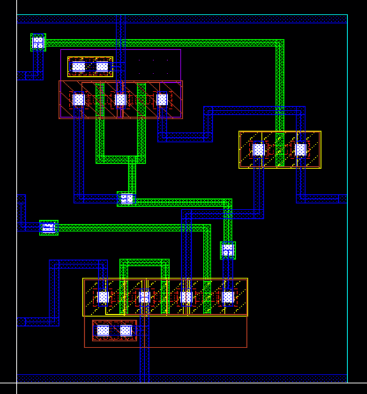

---

## ✅ DRC Check

Design Rule Check completed successfully with no violations.

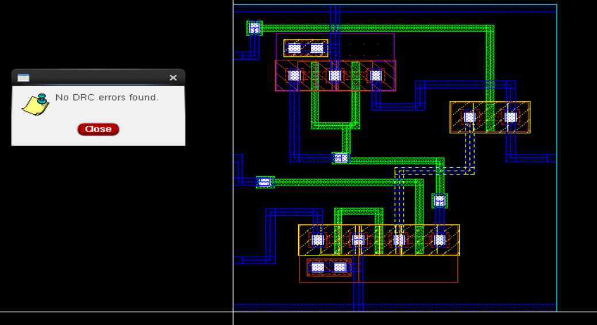

---

## 🔍 LVS Check

Layout Versus Schematic (LVS) check passed.

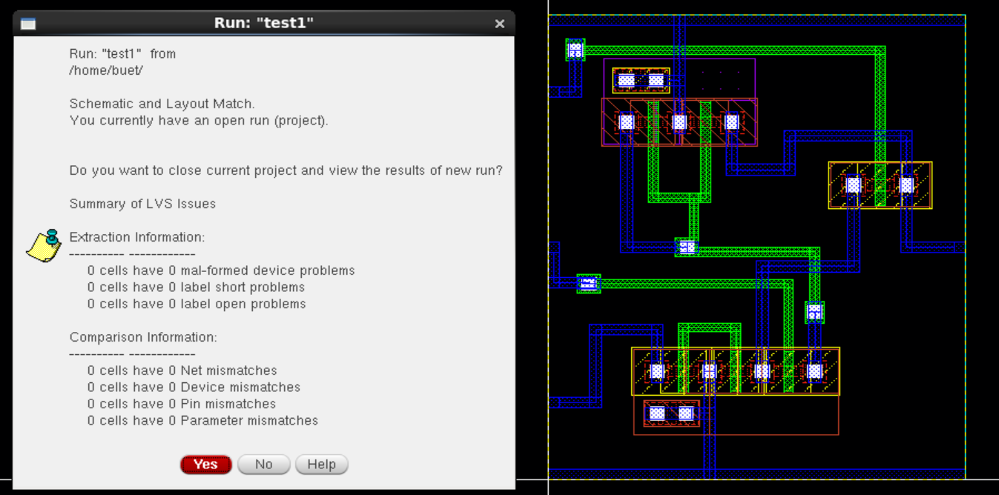

---

## 🧩 Layout vs Schematic Match

The layout and schematic are matched successfully.

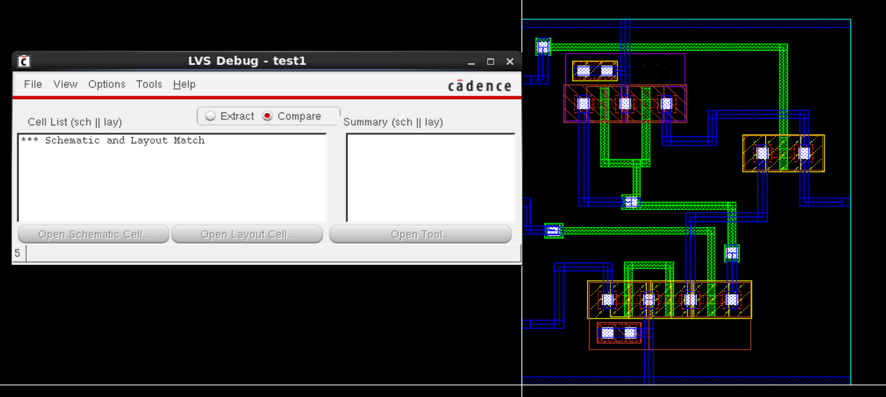

---

## 🧠 RCX Extraction

RC parasitic extraction done for post-layout simulation.

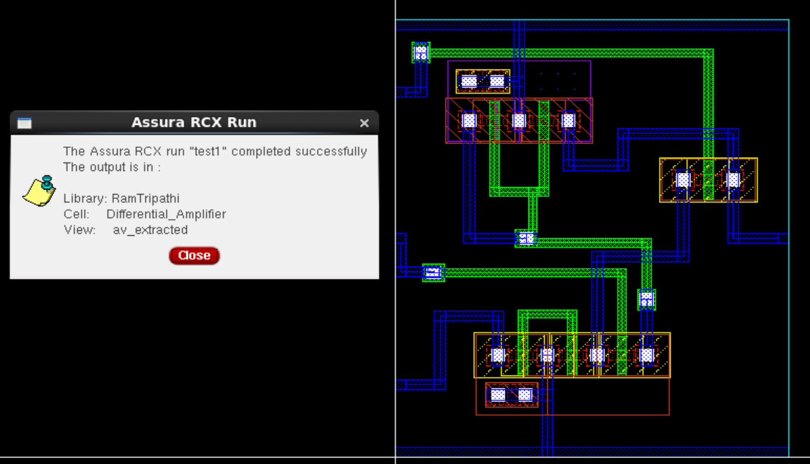

---

## 📡 AV Extracted View

Extracted view of the Differential Amplifier after RCX.

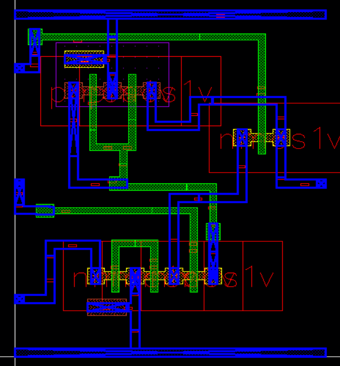

