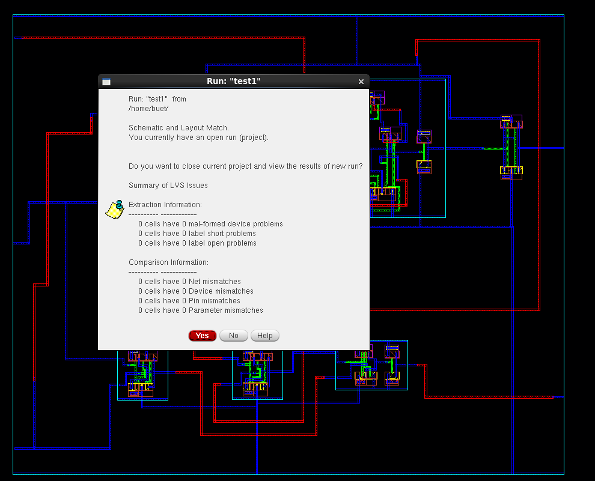

# 🔢 Full Adder Design in Cadence Virtuoso (90nm)

This repository documents the complete **1-bit Full Adder** design using **Cadence Virtuoso**, showcasing schematic creation, symbol generation, layout drawing, simulation, and verification steps such as DRC, LVS, and RC extraction.

---

## 📁 Table of Contents  
- [Schematic](#schematic)  
- [Symbol View](#symbol-view)  
- [Testbench](#testbench)  
- [Transient Simulation](#transient-simulation)  
- [Layout](#layout)  
- [DRC and LVS Checks](#drc-and-lvs-checks)  
- [Schematic vs Layout Matching](#schematic-vs-layout-matching)  
- [RC Extraction](#rc-extraction)  
- [Tools Used](#tools-used)  
- [Author](#author)

---

## Schematic  
The Full Adder was implemented using CMOS logic with combinations of XOR, AND, and OR gates to generate Sum and Carry outputs.

---

## Symbol View  
A hierarchical symbol was generated to ease integration into the testbench.

---

## Testbench  
The testbench provides input combinations of A, B, and Cin to validate the Full Adder functionality.

---

## Transient Simulation  
Functional verification of SUM and CARRY outputs was done through transient analysis using Spectre.

---

## Layout  
A full custom layout was drawn, ensuring optimal transistor placement and routing per 90nm foundry rules.

---

## DRC and LVS Checks

- ✅ **No DRC Errors:**  
  Verified using Assura DRC with zero violations.

  

- ✅ **LVS Clean:**  
  Schematic and layout match confirmed.

  

---

## Schematic vs Layout Matching  
Assura output confirms topological and connectivity consistency between schematic and layout.

---

## RC Extraction  
Parasitic RC components were extracted for post-layout timing and signal integrity analysis.

- **AV View:** Extracted R & C visible  
- **RCX Tool Used:** Assura QRC

  

---

## Tools Used  
- **Cadence Virtuoso** – Schematic, Symbol, and Layout Design  
- **Spectre** – Transient Simulation  
- **Assura** – DRC, LVS, and RC Extraction  
- **GPDK 90nm PDK** – Process Design Kit used for device libraries

---

## Author  
**Ram Tripathi**  
