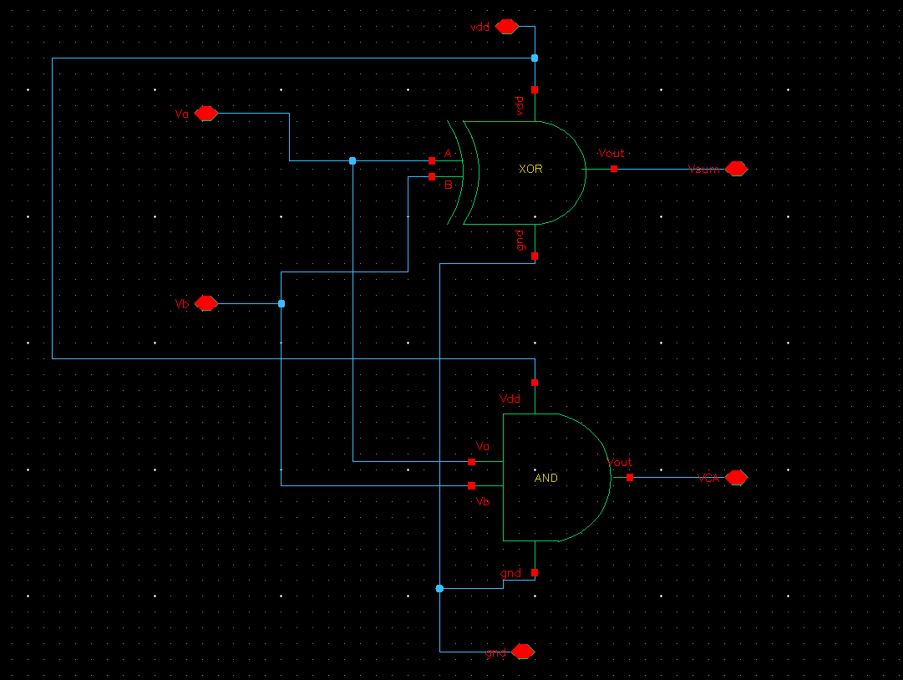
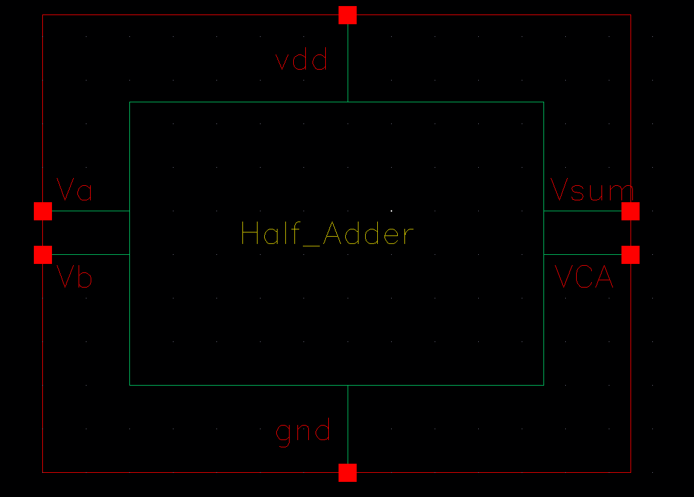
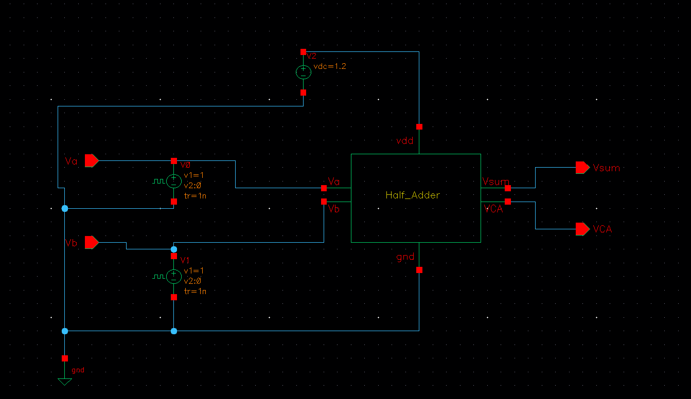
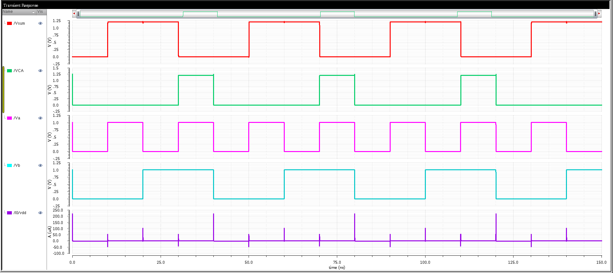
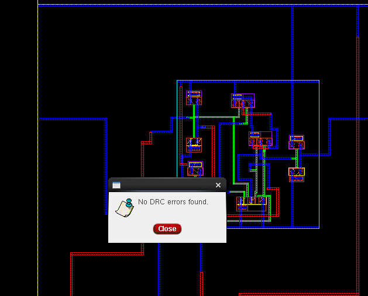
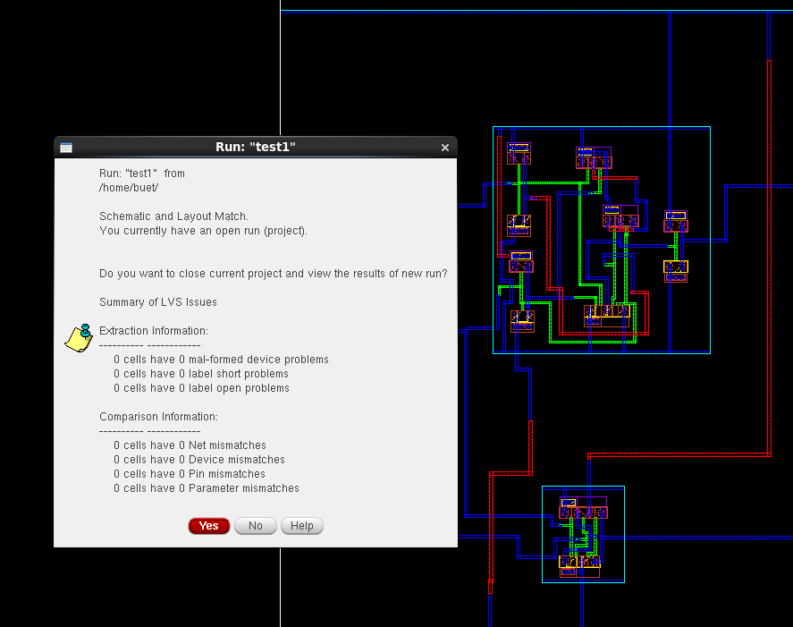
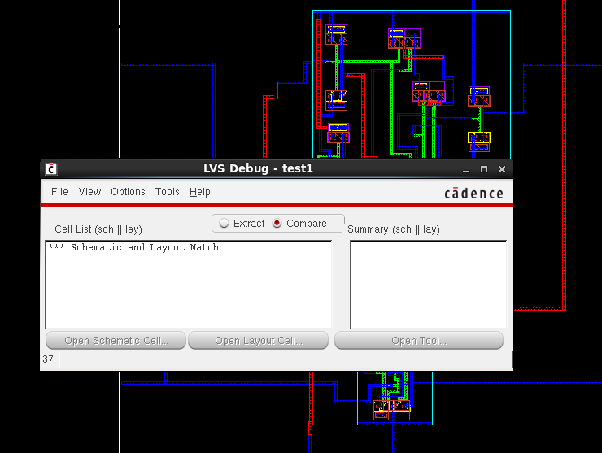
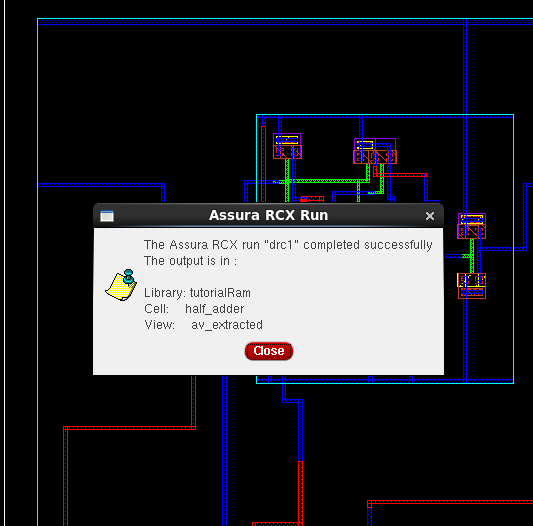
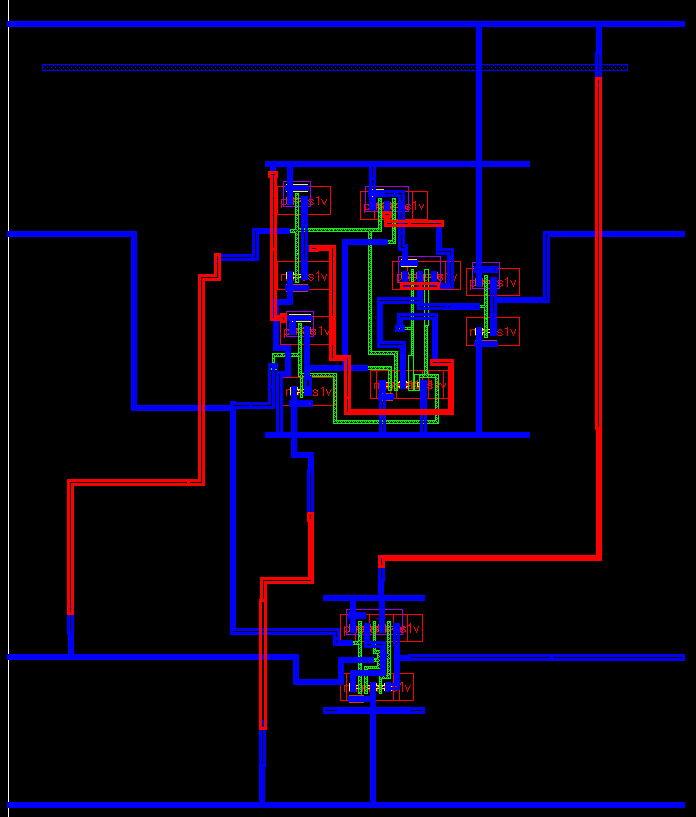
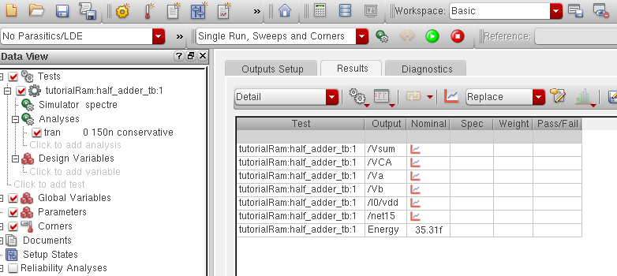

# CMOS Half Adder Design in Cadence Virtuoso

This repository presents the full-custom design and verification of a **CMOS Half Adder** using **Cadence Virtuoso**. The project includes schematic creation, symbol generation, layout design, DRC/LVS verification, RC parasitic extraction, transient simulation, and energy estimation for a single operation cycle.

---

## 📁 Table of Contents  
- [🧩 Schematic](#-schematic)  
- [🎛️ Symbol View](#-symbol-view)  
- [🧪 Testbench Setup](#-testbench-setup)  
- [📈 Transient Simulation](#-transient-simulation)  
- [🧱 Layout](#-layout)  
- [✅ DRC and LVS Checks](#-drc-and-lvs-checks)  
- [🔍 Schematic vs Layout Matching](#-schematic-vs-layout-matching)  
- [🧠 Parasitic Extraction (RCX)](#-parasitic-extraction-rcx)  
- [🧾 AV Extracted View](#-av-extracted-view)  
- [⚡ Energy Estimation](#-energy-estimation)  
- [🛠️ Tools Used](#-tools-used)  
- [👤 Author](#-author)

---

## 🧩 Schematic  
The half adder is designed using CMOS logic to compute both **SUM** and **CARRY** outputs from two binary inputs.

---

## 🎛️ Symbol View  
A symbol was generated from the schematic for hierarchical testbench use.

---

## 🧪 Testbench Setup  
All four binary input combinations (`A`, `B`) were applied to verify the half adder behavior.

---

## 📈 Transient Simulation  
Transient analysis confirms correct logic for SUM (`A ⊕ B`) and CARRY (`A · B`) outputs.

---

## 🧱 Layout  
The layout was drawn manually in Cadence Virtuoso, following 90nm design rules.

---

## ✅ DRC and LVS Checks  

### ✔️ DRC (Design Rule Check)  
No design rule violations were found. Verified using **Assura**.

### ✔️ LVS (Layout vs Schematic)  
The layout matches the schematic netlist perfectly with no mismatches.

---

## 🔍 Schematic vs Layout Matching  
Visual match verification between the layout and schematic to ensure complete functional alignment.

---

## 🧠 Parasitic Extraction (RCX)  
Post-layout **resistor-capacitor (RC)** extraction was performed using **Assura RCX** for more accurate simulation.

---

## 🧾 AV Extracted View  
The **Annotated View** shows detailed parasitic resistances and capacitances mapped onto layout nets.

---

## ⚡ Energy Estimation  
Energy consumption was estimated using post-layout simulation data for one full switching cycle.

---

## 🛠️ Tools Used  
- **Cadence Virtuoso** – Schematic, Layout, Symbol Design  
- **Spectre** – Transient Simulation  
- **Assura** – DRC, LVS, and RCX  
- **ADE L** – Simulation Control and Waveform Viewing

---

## 👤 Author  
**Ram Tripathi**
