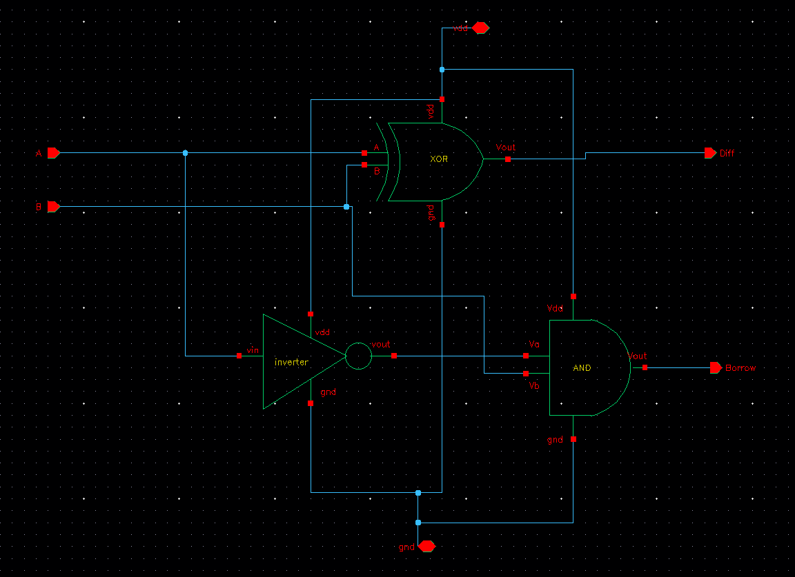
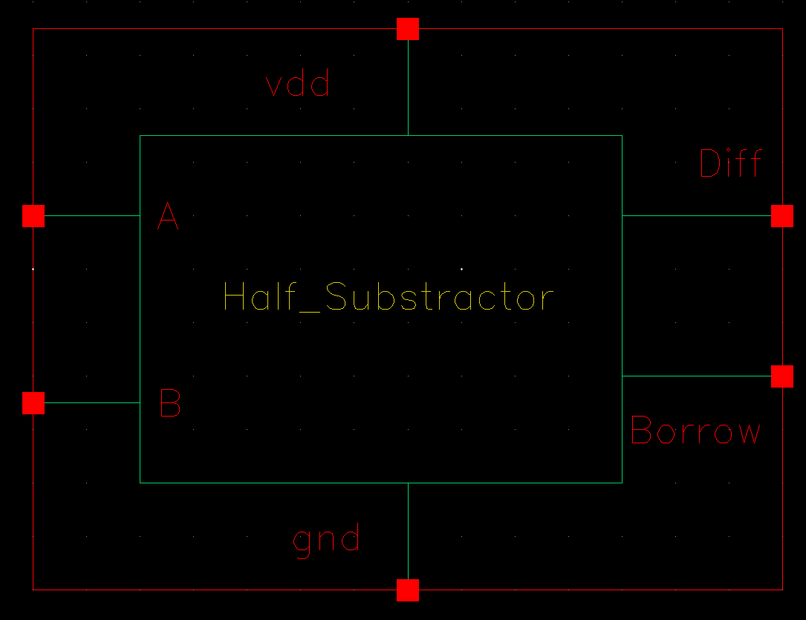
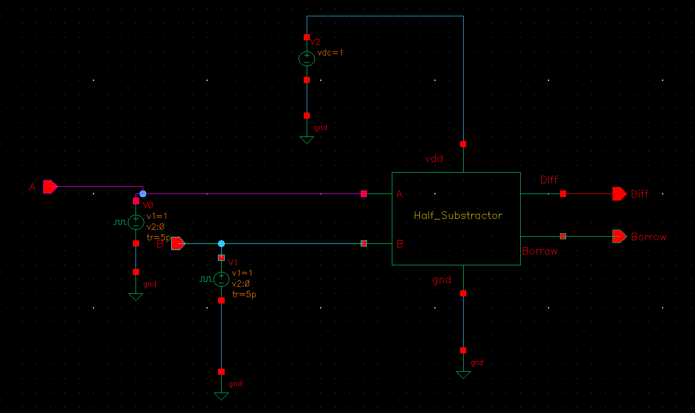
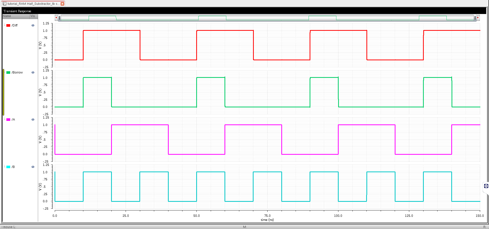
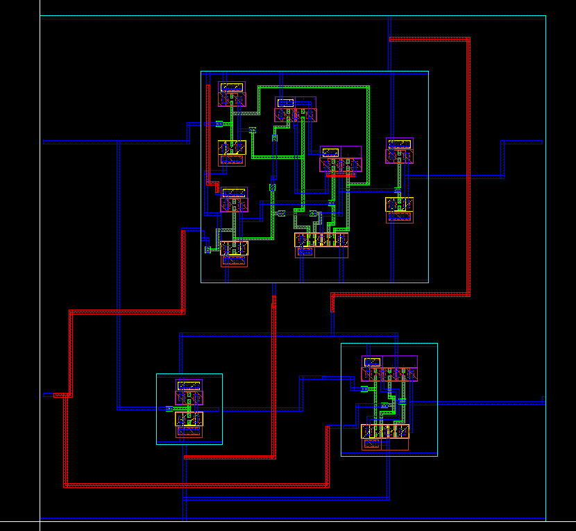
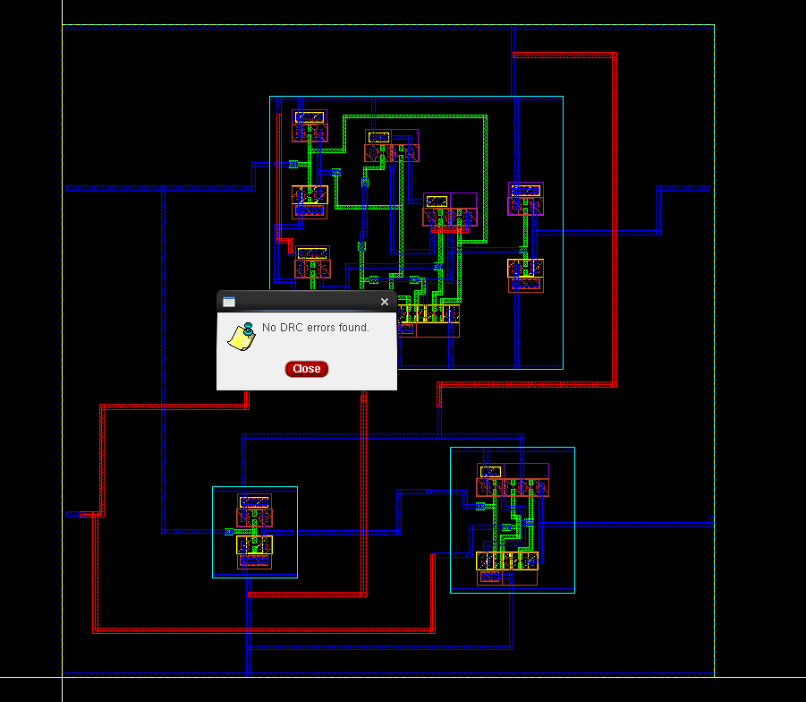
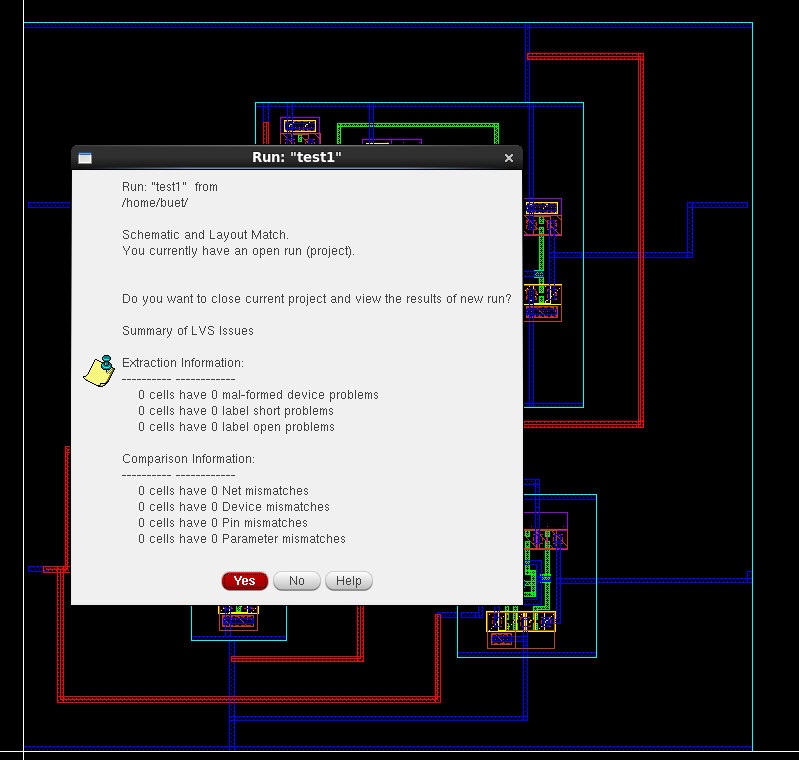
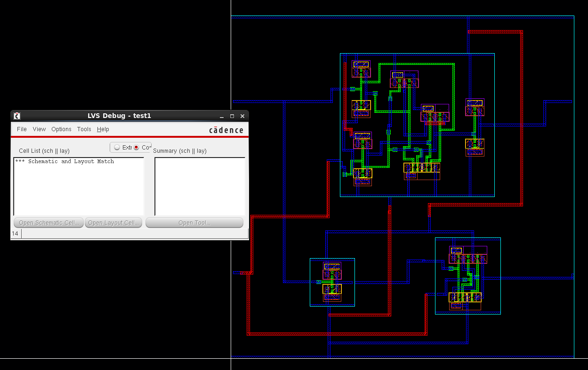
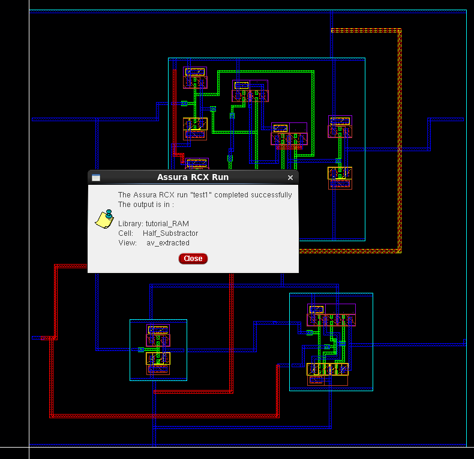
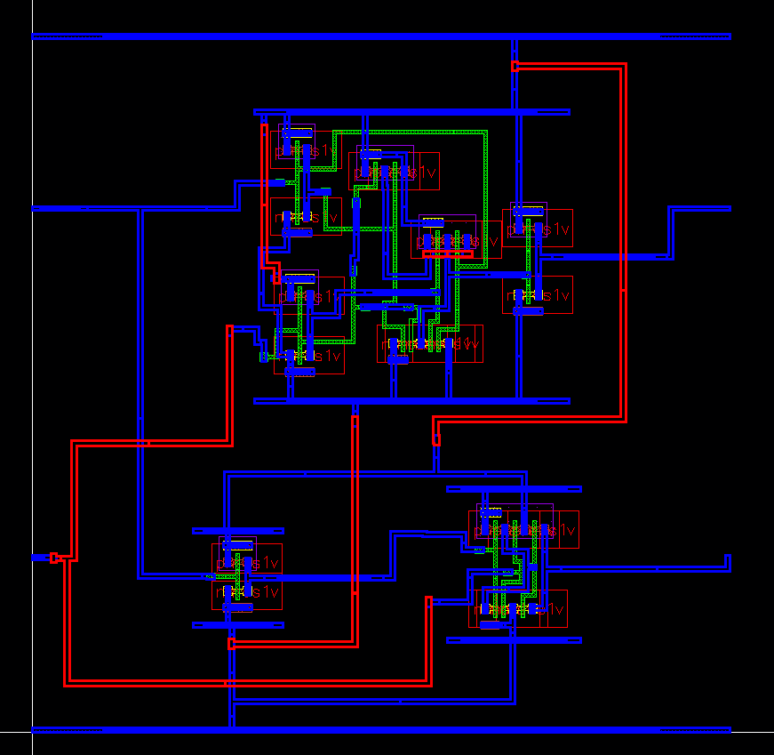

# CMOS Half Subtractor Design in Cadence Virtuoso

This repository documents the complete **CMOS Half Subtractor** design and verification flow in **Cadence Virtuoso**. It covers schematic design, symbol generation, testbench creation, layout implementation, DRC/LVS verification, parasitic extraction, and transient simulation.

---

## Table of Contents  
- [Schematic](#schematic)  
- [Symbol View](#symbol-view)  
- [Testbench](#testbench)  
- [Transient Simulation](#transient-simulation)  
- [Layout](#layout)  
- [DRC and LVS Checks](#drc-and-lvs-checks)  
- [Schematic vs Layout Matching](#schematic-vs-layout-matching)  
- [Parasitic Extraction (RCX)](#parasitic-extraction-rcx)  
- [AV Extracted View](#av-extracted-view)  
- [Tools Used](#tools-used)  
- [Author](#author)

---

## Schematic  
The Half Subtractor circuit is implemented using complementary CMOS logic to compute the difference and borrow outputs for two binary inputs.

---

## Symbol View  
A hierarchical symbol was created from the schematic for clean and reusable testbench integration.

---

## Testbench  
The testbench provides all logic input combinations to validate the Half Subtractor’s functionality.

---

## Transient Simulation  
The simulation results confirm that the Half Subtractor correctly computes the difference and borrow across all input combinations.

---

## Layout  
The layout was created using standard design rules and optimized for area and connectivity.

---

## DRC and LVS Checks

### DRC: Design Rule Check  
The layout passed all DRC checks, ensuring manufacturability and rule compliance.

### LVS: Layout vs Schematic  
LVS verification confirms that the physical layout matches the schematic logic and netlist.

---

## Schematic vs Layout Matching  
This visual comparison validates that the device connections and structure align between schematic and layout views.

---

## Parasitic Extraction (RCX)  
Assura RCX was used to extract parasitic resistances and capacitances from the layout for accurate post-layout simulation.

---

## AV Extracted View  
The AV (Annotated View) represents the extracted parasitics and physical interconnect information used in back-annotated simulations.

---

## Tools Used  
- **Cadence Virtuoso** – Schematic and Layout Design  
- **Spectre Simulator** – Transient and Energy Simulation  
- **Assura** – DRC, LVS, and RC Extraction  
- **ADE L/XL** – Simulation and Analysis Environment  

---

## Author  
**Ram Tripathi**
