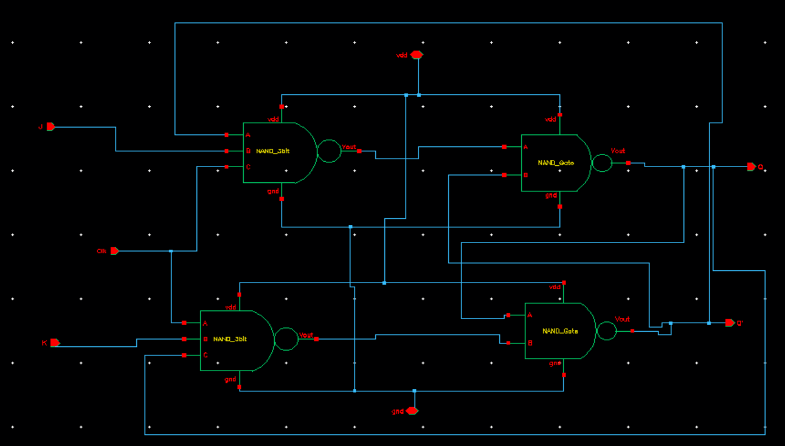
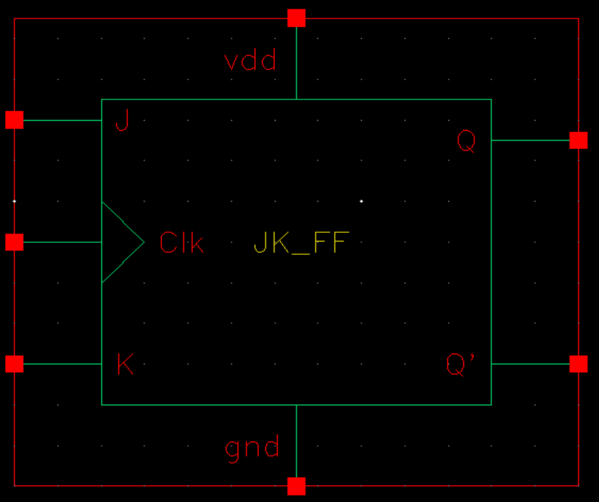
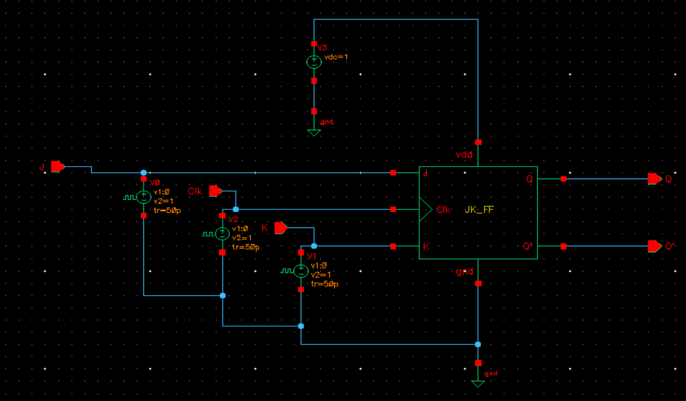
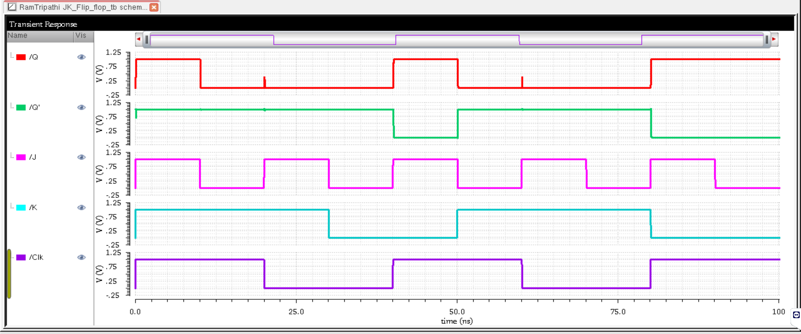
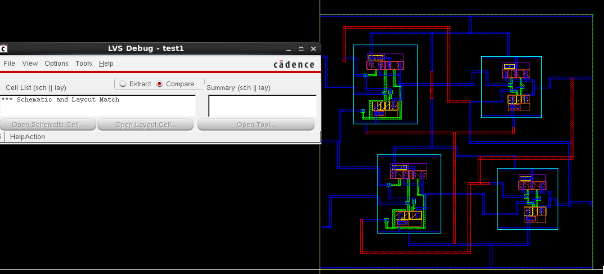
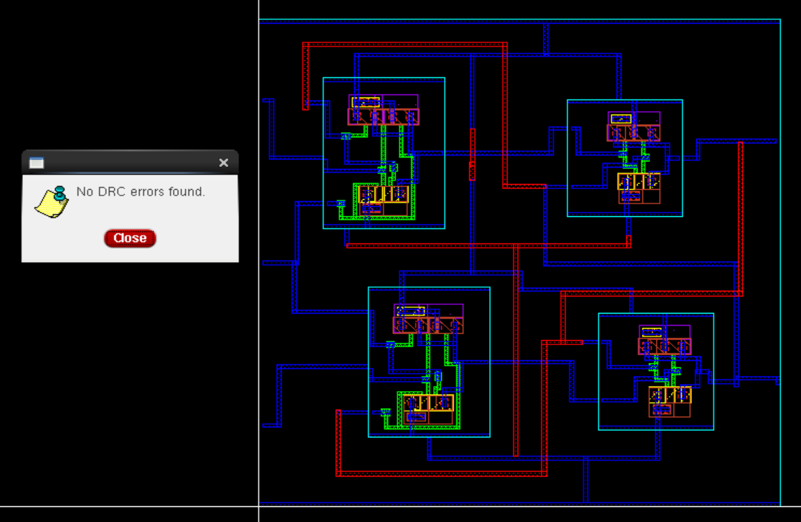
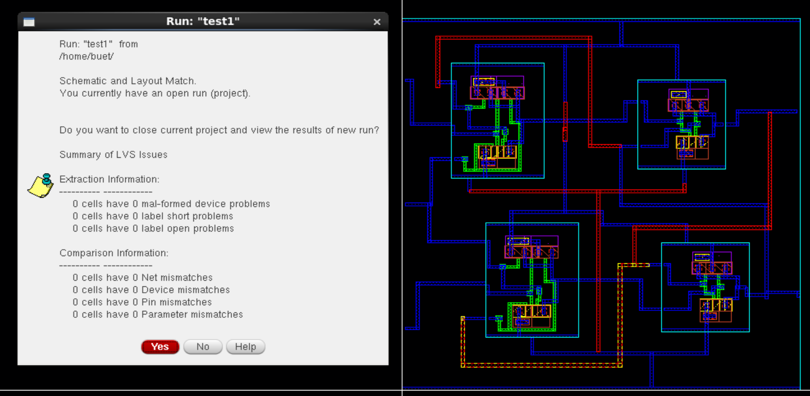
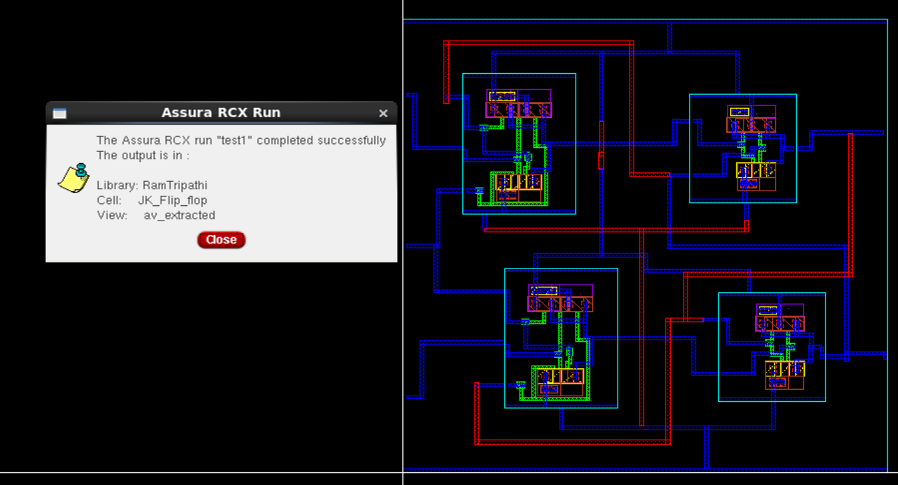
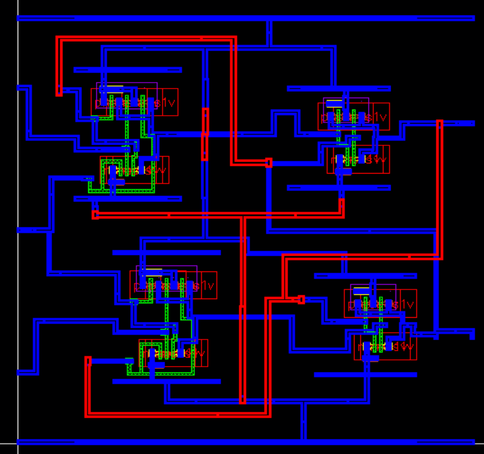

# CMOS JK Flip-Flop Design in Cadence Virtuoso (GPDK 90nm)

This repository documents the complete implementation of a **JK Flip-Flop** using **Cadence Virtuoso** and **GPDK 90nm technology**. The project includes schematic creation, symbol generation, simulation, layout, DRC and LVS verification, RC extraction, and energy estimation.

---

## Table of Contents  
- [Schematic](#schematic)  
- [Symbol View](#symbol-view)  
- [Testbench](#testbench)  
- [Transient Simulation](#transient-simulation)  
- [Layout vs Schematic Matching](#layout-vs-schematic-matching)  
- [DRC and LVS Checks](#drc-and-lvs-checks)  
- [Parasitic Extraction (RCX)](#parasitic-extraction-rcx)  
- [AV Extracted View](#av-extracted-view)  
- [Energy Analysis](#energy-analysis)  
- [Tools Used](#tools-used)  
- [Author](#author)

---

## Schematic  
The JK Flip-Flop was designed using logic gates based on the standard master-slave configuration.

---

## Symbol View  
A symbol was created for the JK Flip-Flop to enable hierarchical design and reuse.

---

## Testbench  
The testbench applies various input combinations to validate the correct operation of the JK Flip-Flop.

---

## Transient Simulation  
Simulation verifies the flip-flop's timing and functional behavior in response to inputs and clock signals.

---

## Layout vs Schematic Matching  
The layout is verified to accurately match the schematic through layout vs schematic (LVS) matching tools.

---

## DRC and LVS Checks

### DRC: Design Rule Check  
The layout passes all design rule checks.

### LVS: Layout vs Schematic  
The layout and schematic are confirmed to be electrically equivalent.

---

## Parasitic Extraction (RCX)  
RCX analysis extracts parasitic capacitances and resistances for accurate post-layout simulation.

---

## AV Extracted View  
The extracted view incorporates parasitics and is used for refined simulation analysis.

---

## Energy Analysis  
This figure shows the estimated energy consumed during one clock cycle of operation.

.png)

---

## Tools Used  
- **Cadence Virtuoso** (Schematic, Layout, Simulation)  
- **GPDK 90nm** PDK  
- **Assura** for DRC, LVS, RCX  
- **Spectre** for transient simulation

---

## Author  
**Ram Tripathi**
