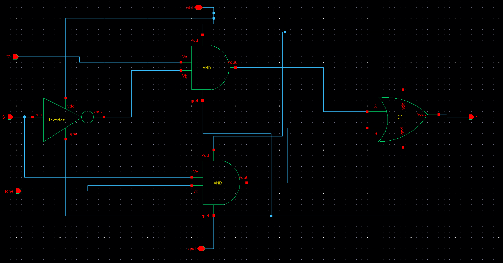
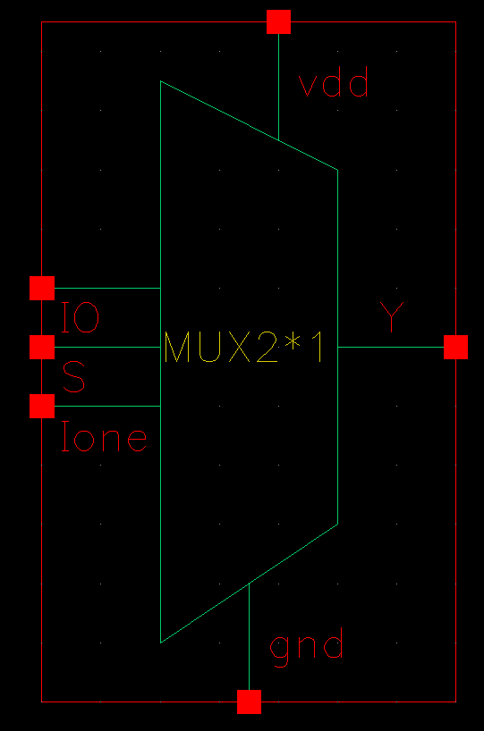
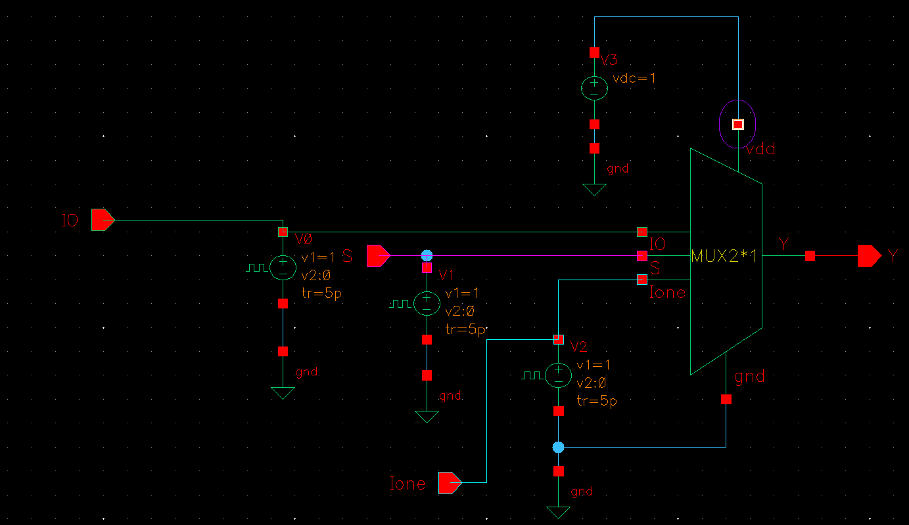
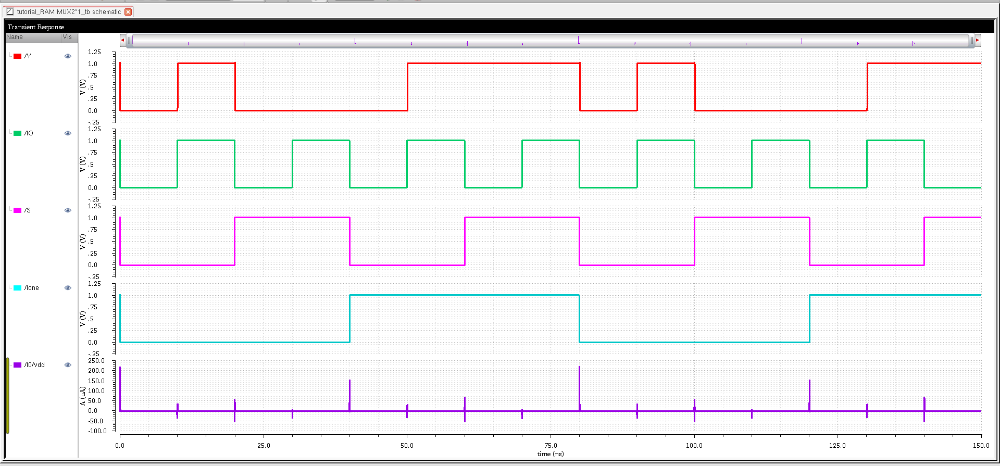
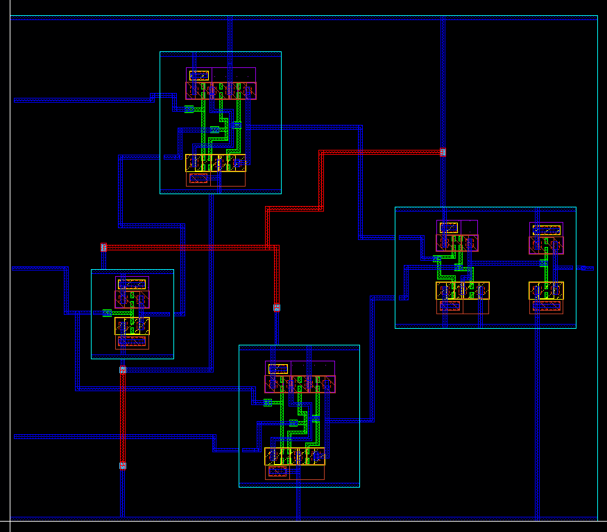
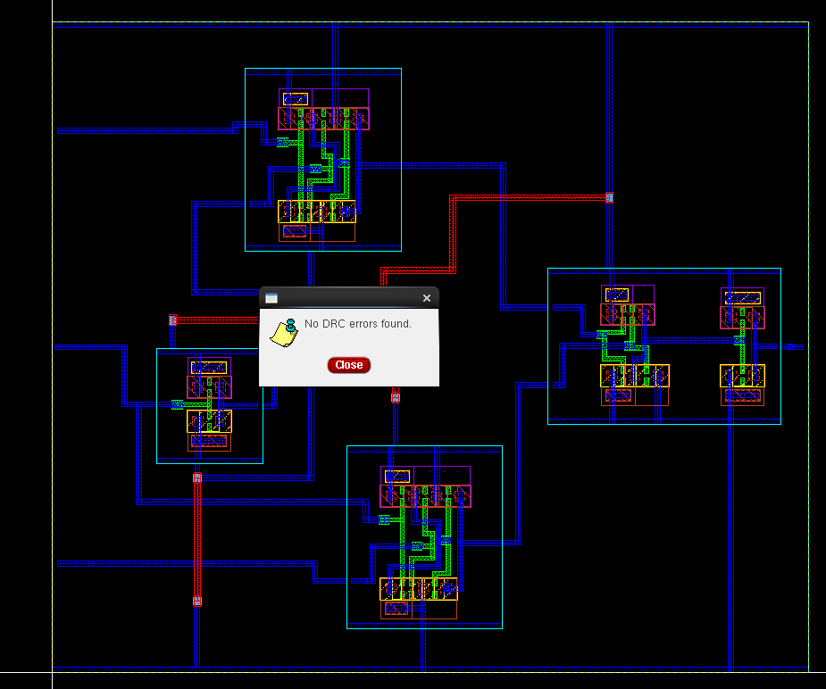
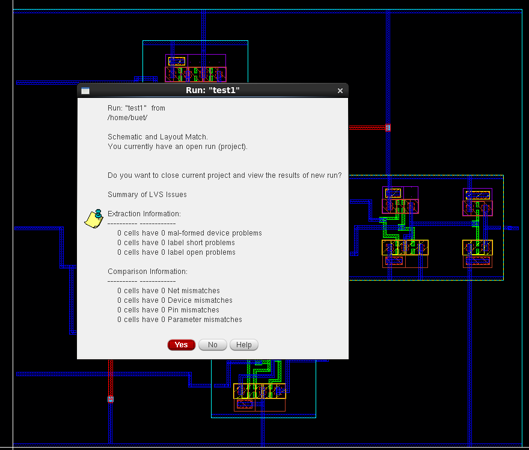
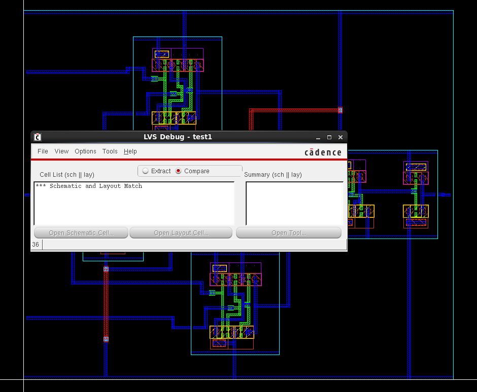
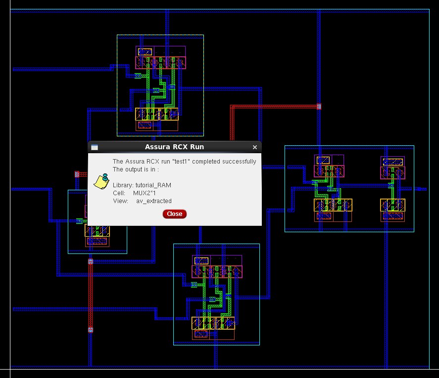
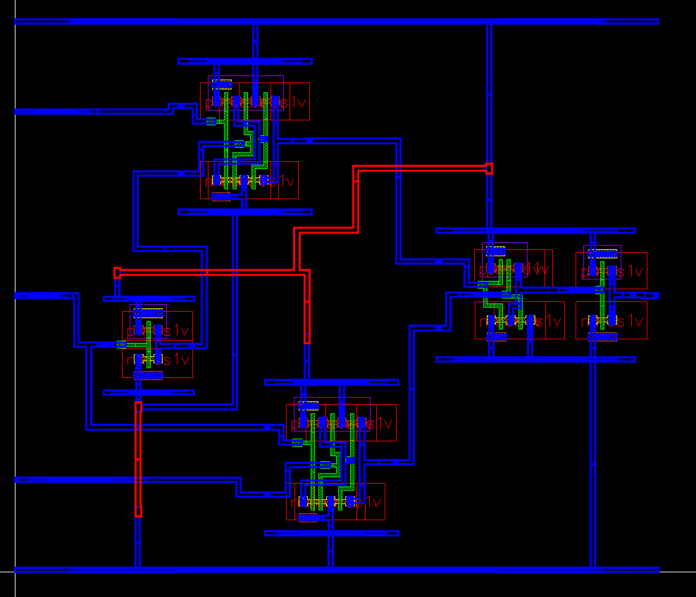

# CMOS 2×1 Multiplexer (MUX) Design in Cadence Virtuoso

This repository presents the complete design and verification flow of a **2×1 CMOS Multiplexer** using **Cadence Virtuoso**. It includes schematic creation, symbol generation, testbench setup, layout design, DRC/LVS verification, RC parasitic extraction, and transient simulation analysis.

---

## Table of Contents  
- [Schematic](#schematic)  
- [Symbol View](#symbol-view)  
- [Testbench](#testbench)  
- [Transient Simulation](#transient-simulation)  
- [Layout](#layout)  
- [DRC and LVS Checks](#drc-and-lvs-checks)  
- [Schematic vs Layout Matching](#schematic-vs-layout-matching)  
- [Parasitic Extraction (RCX)](#parasitic-extraction-rcx)  
- [AV Extracted View](#av-extracted-view)  
- [Tools Used](#tools-used)  
- [Author](#author)

---

## Schematic  
The 2×1 multiplexer is designed using complementary CMOS logic. It selects one of two data inputs based on a single select line.

---

## Symbol View  
A symbol was generated from the schematic for use in hierarchical design and simulation testbench creation.

---

## Testbench  
The testbench tests all combinations of inputs and the select line to verify correct selection behavior of the MUX.

---

## Transient Simulation  
The simulation results confirm that the output switches correctly between the inputs based on the select line.

---

## Layout  
The physical layout of the 2×1 MUX was drawn and optimized while adhering to the standard design rules.

---

## DRC and LVS Checks

### DRC: Design Rule Check  
Design successfully passed all DRC rules and is ready for fabrication.

### LVS: Layout vs Schematic  
LVS verification confirms that the netlists from the schematic and layout match exactly.

---

## Schematic vs Layout Matching  
This visual comparison confirms the structural and connectivity accuracy between the schematic and the layout.

---

## Parasitic Extraction (RCX)  
RC extraction was performed using Assura RCX, providing parasitic resistance and capacitance values for accurate post-layout simulation.

---

## AV Extracted View  
The Annotated View (AV) shows extracted parasitics and interconnect information essential for back-annotation.

---

## Tools Used  
- **Cadence Virtuoso** – Schematic and Layout Design  
- **Spectre Simulator** – Functional and Transient Simulation  
- **Assura** – DRC, LVS, and RC Extraction  
- **ADE L/XL** – Simulation and Waveform Analysis  

---

## Author  
**Ram Tripathi**
