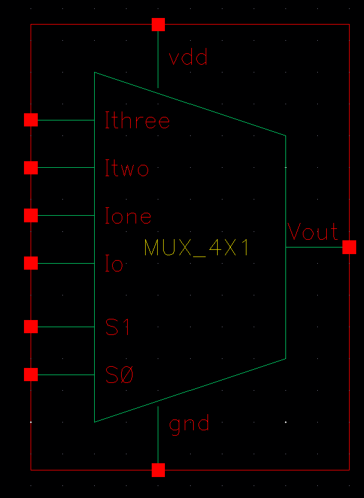

# CMOS 4×1 Multiplexer (MUX) Design in Cadence Virtuoso

This repository documents the design, layout, and verification of a **4×1 CMOS Multiplexer** using **Cadence Virtuoso**. The complete flow includes schematic design, testbench setup, layout creation, DRC/LVS verification, parasitic extraction, and transient simulation.

---

## Table of Contents  
- [Schematic](#schematic)  
- [Symbol View](#symbol-view)  
- [Testbench](#testbench)  
- [Transient Simulation](#transient-simulation)  
- [Layout](#layout)  
- [DRC and LVS Checks](#drc-and-lvs-checks)  
- [Schematic vs Layout Matching](#schematic-vs-layout-matching)  
- [Parasitic Extraction (RCX)](#parasitic-extraction-rcx)  
- [AV Extracted View](#av-extracted-view)  
- [Tools Used](#tools-used)  
- [Author](#author)

---

## Schematic  
The 4×1 MUX selects one of four input lines (`I0`, `I1`, `I2`, `I3`) based on two select signals (`S1`, `S0`) and forwards it to the output.

---

## Symbol View  
A symbol was generated from the schematic to enable hierarchical design and cleaner testbench integration.

---

## Testbench  
The testbench applies all input and select line combinations to ensure the MUX behaves correctly for all cases.

---

## Transient Simulation  
The simulation waveform confirms the 4×1 MUX's correct functionality: the output (`Vout`) follows the selected input (`I0`–`I3`) based on the select signals.

---

## Layout  
The physical layout of the 4×1 MUX is drawn using CMOS transistors while maintaining optimal area and adherence to DRC rules.

---

## DRC and LVS Checks

### DRC: Design Rule Check  
The layout passed all design rule checks and is fabrication-ready.

### LVS: Layout vs Schematic  
The layout was successfully verified against the schematic using LVS.  

  

---

## Schematic vs Layout Matching  
A visual comparison confirms that the schematic and layout structures match in device count and net connectivity.

---

## Parasitic Extraction (RCX)  
Parasitic resistance and capacitance values were extracted using Assura RCX to perform post-layout simulation.

---

## AV Extracted View  
The AV view displays the netlist including parasitics for accurate back-annotated simulation and timing validation.

---

## Tools Used  
- **Cadence Virtuoso** – Schematic and Layout Design  
- **Spectre / ADE L/XL** – Transient and Functional Simulation  
- **Assura** – DRC, LVS, and Parasitic RC Extraction  

---

## Author  
**Ram Tripathi**
