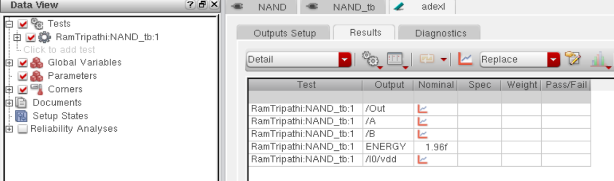

# CMOS NAND Gate Design in Cadence Virtuoso

This repository contains the complete implementation of a **2-input NAND gate** using **Cadence Virtuoso**. The project includes schematic design, testbench development, transient simulation, layout creation, verification (DRC/LVS), RC parasitic extraction, and delay/energy analysis.

---

## Table of Contents  
- [Schematic](#schematic)  
- [Symbol View](#symbol-view)  
- [Testbench](#testbench)  
- [Transient Simulation](#transient-simulation)  
- [Layout](#layout)  
- [DRC and LVS Checks](#drc-and-lvs-checks)  
- [Schematic vs Layout Matching](#schematic-vs-layout-matching)  
- [Parasitic Extraction (RCX)](#parasitic-extraction-rcx)  
- [AV Extracted View](#av-extracted-view)  
- [Delay Analysis](#delay-analysis)  
- [Energy Estimation](#energy-estimation)  
- [Tools Used](#tools-used)  
- [Author](#author)

---

## Schematic  
The 2-input NAND gate outputs logic low only when both inputs are high. It is implemented using CMOS logic.

---

## Symbol View  
A custom symbol was created to allow hierarchical integration in larger designs and testbenches.

---

## Testbench  
A comprehensive testbench was designed to apply all possible input combinations to the NAND gate and verify its functionality.

---

## Transient Simulation  
The waveform below confirms that the NAND gate produces the correct output for all input combinations. The output is high for all cases except when both inputs are high.

---

## Layout  
The layout of the NAND gate was created following the 90nm CMOS design rules using Cadence Virtuoso's layout editor.

---

## DRC and LVS Checks

### DRC: Design Rule Check  
The layout passed all design rule checks without violations.

### LVS: Layout vs Schematic  
The layout netlist matches the schematic netlist, confirming the design correctness.

---

## Schematic vs Layout Matching  
A visual comparison of the schematic and layout was performed to confirm logical and structural equivalence.

---

## Parasitic Extraction (RCX)  
RC parasitics were extracted using Assura RCX to enable realistic post-layout simulation and power/delay analysis.

---

## Delay Analysis  
The propagation delay of the NAND gate was measured from the transient simulation using the extracted view.

---

## Energy Estimation  
The energy consumed by the NAND gate during a single transition cycle was estimated using ADE simulation results.

---

## Tools Used  
- **Cadence Virtuoso** – Schematic & Layout Design  
- **Spectre / ADE L/XL** – Simulation and Waveform Analysis  
- **Assura** – DRC, LVS, and RCX Extraction  

---

## Author  
**Ram Tripathi**
