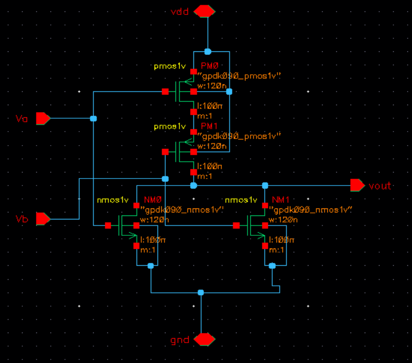
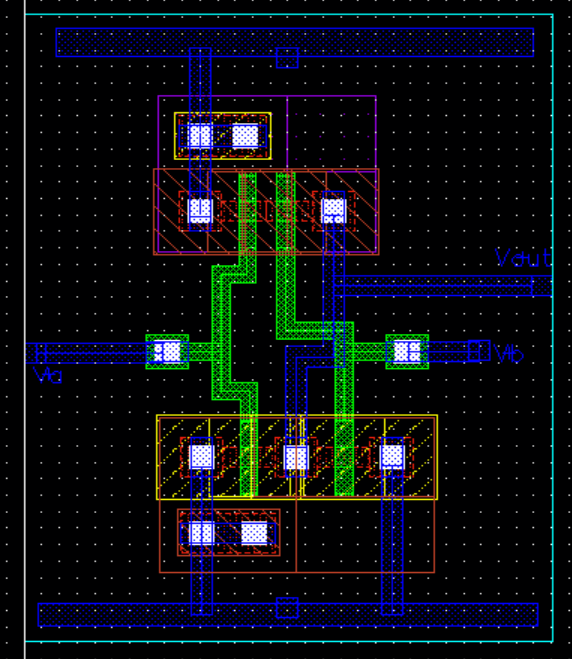
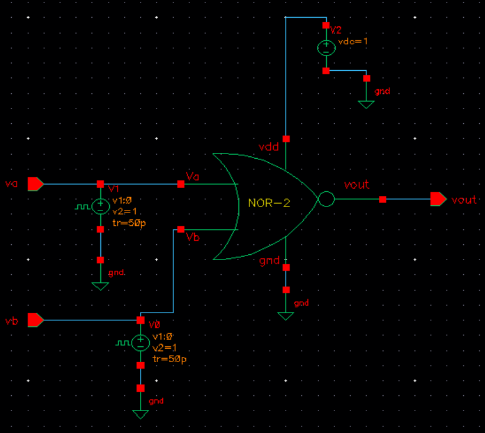
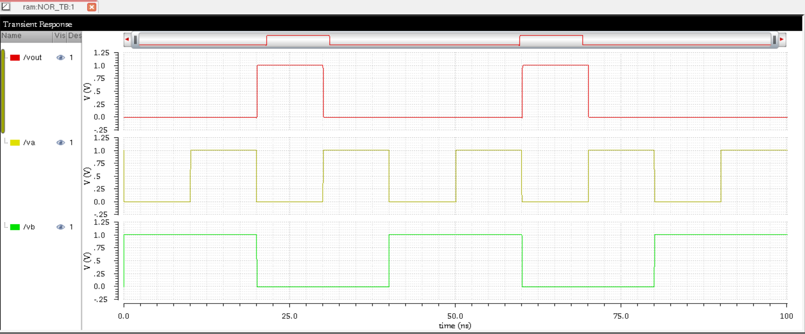

This repository demonstrates the design and simulation of a **NOR Gate** using **Cadence Virtuoso**. It includes the **schematic, layout, testbench circuit, and output waveforms**. 

Technology : Generic Process Design Kit 90nm

## Table of Contents  
- [Schematic](#schematic)  
- [Layout](#layout)  
- [Testbench Circuit](#testbench-circuit)  
- [Simulation and Output Waveform](#simulation-and-output-waveform)  
- [Tools Used](#tools-used)  

---

## Schematic  
The schematic of the NOR gate is designed using **Cadence Virtuoso**.  

  

---

## Layout  
The layout follows **design rules (DRC)** and has been verified for **LVS**.  

  

---

## Testbench Circuit  
The testbench is designed to verify the functionality of the NOR gate.  

  

---

## Simulation and Output Waveform  
The waveform below shows the NOR gate's response to different input conditions.  

  

---

## Tools Used  
- **Cadence Virtuoso** – Schematic and Layout Design  
- **Spectre Simulator** – Circuit Simulation  
- **Assura** – DRC & LVS Checks  

---

## Author  
**Ram Tripathi**  

