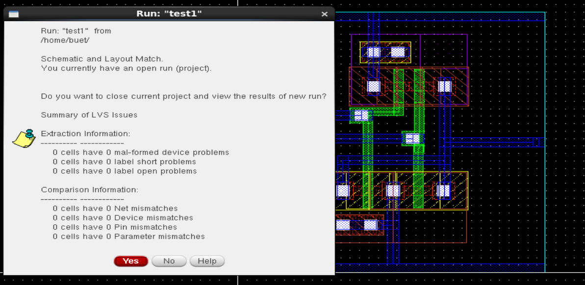

# CMOS NOR Gate Implementation in Cadence Virtuoso

This repository presents the complete CMOS design flow of a **NOR Gate** using **Cadence Virtuoso** and **GPDK 90nm** technology. The flow includes schematic design, symbol creation, testbench simulation, layout creation, DRC/LVS verification, parasitic extraction (RCX), and energy estimation.

---

## Table of Contents  
- [Schematic](#schematic)  
- [Symbol View](#symbol-view)  
- [Testbench](#testbench)  
- [Transient Simulation](#transient-simulation)  
- [Layout](#layout)  
- [DRC and LVS Checks](#drc-and-lvs-checks)  
- [Schematic vs Layout Matching](#schematic-vs-layout-matching)  
- [Parasitic Extraction (RCX)](#parasitic-extraction-rcx)  
- [AV Extracted View](#av-extracted-view)  
- [Energy Analysis](#energy-analysis)  
- [Tools Used](#tools-used)  
- [Author](#author)

---

## Schematic  
The NOR gate is implemented using CMOS pull-up and pull-down networks.

---

## Symbol View  
A custom symbol was created for the NOR gate to support hierarchy and simplify integration into larger designs.

---

## Testbench  
The testbench applies all input combinations to verify the logic behavior of the NOR gate.

---

## Transient Simulation  
Transient simulation confirms correct NOR logic behavior across all input states.

---

## Layout  
The NOR gate layout adheres to 90nm CMOS design rules and is optimized for area and performance.

---

## DRC and LVS Checks

### DRC: Design Rule Check  
The design passed all DRC checks without violations.

### LVS: Layout vs Schematic  
LVS confirms netlist equivalency between layout and schematic.

---

## Schematic vs Layout Matching  
Visual comparison ensures alignment between schematic and layout implementations.

---

## Parasitic Extraction (RCX)  
RCX extracts resistance and capacitance values from the layout for accurate post-layout simulation.

---

## AV Extracted View  
The AV extracted view includes parasitic elements used in post-layout simulations.

---

## Energy Analysis  
The NOR gate demonstrates efficient energy usage with an estimated switching energy in the femtojoule range, typical for GPDK 90nm CMOS technology.

---

## Tools Used  
- **Cadence Virtuoso** – Schematic and Layout Design  
- **Assura** – DRC, LVS, and RCX Extraction  
- **Spectre / ADE L/XL** – Transient Simulation and Energy Estimation  

---

## Author  
**Ram Tripathi**
