# CMOS OR Gate Design in Cadence Virtuoso

This repository contains the full-custom design and simulation of a **CMOS OR Gate** implemented using **Cadence Virtuoso**. It includes schematic design, symbol generation, testbench simulation, layout implementation, DRC/LVS verification, post-layout RC extraction, and energy estimation.

---

## Table of Contents  
- [Schematic](#schematic)  
- [Symbol View](#symbol-view)  
- [Testbench](#testbench)  
- [Transient Simulation](#transient-simulation)  
- [Layout](#layout)  
- [DRC and LVS Checks](#drc-and-lvs-checks)  
- [LVS Match View](#lvs-match-view)  
- [Parasitic Extraction (RCX)](#parasitic-extraction-rcx)  
- [AV Extracted View](#av-extracted-view)  
- [Energy Estimation](#energy-estimation)  
- [Tools Used](#tools-used)  
- [Author](#author)

---

## Schematic  
The OR gate is designed using complementary CMOS logic. It outputs HIGH if either input is HIGH.

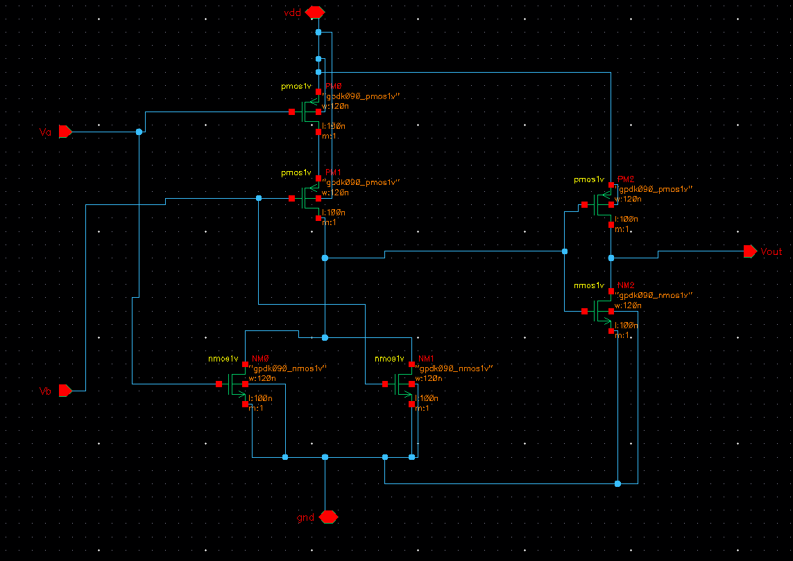

---

## Symbol View  
A custom symbol view was generated to enable modular design and testbench integration.

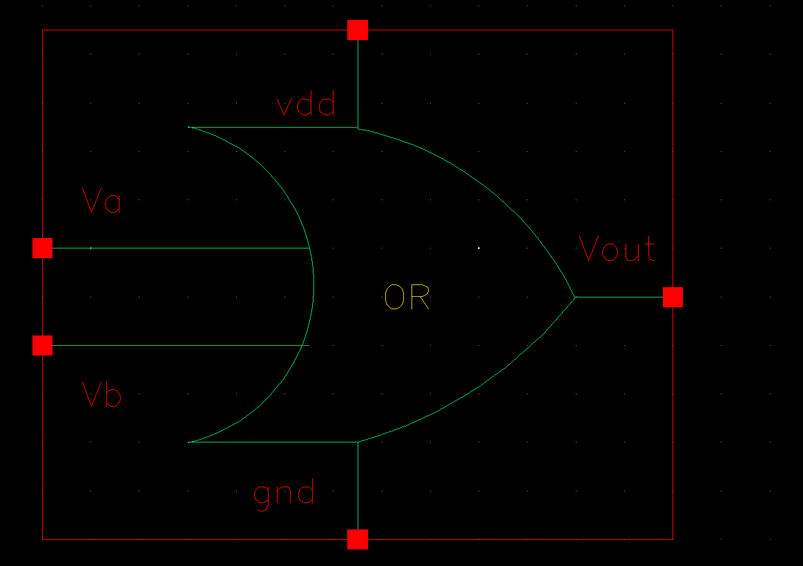

---

## Testbench  
The testbench applies all binary input combinations (`A`, `B`) to validate the OR gate’s logic.

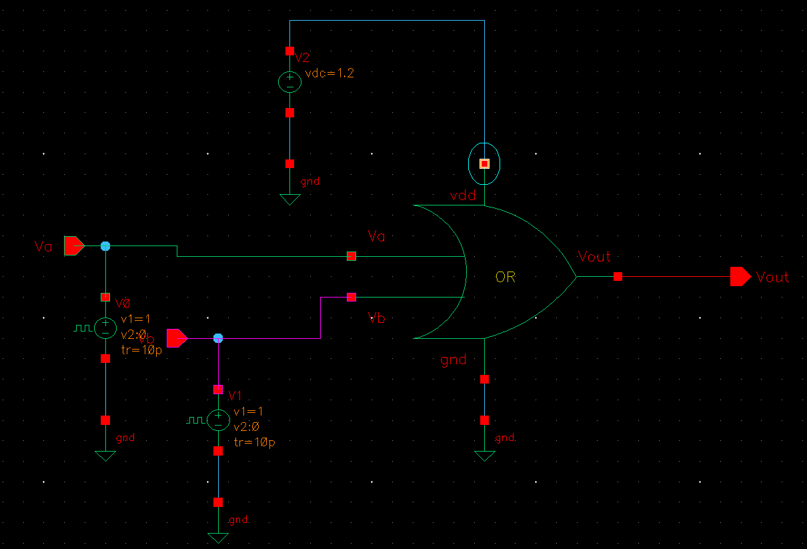

---

## Transient Simulation  
Transient simulation confirms correct OR gate behavior under all logic transitions.

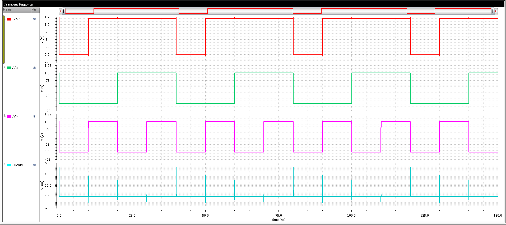

---

## Layout  
The layout was created using Cadence Virtuoso, following 90nm CMOS design rules.

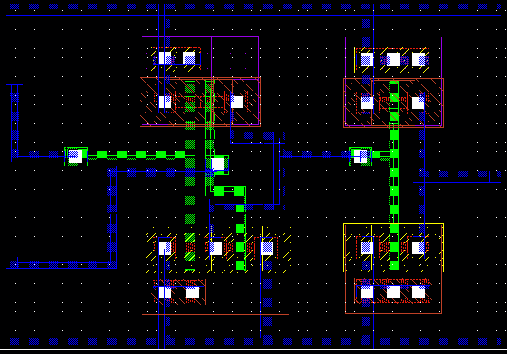

---

## DRC and LVS Checks

### DRC: Design Rule Check  
No design rule violations were found. Verified using **Assura DRC**.

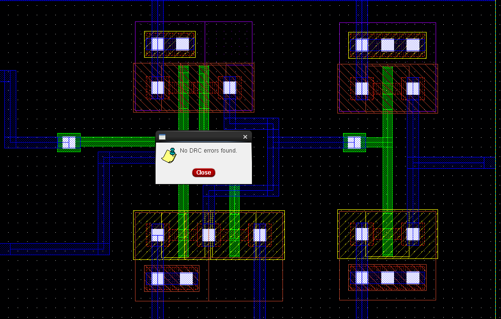

### LVS: Layout vs Schematic  
The layout matches the schematic in both topology and connectivity.

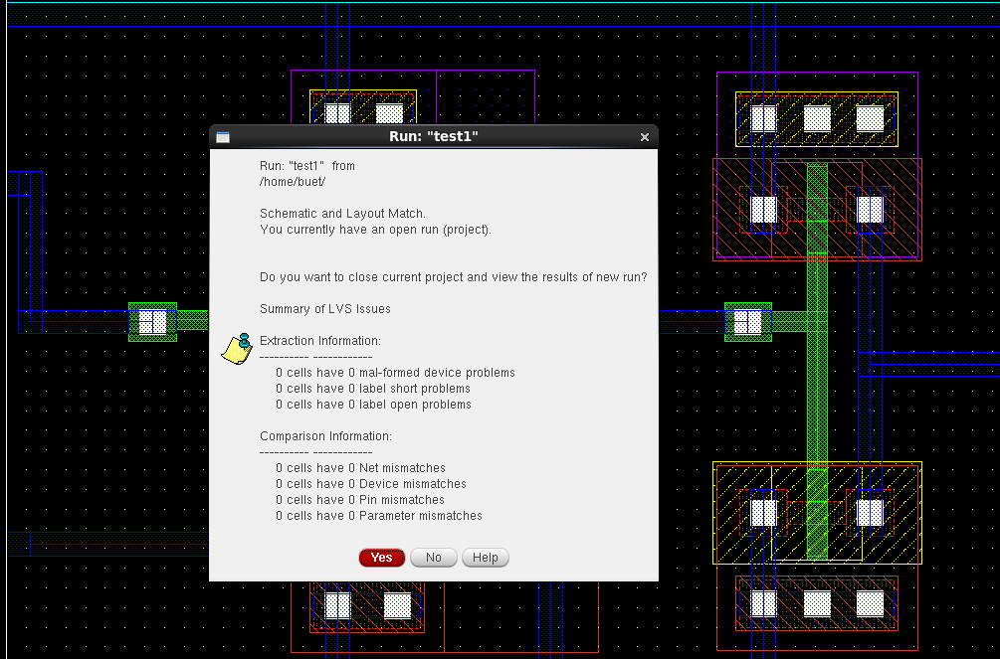

---

## LVS Match View  
Visual match between schematic netlist and layout confirms correctness.

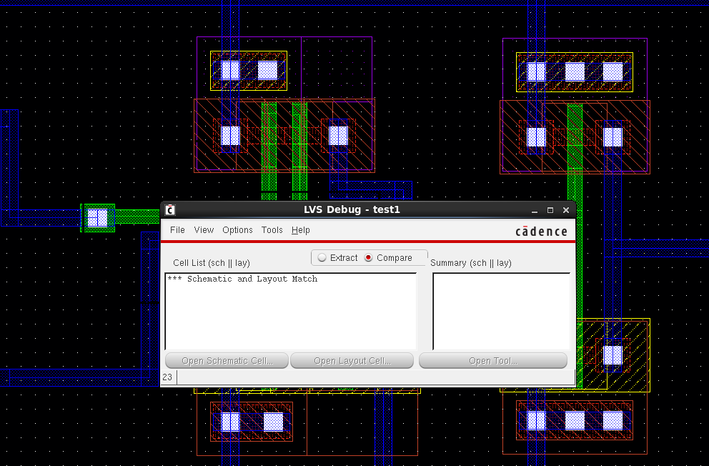

---

## Parasitic Extraction (RCX)  
RC parasitic extraction was done to account for layout-related R and C during post-layout simulation.

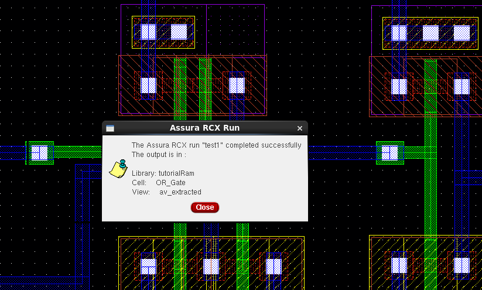

---

## AV Extracted View  
The AV (Annotated View) highlights the extracted parasitic components on layout interconnects.

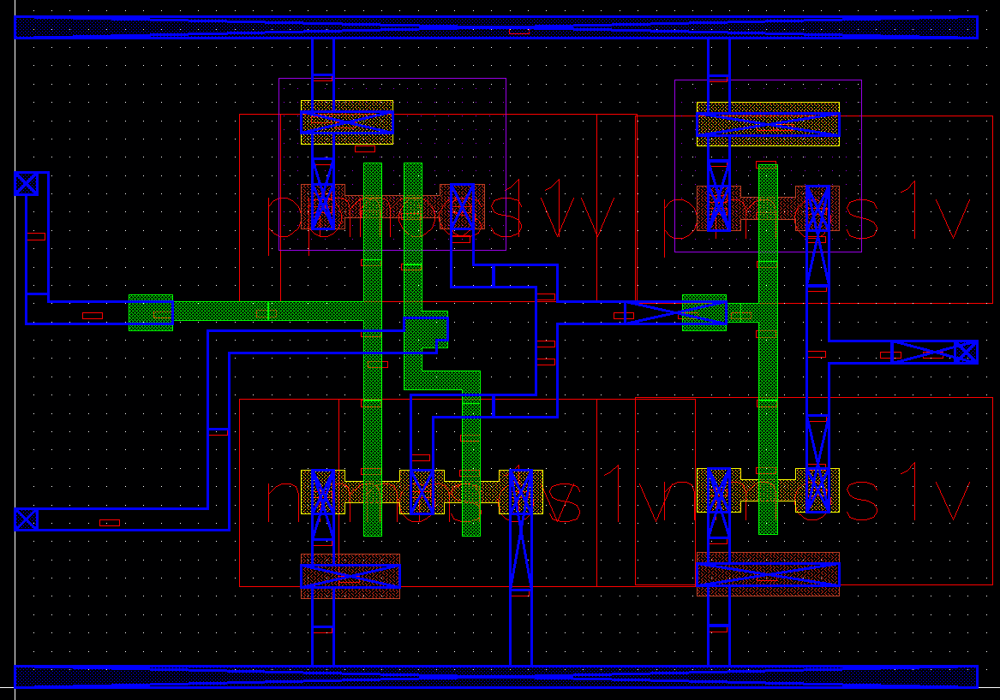

---

## Energy Estimation  
Power analysis based on post-layout switching activity for a single operation cycle.

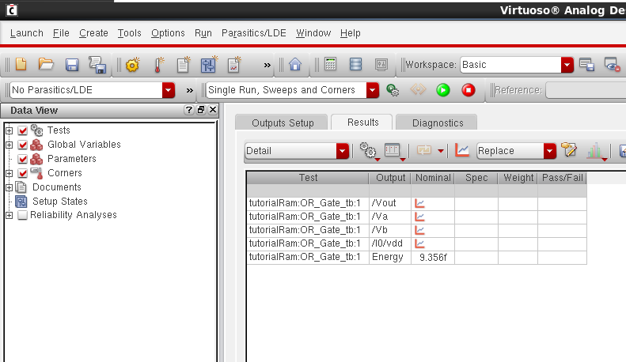

---

## Tools Used  
- **Cadence Virtuoso** – Schematic, Symbol, and Layout Design  
- **Spectre** – Transient Simulation  
- **Assura** – DRC, LVS, RCX  
- **ADE L** – Simulation & Energy Estimation

---

## Author  

**Ram Tripathi**
