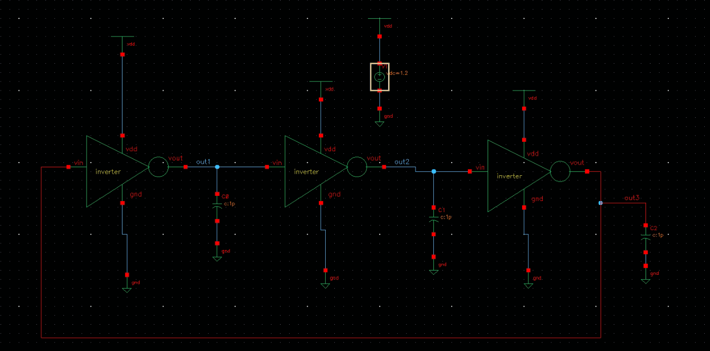
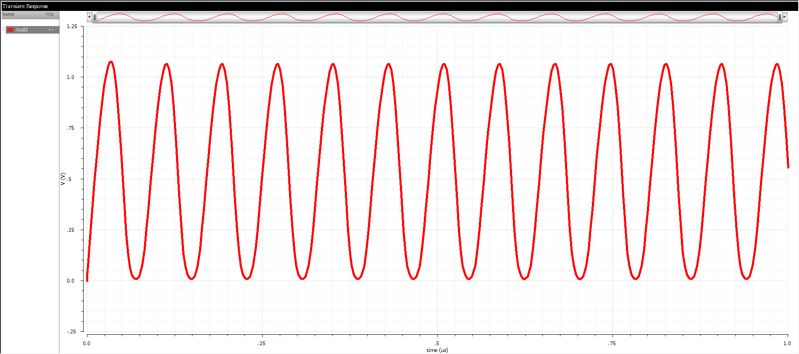

# 3-Stage CMOS Ring Oscillator in Cadence Virtuoso

This project demonstrates the design and simulation of a **3-stage CMOS Ring Oscillator** using **Cadence Virtuoso**. The ring oscillator is built using an odd number of inverter stages connected in a loop to produce a self-sustaining oscillating signal.

## Table of Contents  
- [Schematic](#schematic)  
- [Transient Simulation](#transient-simulation)  
- [Oscillation Frequency](#oscillation-frequency)  
- [Design Principle](#design-principle)  
- [Tools Used](#tools-used)  
- [Author](#author)

---

## Schematic  
The schematic shows the implementation of a 3-stage ring oscillator using CMOS inverters.

---

## Transient Simulation  
The transient analysis confirms the oscillatory behavior of the ring oscillator and helps calculate the frequency of operation.

---

## Oscillation Frequency  

The oscillation frequency is calculated from the period of the output waveform using the formula:

\[
f = \frac{1}{2 \cdot N \cdot t_{\text{delay}}}
\]

Where:  
- N = 3 is the number of inverter stages  
- t_{\text{delay}} is the propagation delay per inverter stage

Measure the time between two rising (or falling) edges in the transient waveform to extract the period.

---

## Design Principle

A ring oscillator is based on the principle that an **odd number of inverters** connected in a feedback loop with sufficient gain and delay will oscillate naturally. This design can be used for:
- On-chip clock generation
- Process variation monitoring
- Random number generation (with jitter)

---

## Tools Used  
- **Cadence Virtuoso** – For schematic design  
- **Spectre** – For transient simulations  

---

## Author  
**Ram Tripathi**