# CMOS SR Flip-Flop Design in Cadence Virtuoso (GPDK 90nm)

This repository presents the complete implementation of an **SR Flip-Flop** using **Cadence Virtuoso** with **GPDK 90nm technology**. The design includes schematic capture, symbol creation, simulation, layout, DRC/LVS checks, parasitic extraction, and energy analysis.

---

## Table of Contents  
- [Schematic](#schematic)  
- [Symbol View](#symbol-view)  
- [Testbench](#testbench)  
- [Transient Simulation](#transient-simulation)  
- [Layout](#layout)  
- [DRC and LVS Checks](#drc-and-lvs-checks)  
- [Schematic vs Layout Matching](#schematic-vs-layout-matching)  
- [Parasitic Extraction (RCX)](#parasitic-extraction-rcx)  
- [AV Extracted View](#av-extracted-view)  
- [Energy Analysis](#energy-analysis)  
- [Tools Used](#tools-used)  
- [Author](#author)

---

## Schematic  
The SR Flip-Flop circuit was designed using basic logic gates following standard flip-flop design principles.

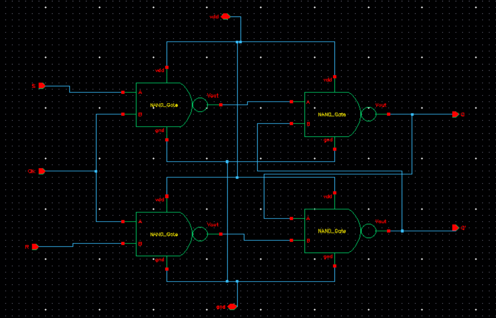

---

## Symbol View  
A reusable symbol view of the SR Flip-Flop was created for easy integration into larger designs.

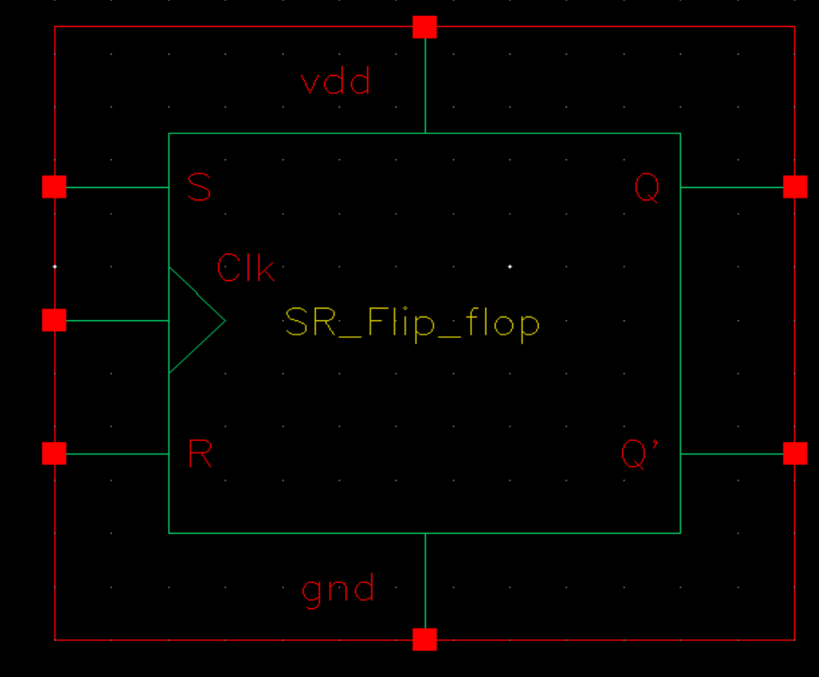

---

## Testbench  
The testbench validates the operation of the flip-flop using a set of predefined input conditions.

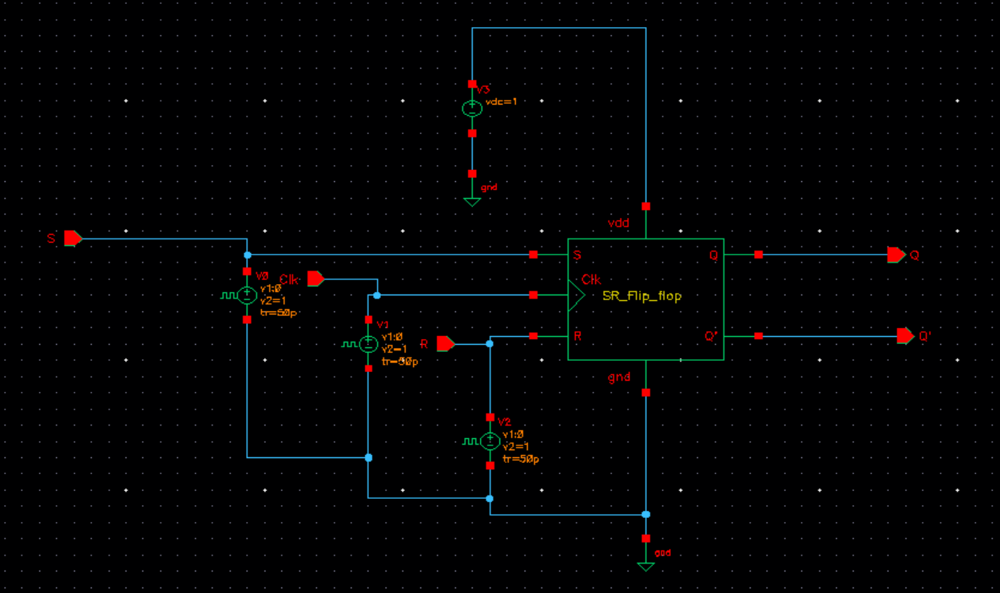

---

## Transient Simulation  
Transient analysis confirms the expected behavior of the SR Flip-Flop over time.

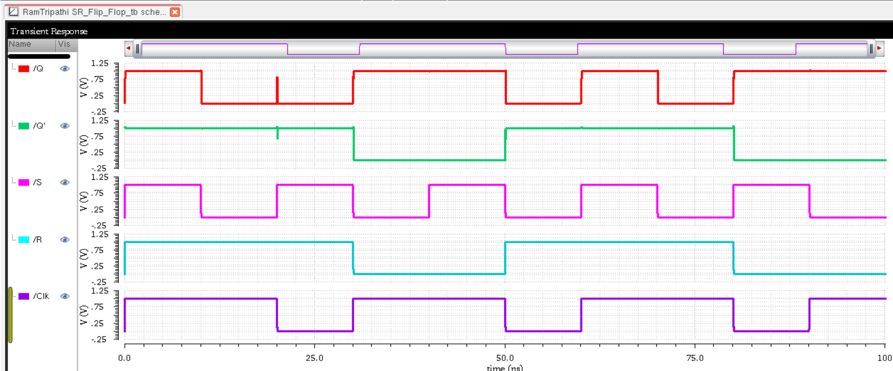

---

## Layout  
Physical implementation of the SR Flip-Flop following the design rules of GPDK 90nm.

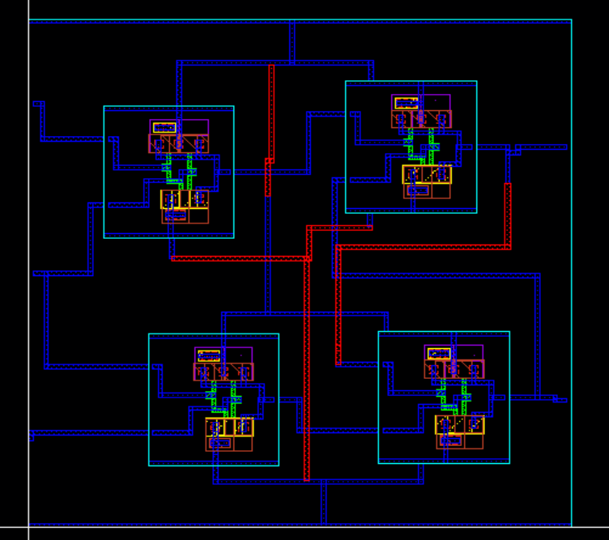

---

## DRC and LVS Checks

### DRC: Design Rule Check  
Layout is verified to be free of design rule violations.

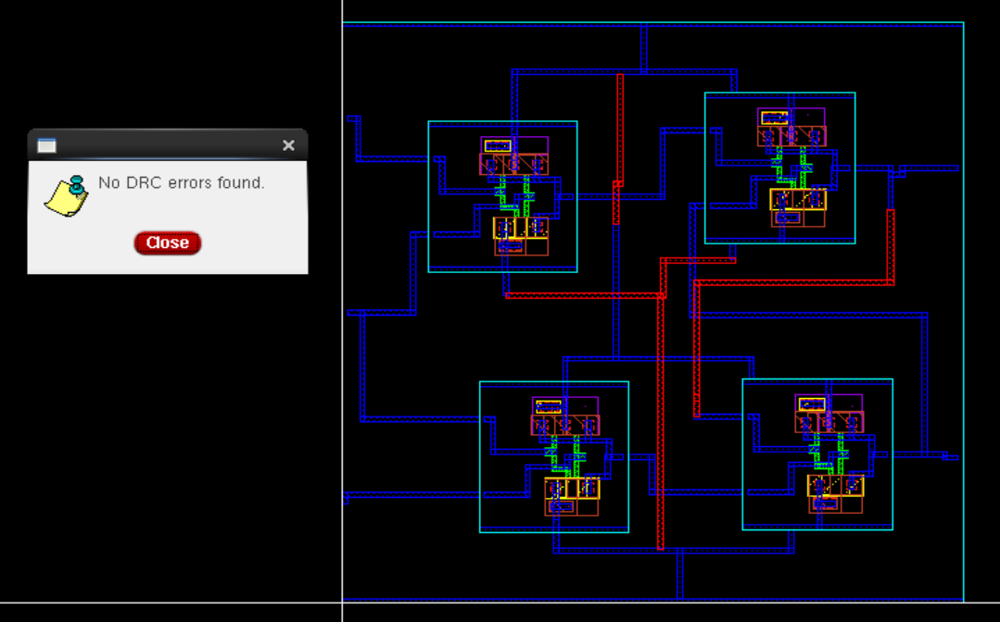

### LVS: Layout vs Schematic  
Layout is confirmed to match the schematic connectivity.

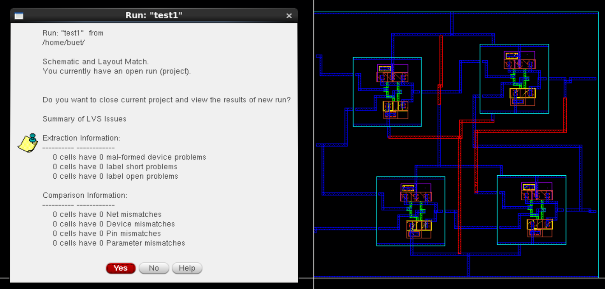

---

## Schematic vs Layout Matching  
Graphical confirmation of matched schematic and layout topologies.

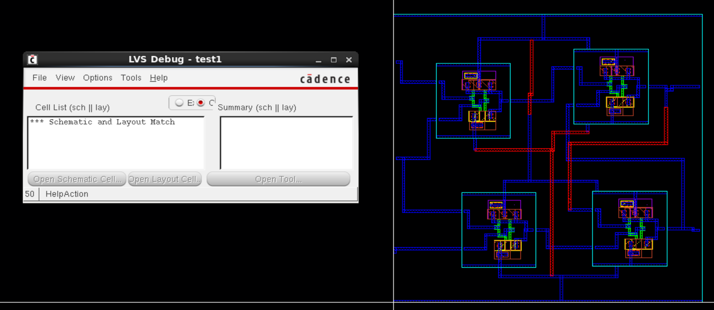

---

## Parasitic Extraction (RCX)  
Parasitic elements are extracted using RCX for post-layout simulation accuracy.

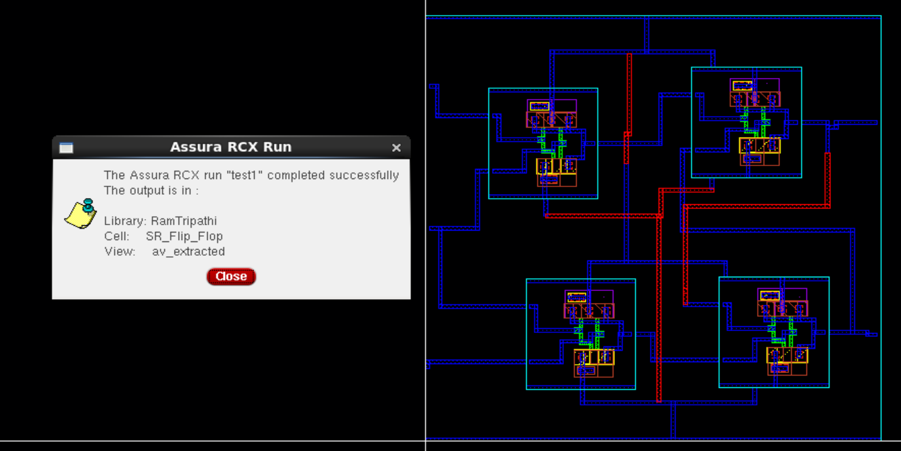

---

## AV Extracted View  
The extracted view includes parasitic capacitance and resistance for post-layout simulations.

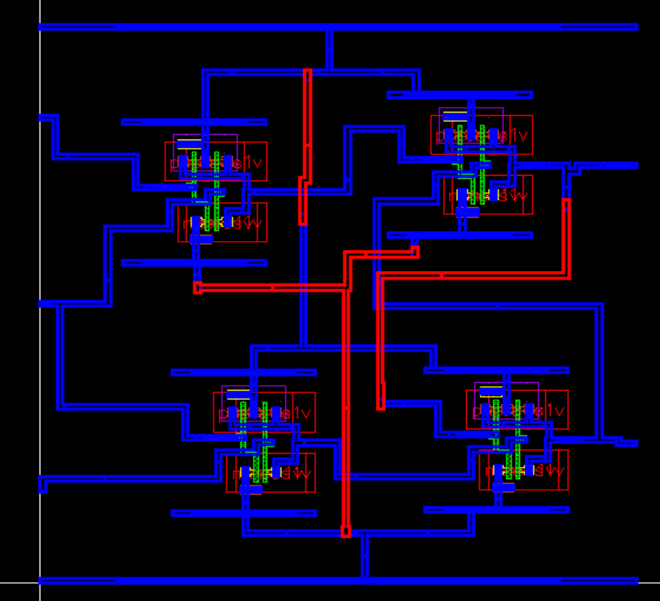

---

## Energy Analysis  
Estimation of energy consumption per switching event.

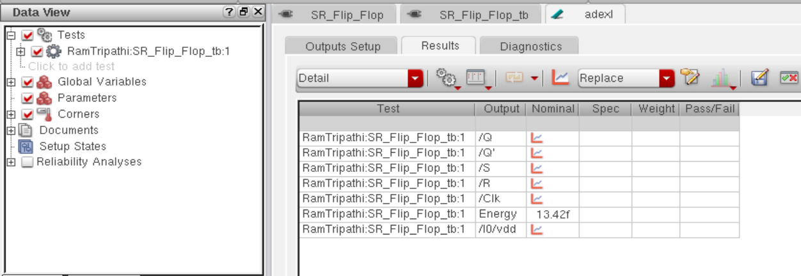

---

## Tools Used  
- **Cadence Virtuoso** for design and simulation  
- **GPDK 90nm PDK**  
- **Assura** for DRC, LVS, and RC extraction  
- **Spectre Simulator** for transient analysis

---

## Author  
**Ram Tripathi**
