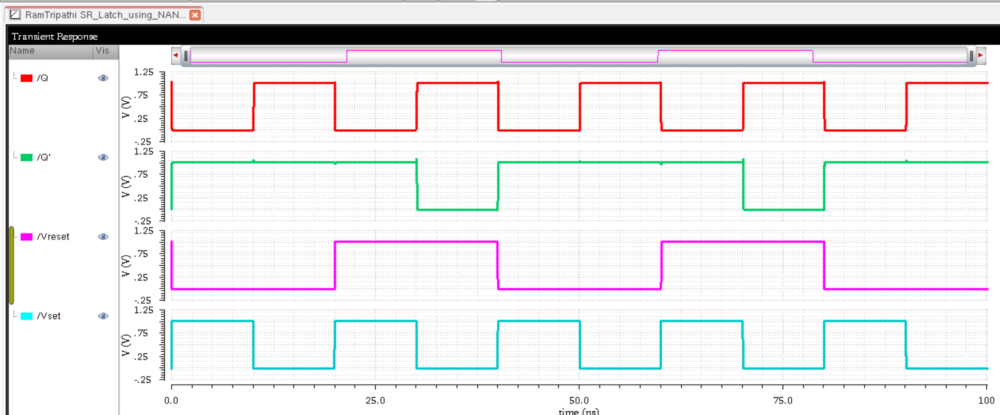

# CMOS SR Latch Using NAND Gates in Cadence Virtuoso

This repository contains the design and simulation of an **SR Latch using NAND gates** using **GPDK 90nm** technology in **Cadence Virtuoso**. It includes schematic, symbol creation, testbench setup, transient response analysis, physical layout, and backend verification such as DRC, LVS, RC extraction, and energy estimation.

---

## Table of Contents  
- [Schematic](#schematic)  
- [Symbol View](#symbol-view)  
- [Testbench](#testbench)  
- [Transient Simulation](#transient-simulation)  
- [Layout](#layout)  
- [DRC and LVS Checks](#drc-and-lvs-checks)  
- [Schematic vs Layout Matching](#schematic-vs-layout-matching)  
- [Parasitic Extraction (RCX)](#parasitic-extraction-rcx)  
- [AV Extracted View](#av-extracted-view)  
- [Energy Analysis](#energy-analysis)  
- [Tools Used](#tools-used)  
- [Author](#author)

---

## Schematic  
The latch is designed using cross-coupled NAND gates, forming the SR latch logic.

---

## Symbol View  
A compact symbol view was created for hierarchy-based simulation and reuse.

---

## Testbench  
Testbench applies stimulus to S and R inputs to evaluate latch behavior.

---

## Transient Simulation  
The waveform shows output Q and Q' toggling as per SR inputs with valid logic behavior.

---

## Layout  
The full-custom layout is created using GPDK 90nm standard layers.

---

## DRC and LVS Checks

### DRC: Design Rule Check  
The layout passed all design rules.

### LVS: Layout vs Schematic  
LVS confirms electrical equivalence between layout and schematic.

---

## Schematic vs Layout Matching  
Visual confirmation of layout and schematic netlist alignment.

---

## Parasitic Extraction (RCX)  
Post-layout parasitic extraction using Assura RCX for accurate power and timing evaluation.

---

## AV Extracted View  
Extracted view showing parasitic-aware design layout.

---

## Energy Analysis  
Energy consumption was estimated using back-annotated simulation. The latch demonstrates efficient power use in femtojoule range.

---

## Tools Used  
- **Cadence Virtuoso** (GPDK 90nm)  
- **Assura** for DRC/LVS/RCX  
- **Spectre ADE** for simulation

---

## Author  
**Ram Tripathi**
