# CMOS SR Latch Implementation Using NAND Gates in Cadence Virtuoso

This repository presents the design, layout, simulation, and verification of an **SR Latch** implemented using **basic NAND gates** in **Cadence Virtuoso**, leveraging GPDK 90nm technology. The project includes schematic capture, symbol creation, transient simulation, DRC/LVS verification, parasitic extraction (RCX), and energy analysis.

---

## Table of Contents  
- [Schematic](#schematic)  
- [Symbol View](#symbol-view)  
- [Testbench](#testbench)  
- [Transient Simulation](#transient-simulation)  
- [Layout](#layout)  
- [DRC and LVS Checks](#drc-and-lvs-checks)  
- [Schematic vs Layout Matching](#schematic-vs-layout-matching)  
- [Parasitic Extraction (RCX)](#parasitic-extraction-rcx)  
- [AV Extracted View](#av-extracted-view)  
- [Energy Analysis](#energy-analysis)  
- [Tools Used](#tools-used)  
- [Author](#author)

---

## Schematic  
The SR Latch is built using cross-coupled NAND gates. The latch operates with asynchronous Set (S) and Reset (R) inputs to store one bit of information.

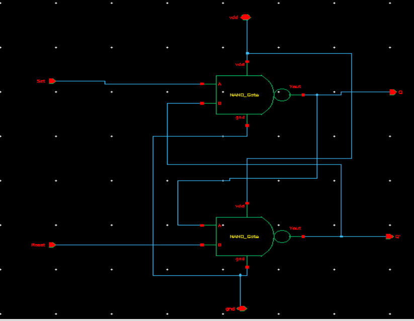

---

## Symbol View  
A symbol for the SR latch was created to simplify testbench design and enable hierarchy in layout.

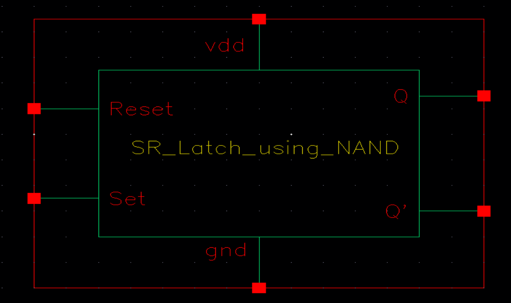

---

## Testbench  
The testbench applies various Set and Reset inputs to validate latch behavior and stability.

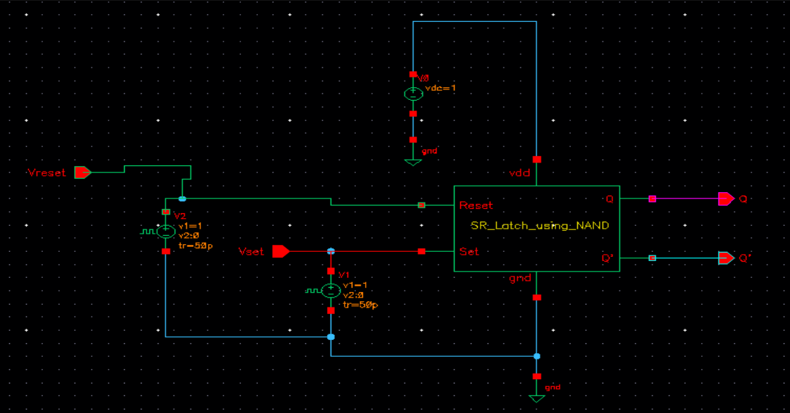

---

## Transient Simulation  
The transient simulation confirms correct operation of the latch including set, reset, and hold states.

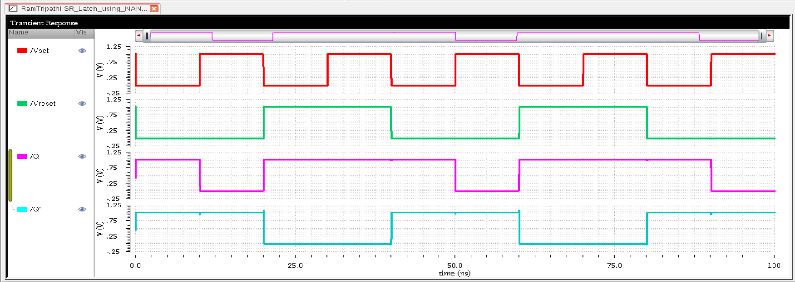

---

## Layout  
The layout is designed to adhere to DRC constraints and optimized for compact area and minimal parasitics.

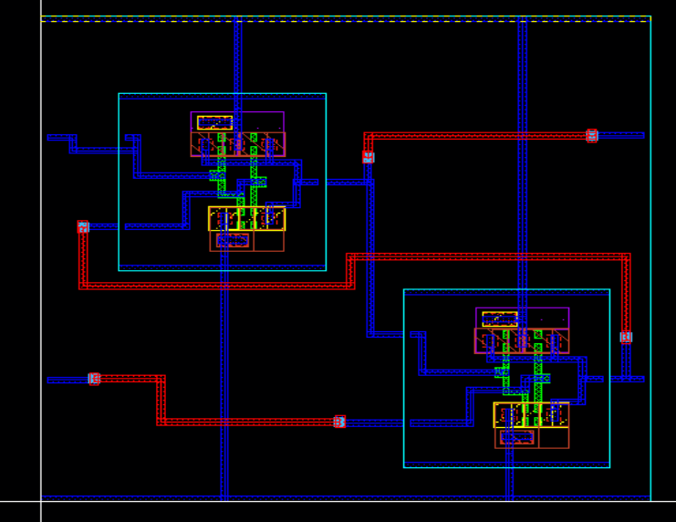

---

## DRC and LVS Checks

### DRC: Design Rule Check  
The layout passed all design rule checks.

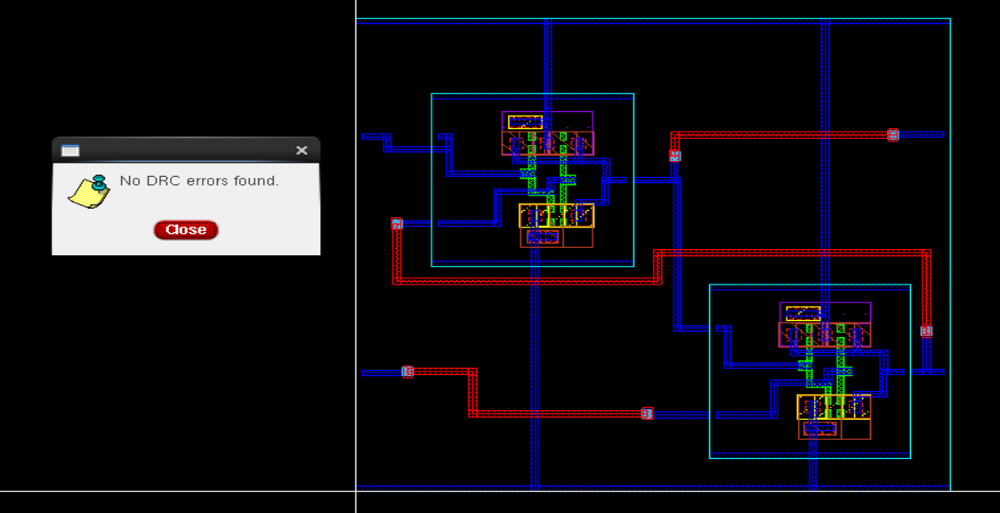

### LVS: Layout vs Schematic  
LVS confirms that the layout is electrically equivalent to the schematic.

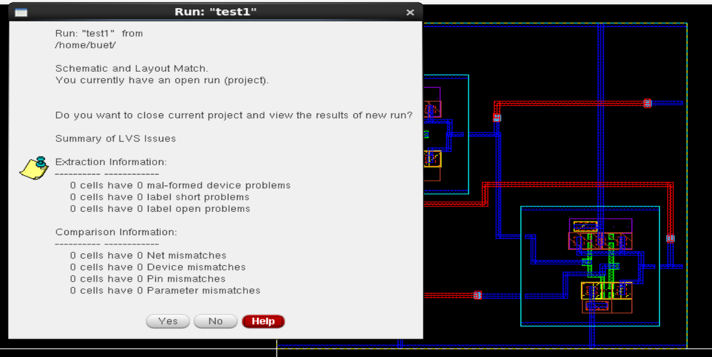

---

## Schematic vs Layout Matching  
A visual confirmation of layout vs schematic structural alignment.

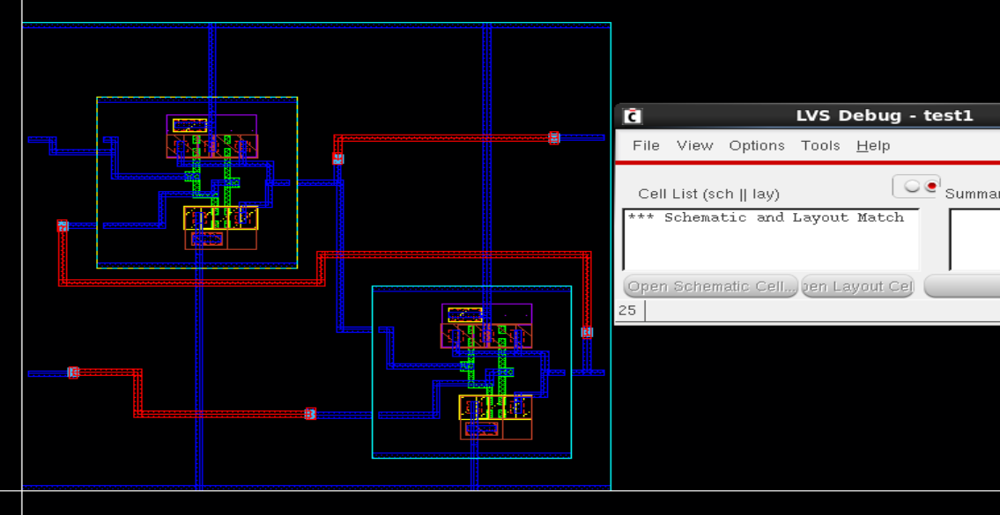

---

## Parasitic Extraction (RCX)  
RCX extracts resistance and capacitance values from the layout for accurate post-layout simulation.

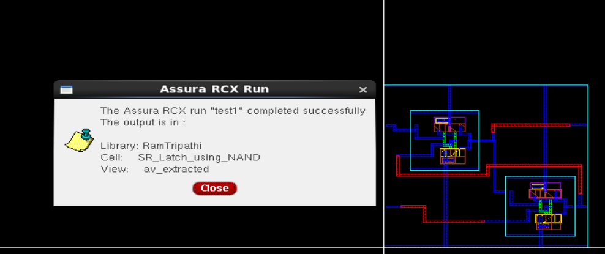

---

## AV Extracted View  
The AV view contains parasitics from the layout, used for back-annotated simulation.

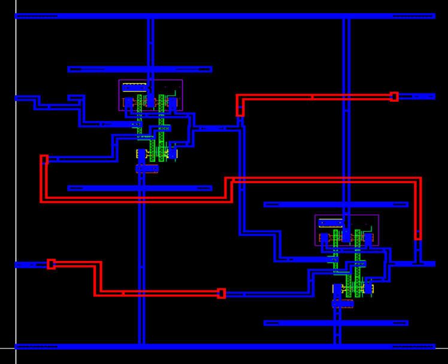

---

## Energy Analysis  
The energy consumed per transition is estimated to be **within femtojoule range**, which aligns well with expected values for designs using GPDK 90nm technology. This efficiency makes it suitable for low-power latch-based storage or sequential logic systems.

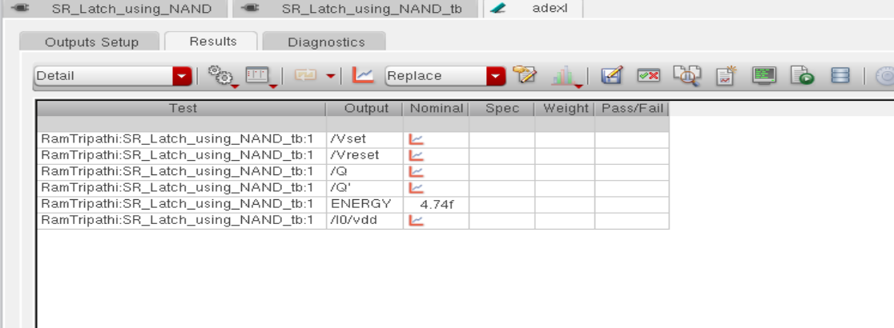

---

## Tools Used  
- **Cadence Virtuoso** – Schematic and Layout Design  
- **Assura** – DRC, LVS, and RCX Extraction  
- **Spectre / ADE L/XL** – Transient Simulation and Energy Estimation  

---

## Author  
**Ram Tripathi**
