# CMOS SR Latch Using NOR Gates in Cadence Virtuoso

This repository presents the design and simulation of a **Set-Reset (SR) Latch** using **NOR gates** in **Cadence Virtuoso**, based on the **GPDK 90nm** CMOS technology. The project includes schematic creation, symbol view, testbench simulation, layout drawing, verification (DRC & LVS), parasitic extraction, and energy estimation.

---

## Table of Contents  
- [Schematic](#schematic)  
- [Symbol View](#symbol-view)  
- [Testbench](#testbench)  
- [Transient Simulation](#transient-simulation)  
- [Layout](#layout)  
- [DRC and LVS Checks](#drc-and-lvs-checks)  
- [Schematic vs Layout Matching](#schematic-vs-layout-matching)  
- [Parasitic Extraction (RCX)](#parasitic-extraction-rcx)  
- [AV Extracted View](#av-extracted-view)  
- [Energy Analysis](#energy-analysis)  
- [Tools Used](#tools-used)  
- [Author](#author)

---

## Schematic  
The schematic of the SR Latch is constructed using two cross-coupled NOR gates.

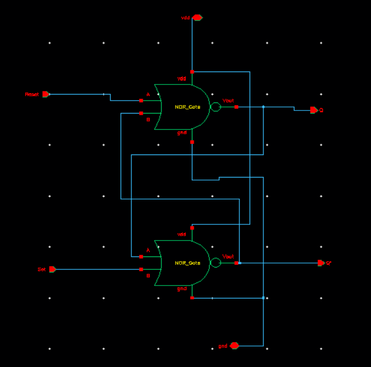

---

## Symbol View  
A custom symbol view for the SR Latch enables easy hierarchical design integration.

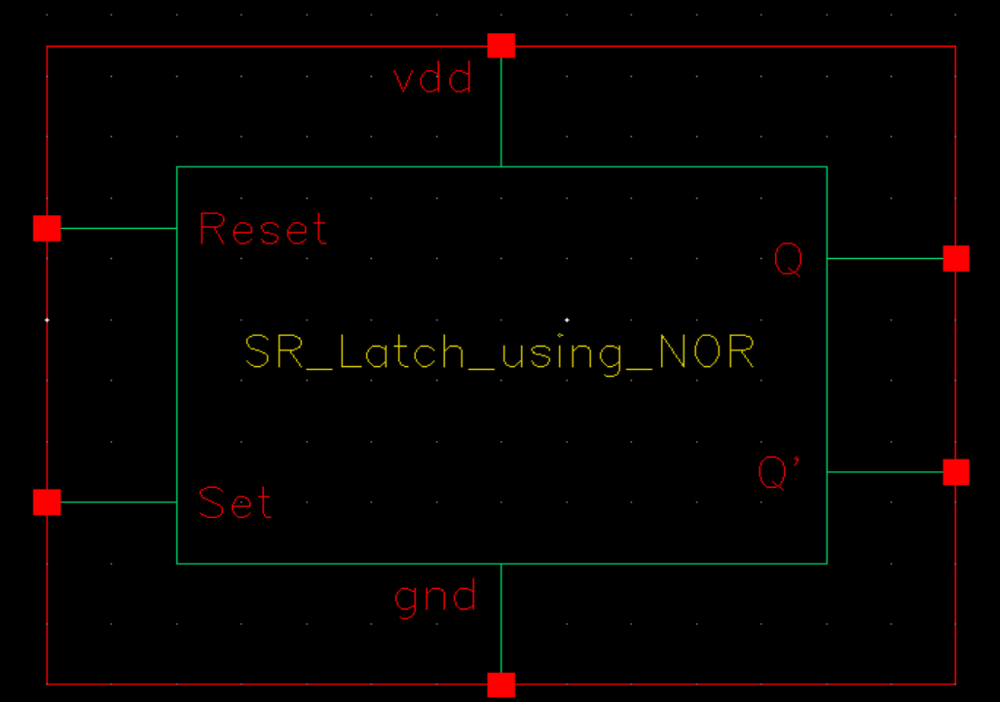

---

## Testbench  
The testbench applies various combinations of Set (S) and Reset (R) inputs to verify latch behavior.

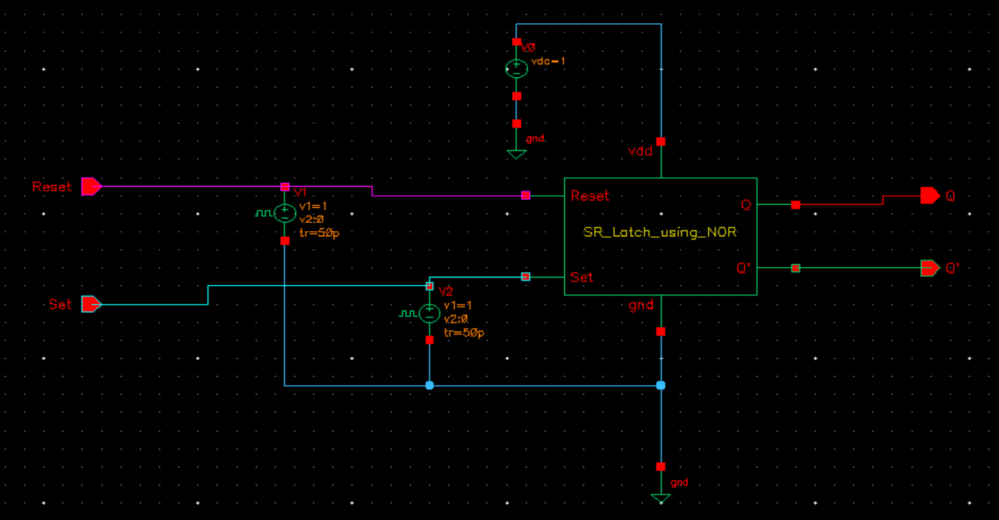

---

## Transient Simulation  
The transient response confirms the expected SR latch behavior under different input conditions.

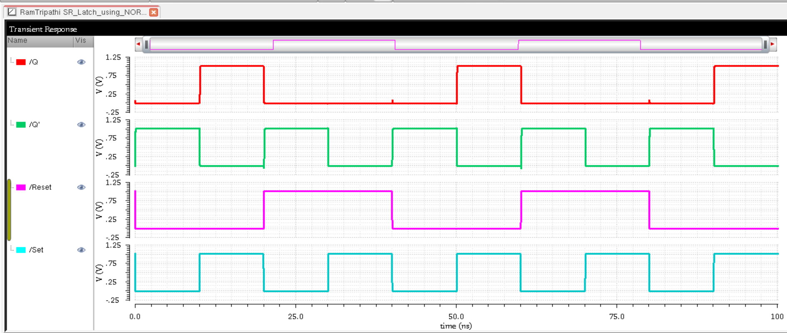

---

## Layout  
A compact layout of the SR Latch was created using standard layout techniques for 90nm CMOS.

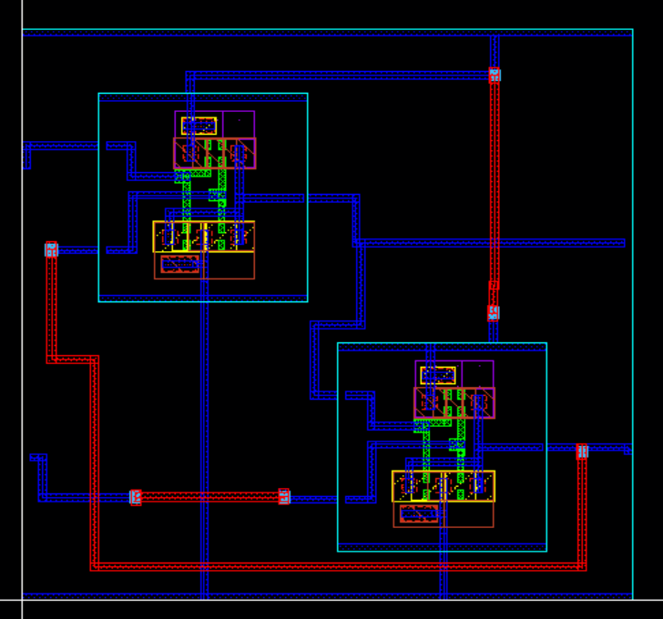

---

## DRC and LVS Checks

### DRC: Design Rule Check  
The layout passed all design rule checks (DRC) successfully.

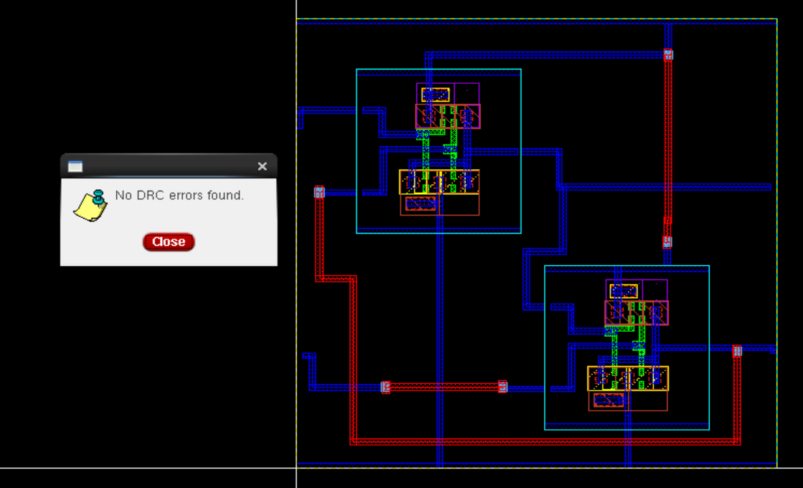

### LVS: Layout vs Schematic  
LVS confirms the layout is electrically equivalent to the schematic.

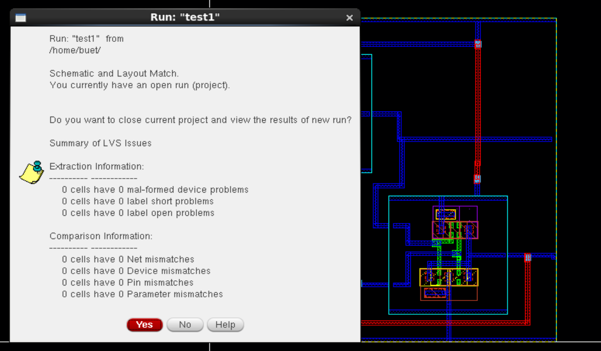

---

## Schematic vs Layout Matching  
Visual confirmation of schematic and layout netlist alignment.

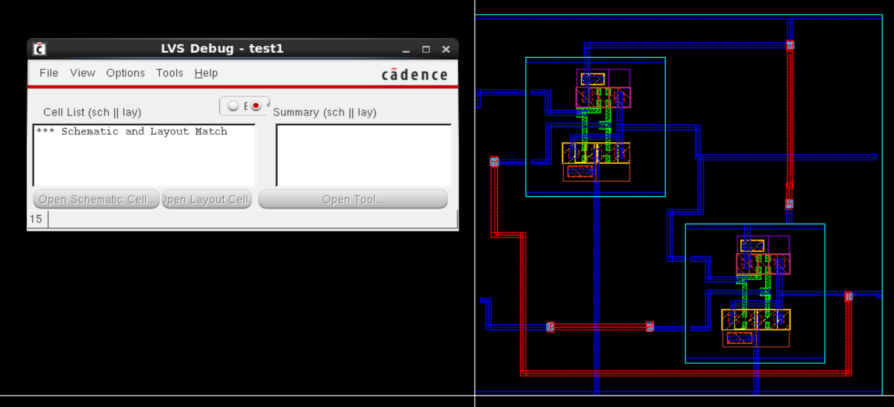

---

## Parasitic Extraction (RCX)  
Assura RCX was used to extract parasitic elements for accurate post-layout simulation.

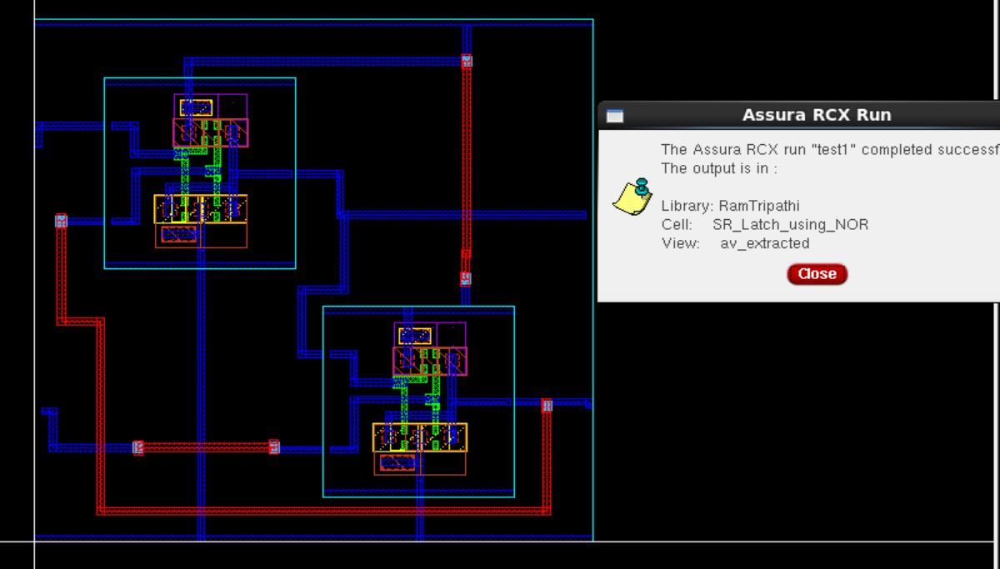

---

## AV Extracted View  
The AV view includes parasitics, allowing accurate back-annotated simulation.

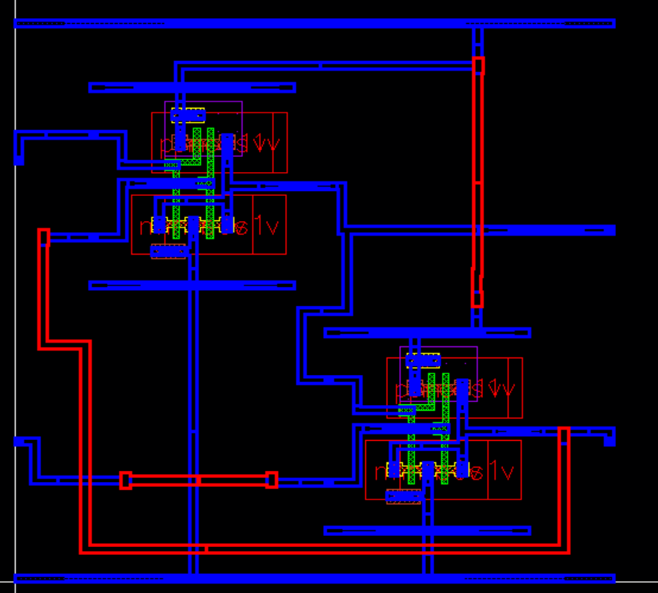

---

## Energy Analysis  
Post-layout simulation estimates the energy consumption per transition cycle in the **femtojoule (fJ)** range, reflecting a power-efficient latch design.

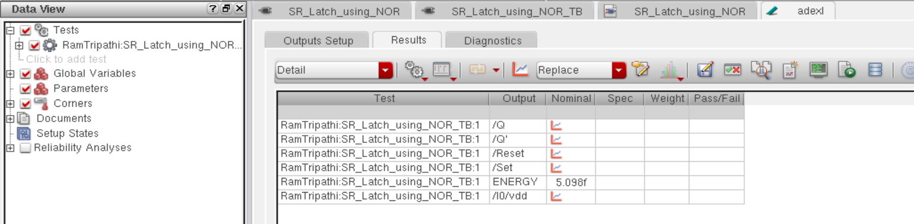

---

## Tools Used  
- **Cadence Virtuoso** – Schematic and Layout Design  
- **Assura** – DRC, LVS, and RCX Parasitic Extraction  
- **Spectre / ADE L/XL** – Transient Simulation and Energy Analysis  

---

## Author  
**Ram Tripathi**
