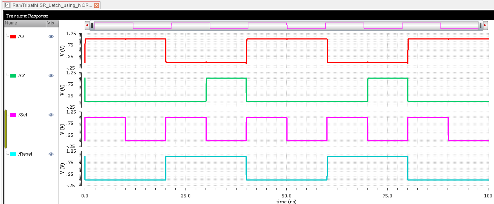

# CMOS SR Latch Using NOR Gates in Cadence Virtuoso

This repository contains the design and simulation of an **SR Latch using NOR gates** using **GPDK 90nm** technology in **Cadence Virtuoso**. It includes schematic design, symbol creation, testbench setup, transient simulation, custom layout, and verification steps like DRC, LVS, RCX, and energy estimation.

---

## Table of Contents  
- [Schematic](#schematic)  
- [Symbol View](#symbol-view)  
- [Testbench](#testbench)  
- [Transient Simulation](#transient-simulation)  
- [Layout](#layout)  
- [DRC and LVS Checks](#drc-and-lvs-checks)  
- [Schematic vs Layout Matching](#schematic-vs-layout-matching)  
- [Parasitic Extraction (RCX)](#parasitic-extraction-rcx)  
- [AV Extracted View](#av-extracted-view)  
- [Energy Analysis](#energy-analysis)  
- [Tools Used](#tools-used)  
- [Author](#author)

---

## Schematic  
The SR latch is implemented using cross-coupled NOR gates, forming a basic memory element.

---

## Symbol View  
A simplified symbol was created to use in higher-level designs and testbenches.

---

## Testbench  
The testbench applies input vectors to verify the functional behavior of the SR latch.

---

## Transient Simulation  
Simulation results show expected output behavior based on input combinations, confirming correct latch functionality.

---

## Layout  
Custom layout was drawn using 90nm standard cell design rules in Cadence Virtuoso.

---

## DRC and LVS Checks

### DRC: Design Rule Check  
No violations were found; layout is clean.

### LVS: Layout vs Schematic  
Schematic and layout netlists matched successfully.

---

## Schematic vs Layout Matching  
Shows correspondence between designed schematic and physical layout.

---

## Parasitic Extraction (RCX)  
RCX extraction adds parasitic capacitance and resistance for post-layout simulation.

---

## AV Extracted View  
The AV view represents the extracted design including parasitics.

---

## Energy Analysis  
Energy estimation performed for one complete cycle using post-layout data.

---

## Tools Used  
- **Cadence Virtuoso** with **GPDK 90nm**  
- **Assura DRC/LVS/RCX**  
- **Spectre ADE** for transient simulations

---

## Author  
**Ram Tripathi**
