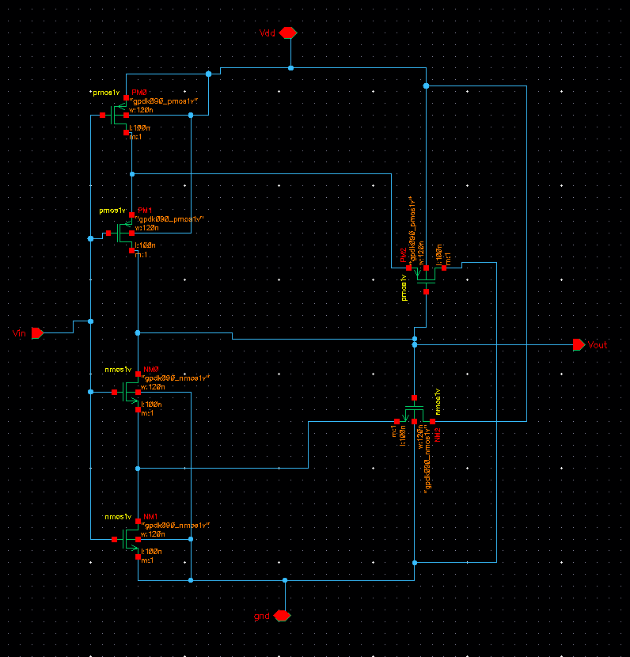
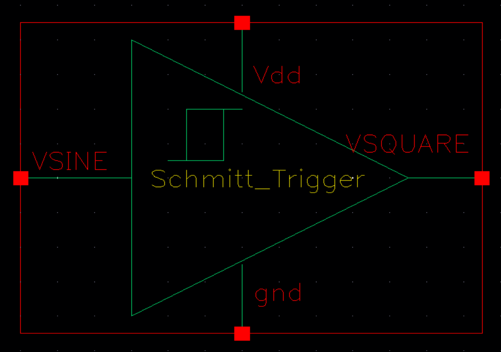
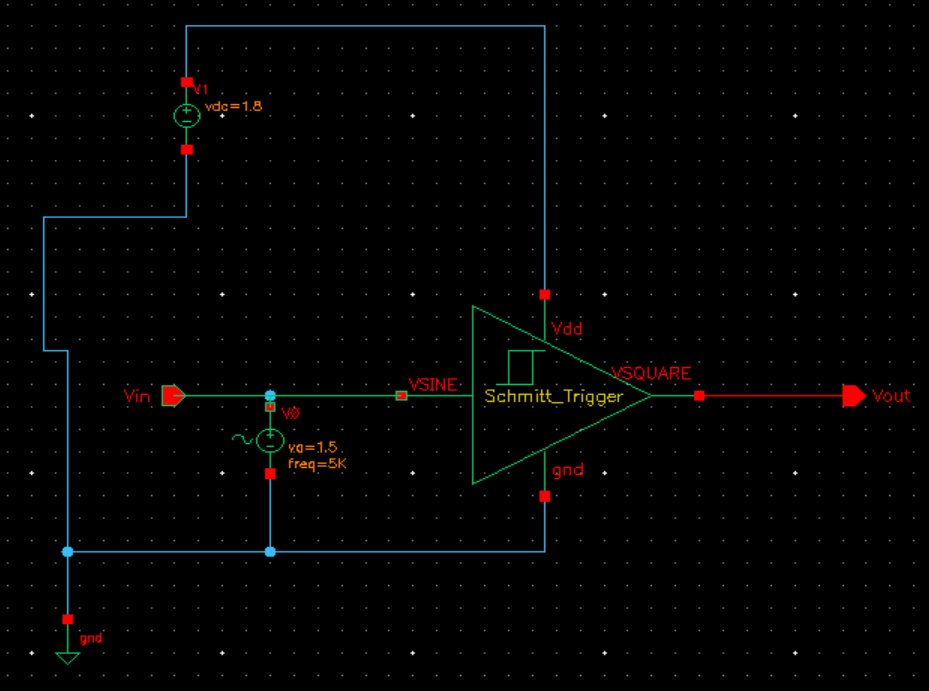
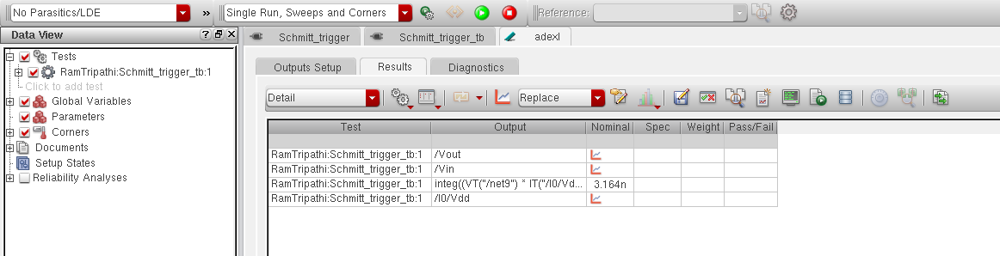
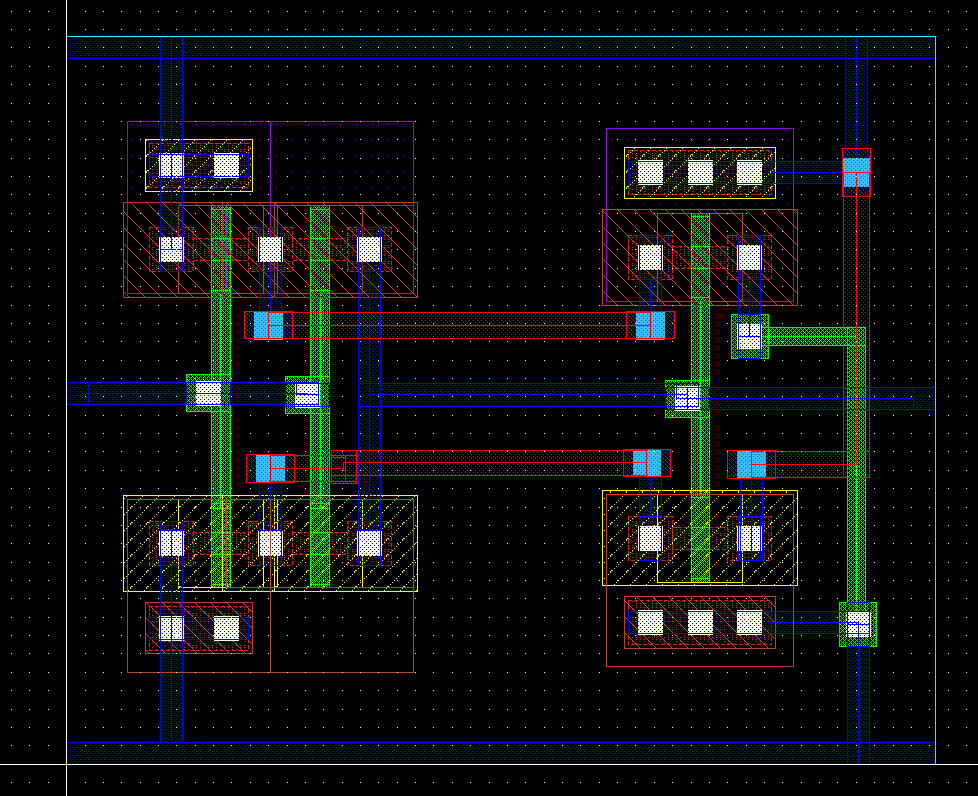
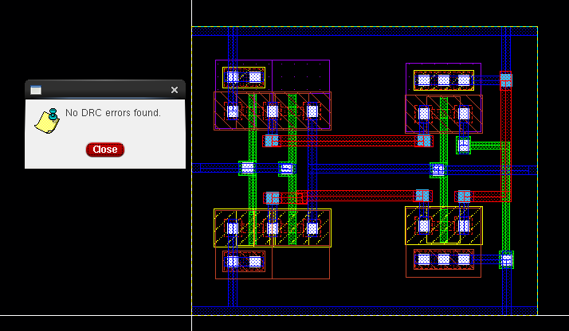
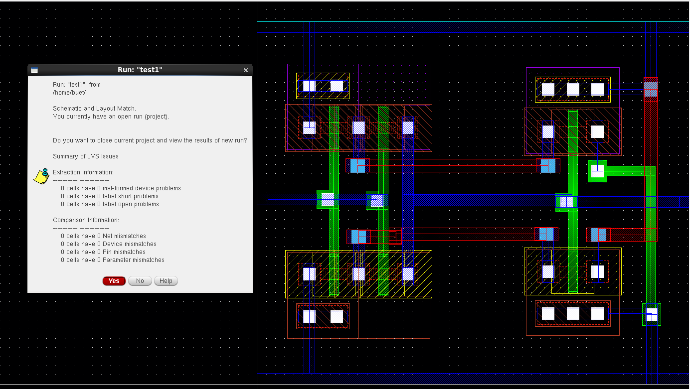
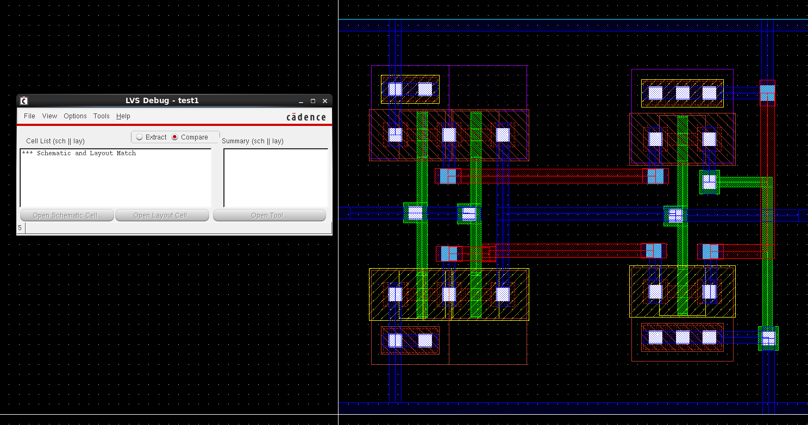
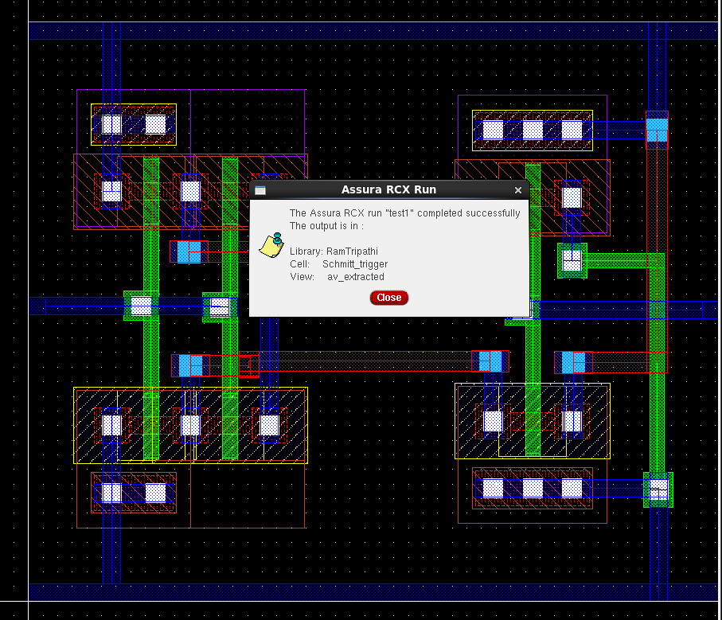
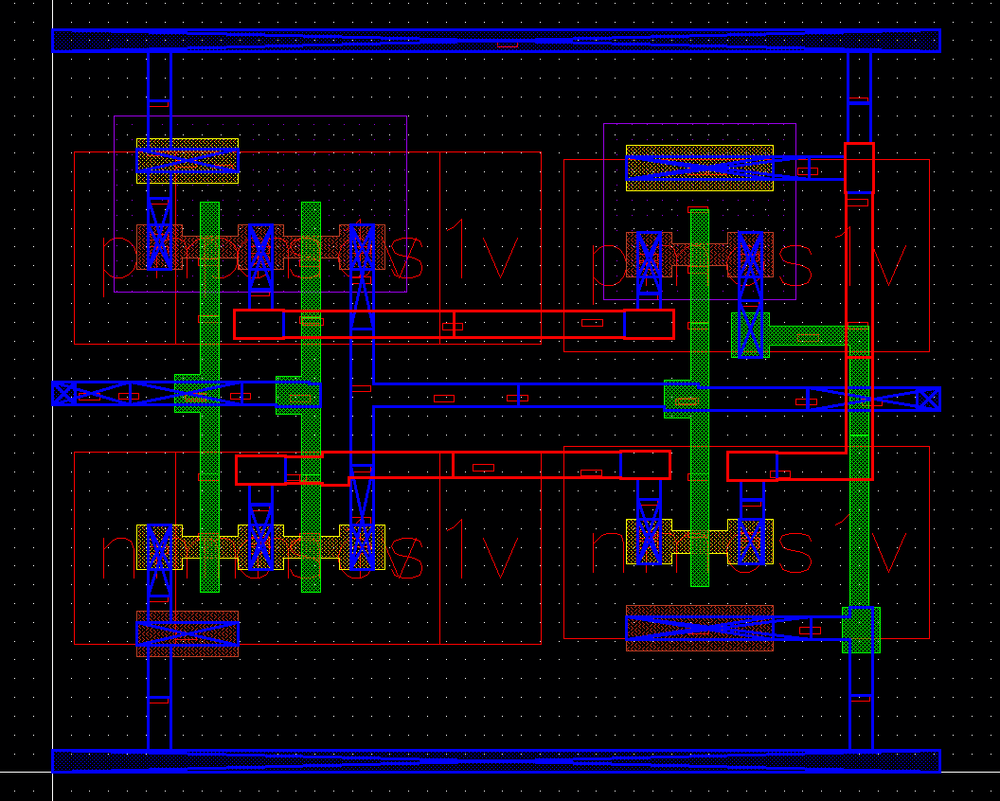

# 🔁 Schmitt Trigger using GPDK 90nm

This repository contains the complete design flow of a **Schmitt Trigger** circuit implemented using the **GPDK 90nm** technology node in **Cadence Virtuoso**. It includes schematic design, layout, simulation results, verification checks, and energy estimation.

---

## 📚 Table of Contents

- [🧰 Schematic](#-schematic)
- [📐 Symbol](#-symbol)
- [🧪 Testbench](#-testbench)
- [📊 Transient Response](#-transient-response)
- [⚡ Spectral Power Analysis](#-spectral-power-analysis)
- [🔋 Energy Estimation](#-energy-estimation)
- [🏗️ Layout](#-layout)
- [✅ DRC Check](#-drc-check)
- [🔍 LVS Check](#-lvs-check)
- [🧩 Layout vs Schematic Match](#-layout-vs-schematic-match)
- [🧠 RCX Extraction](#-rcx-extraction)
- [📡 AV Extracted View](#-av-extracted-view)
- [🛠️ Tools Used](#-tools-used)
- [👨‍💻 Author](#-author)

---

## 🧰 Schematic

This is the core schematic of the Schmitt Trigger designed in Virtuoso.

---

## 📐 Symbol

The symbol generated for reuse and easier testbench integration.

---

## 🧪 Testbench

Testbench to verify transient response and hysteresis behavior.

---

## 📊 Transient Response

Output waveform showing hysteresis behavior of the Schmitt Trigger.

---

## ⚡ Spectral Power Analysis

Power waveform captured over time using calculator and waveform tool.

---

## 🔋 Energy Estimation

Estimation of energy consumed during one switching cycle.

---

## 🏗️ Layout

Custom layout designed for the Schmitt Trigger circuit.

---

## ✅ DRC Check

Design Rule Check (DRC) passed successfully with no violations.

---

## 🔍 LVS Check

Layout Versus Schematic (LVS) successfully completed.

---

## 🧩 Layout vs Schematic Match

Physical layout matches schematic connectivity perfectly.

---

## 🧠 RCX Extraction

RC parasitic extraction performed for post-layout simulation.

---

## 📡 AV Extracted View

View of the extracted netlist including parasitics for accurate post-layout simulation.

---

## 🛠️ Tools Used

- **Cadence Virtuoso** – Schematic & Layout Design  
- **Spectre Simulator** – Transient, power, and energy simulations  
- **Assura** – DRC and LVS verification  
- **RCX** – RC Extraction  
- **Virtuoso Waveform Viewer** – Signal and power plotting  
- **GPDK 90nm** – Process Design Kit  

---

## 👨‍💻 Author

**Ram Tripathi**  

