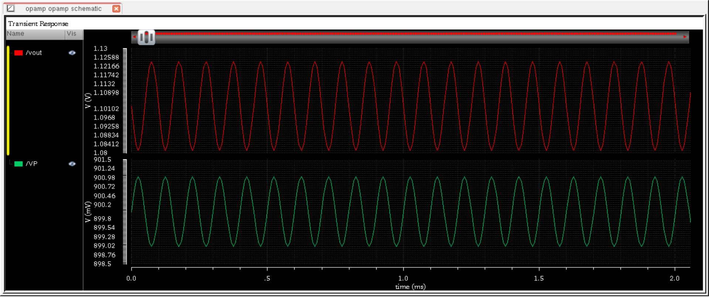
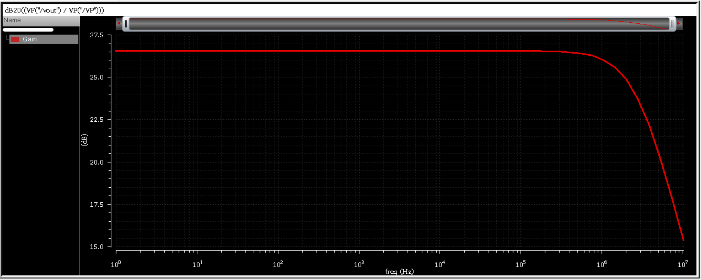
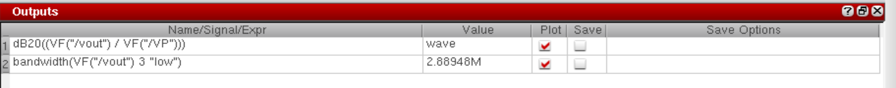

# Single-Stage CMOS Operational Amplifier in Cadence Virtuoso

This project demonstrates the design, simulation, and frequency-domain analysis of a **Single-Stage CMOS Operational Amplifier (Op-Amp)** using **Cadence Virtuoso**. The design has been evaluated for its DC gain, phase response, transient performance, and bandwidth.

---

## Table of Contents  
- [Schematic](#schematic)  
- [Transient Analysis](#transient-analysis)  
- [Gain and Phase Response](#gain-and-phase-response)  
- [Bandwidth Estimation](#bandwidth-estimation)  
- [Tools Used](#tools-used)  
- [Author](#author)

---

## Schematic  
The schematic below shows the transistor-level implementation of a single-stage CMOS op-amp designed in Cadence Virtuoso.

---

## Transient Analysis  
Transient simulation was performed to verify the time-domain response of the amplifier to an input step or ramp signal.

---

## Gain and Phase Response  
The AC analysis was used to obtain the frequency-dependent **gain and phase characteristics** of the op-amp.

- **Gain (Magnitude Response):**

  

- **Gain vs Phase (Bode Plot):**

  

---

## Bandwidth Estimation  
The **-3dB bandwidth** of the amplifier was extracted from the gain plot, indicating the frequency at which the gain drops by 3dB.

---

## Tools Used  
- **Cadence Virtuoso** – For schematic entry and circuit design  
- **Spectre** – For transient and AC simulation  
- **ADE XL** – For multi-corner and parametric analysis (optional)  

---

## Author  
**Ram Tripathi**
