# 🔀 Transmission Gate using GPDK 90nm

This repository showcases the complete analog design flow of a **Transmission Gate**, implemented using **Cadence Virtuoso** with the **GPDK 90nm** technology. It includes schematic design, layout, simulation, verification, and energy analysis.

---

## 📚 Table of Contents

- [🧰 Schematic](#-schematic)
- [📐 Symbol](#-symbol)
- [🧪 Testbench](#-testbench)
- [📊 Transient Response](#-transient-response)
- [⚡ Spectral Power Analysis](#-spectral-power-analysis)
- [🔋 Energy Estimation](#-energy-estimation)
- [🏗️ Layout](#-layout)
- [✅ DRC Check](#-drc-check)
- [🔍 LVS Check](#-lvs-check)
- [🧩 Layout vs Schematic Match](#-layout-vs-schematic-match)
- [🧠 RCX Extraction](#-rcx-extraction)
- [📡 AV Extracted View](#-av-extracted-view)
- [🛠️ Tools Used](#-tools-used)
- [👨‍💻 Author](#-author)

---

## 🧰 Schematic

Schematic of the Transmission Gate drawn in Cadence Virtuoso.

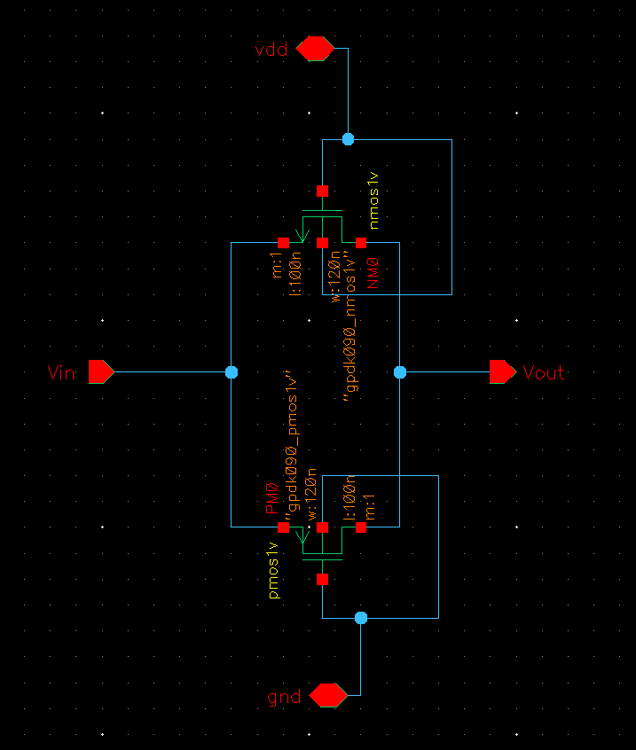

---

## 📐 Symbol

Hierarchical symbol created for simulation testbench connectivity.

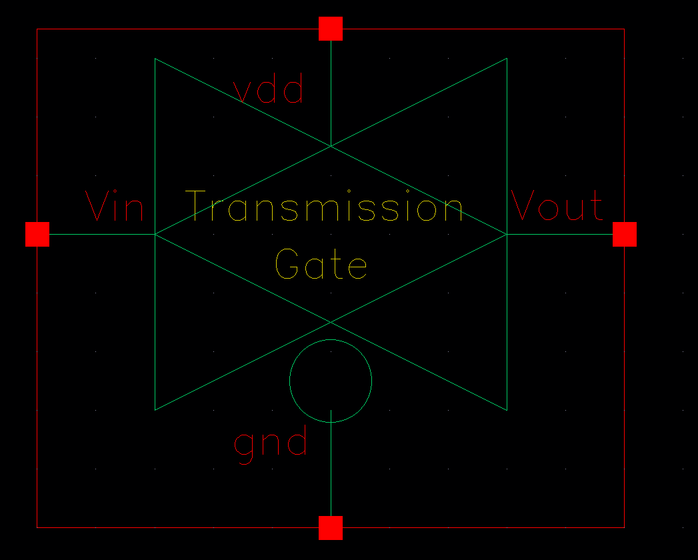

---

## 🧪 Testbench

Testbench circuit used for transient and power simulations.

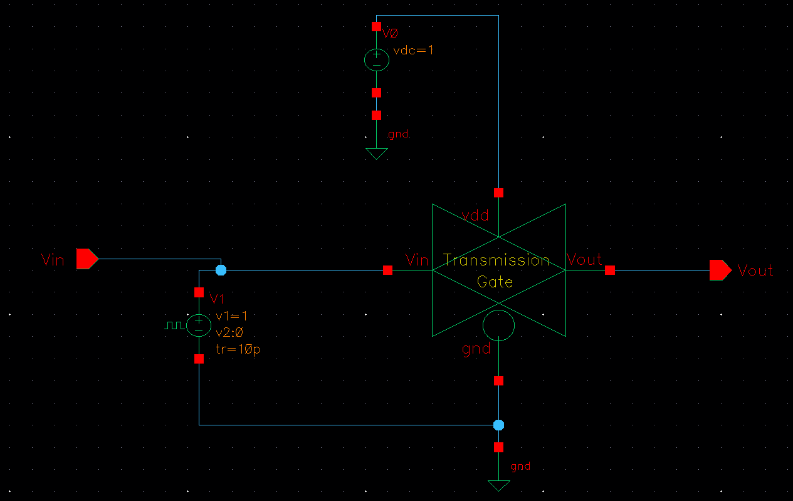

---

## 📊 Transient Response

Transient simulation showing gate functionality over time.

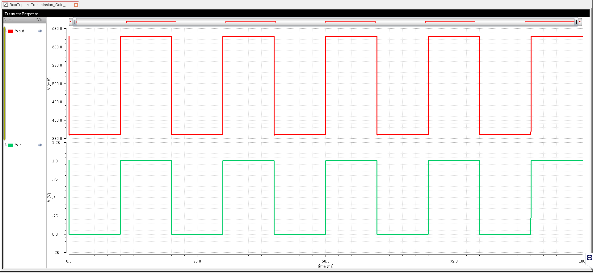

---

## ⚡ Spectral Power Analysis

Power waveform from simulation, showing dynamic power consumption.

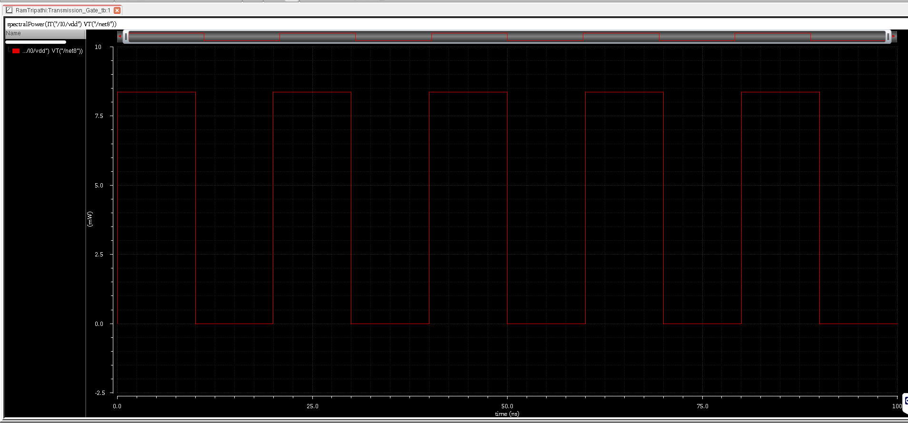

---

## 🔋 Energy Estimation

Calculated energy usage based on simulation data.

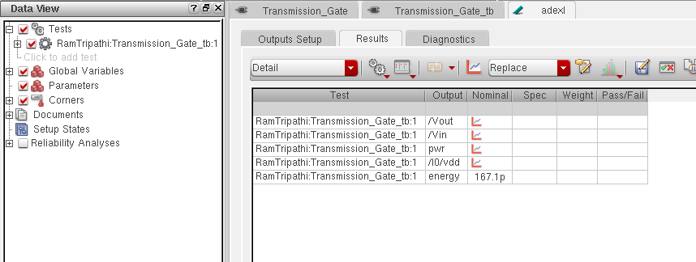

---

## 🏗️ Layout

Full-custom layout designed for DRC compliance.

---

## ✅ DRC Check

Design Rule Check passed without errors.

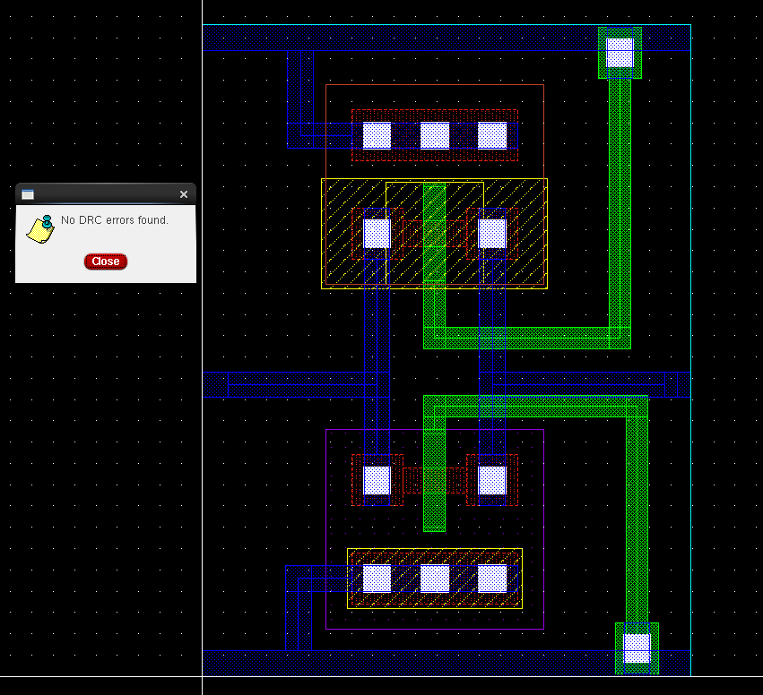

---

## 🔍 LVS Check

Layout Versus Schematic verified and matched.

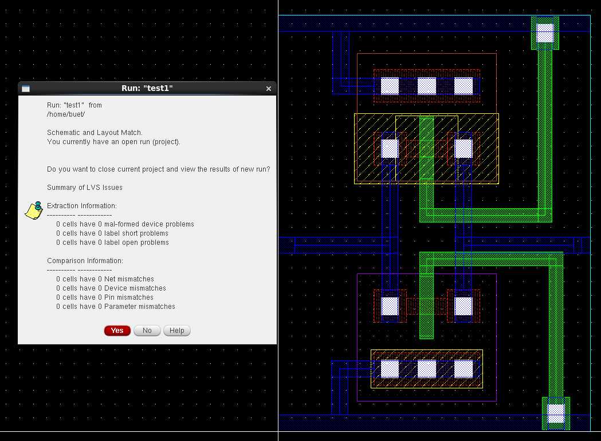

---

## 🧩 Layout vs Schematic Match

Visual confirmation of matching layout and schematic.

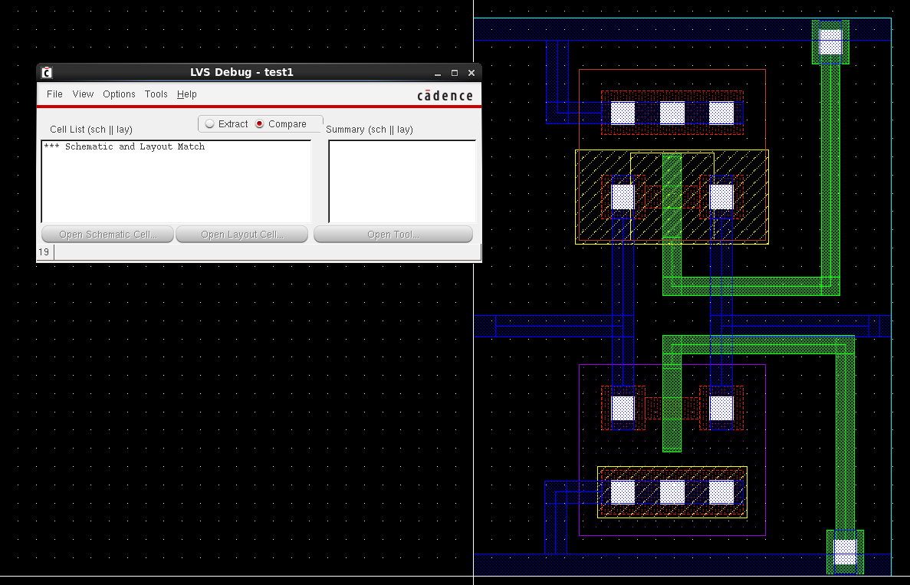

---

## 🧠 RCX Extraction

Parasitic RC extraction using post-layout view.

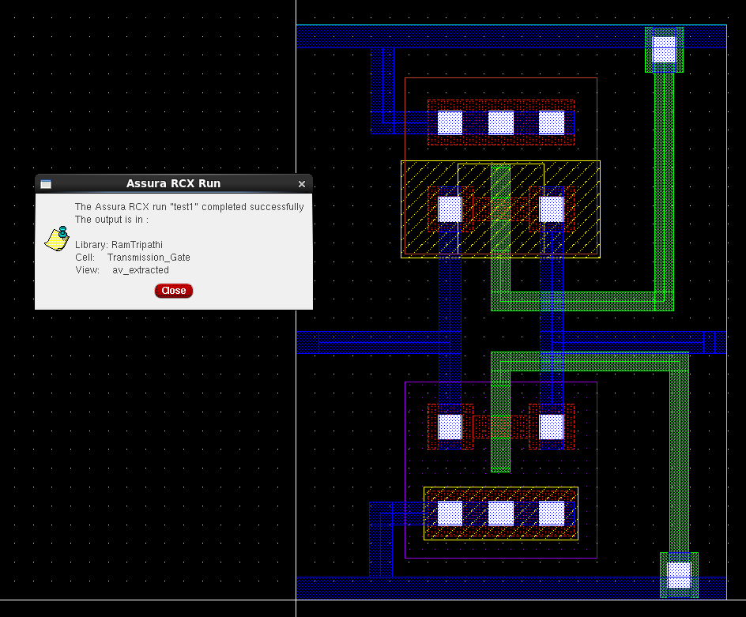

---

## 📡 AV Extracted View

Annotated view for simulation with extracted parasitics.

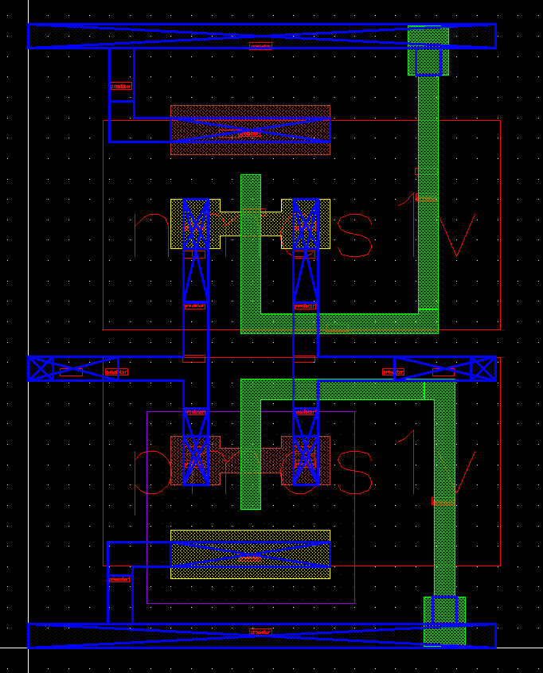

---

## 🛠️ Tools Used

- **Cadence Virtuoso** – Schematic, Layout & Simulation  
- **Spectre** – Transient and Power Simulations  
- **Assura/Calibre** – DRC & LVS  
- **QRC/RCX** – Parasitic Extraction  
- **GPDK 90nm** – Technology Library  

---

## 👨‍💻 Author

**Ram Tripathi**  
B.Tech – Electronics and Communication Engineering  
Analog IC Design Enthusiast

---
