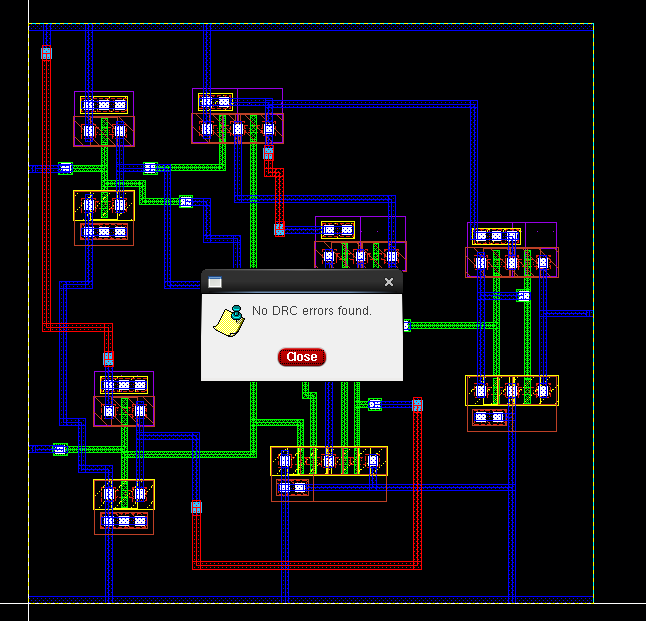
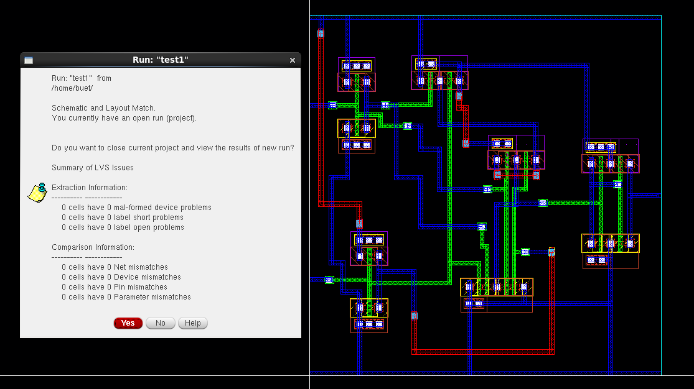

# CMOS 3-Input AND Gate Design in Cadence Virtuoso

This repository showcases the complete design flow of a **CMOS 3-Input AND Gate** using **Cadence Virtuoso**, including schematic design, symbol creation, testbench simulation, layout implementation, DRC/LVS verification, and post-layout RC extraction using **Assura**.

---

## 📁 Table of Contents  
- [🧩 Schematic](#-schematic)  
- [🎛️ Symbol View](#-symbol-view)  
- [🧪 Testbench](#-testbench)  
- [📈 Transient Simulation](#-transient-simulation)  
- [🧱 Layout](#-layout)  
- [✅ DRC and LVS Checks](#-drc-and-lvs-checks)  
- [🔍 Schematic vs Layout Matching](#-schematic-vs-layout-matching)  
- [🧠 Parasitic Extraction (RCX)](#-parasitic-extraction-rcx)  
- [🧾 AV Extracted View](#-av-extracted-view)  
- [🛠️ Tools Used](#-tools-used)  
- [👤 Author](#-author)

---

## 🧩 Schematic  
The 3-input AND gate is designed using CMOS logic, consisting of a pull-up PMOS network and pull-down NMOS network.

---

## 🎛️ Symbol View  
The symbol view enables modular design and was used for easy testbench integration.

---

## 🧪 Testbench  
All input combinations for the 3-input AND gate were applied using a custom testbench.

---

## 📈 Transient Simulation  
Spectre-based transient simulation verifies the gate behavior dynamically. Output is HIGH only when all three inputs are HIGH.

---

## 🧱 Layout  
A full-custom layout was created based on the schematic using Cadence Virtuoso.

---

## ✅ DRC and LVS Checks  

### ✔️ DRC (Design Rule Check)  
All layout rules were satisfied, verified via **Assura**.

### ✔️ LVS (Layout vs Schematic)  
The layout matches the schematic netlist exactly.

---

## 🔍 Schematic vs Layout Matching  
A graphical comparison confirming full connectivity and functionality match between layout and schematic.

---

## 🧠 Parasitic Extraction (RCX)  
RCX (resistor-capacitor extraction) was performed to analyze the effect of parasitic components on circuit behavior.

---

## 🧾 AV Extracted View  
The Annotated View displays the extracted resistive and capacitive parasitics on the layout for back-annotation into simulations.

---

## 🛠️ Tools Used  
- **Cadence Virtuoso** – Schematic, Symbol, Layout  
- **Spectre** – Transient Simulation  
- **Assura** – DRC, LVS, RCX  
- **ADE L** – Testbench Simulation & Analysis  

---

## 👤 Author  
**Ram Tripathi**  
Roll Number: 22HEL2231  
University of Delhi & IIT Madras  
Samsung EWS Grade-1 Fellow  

