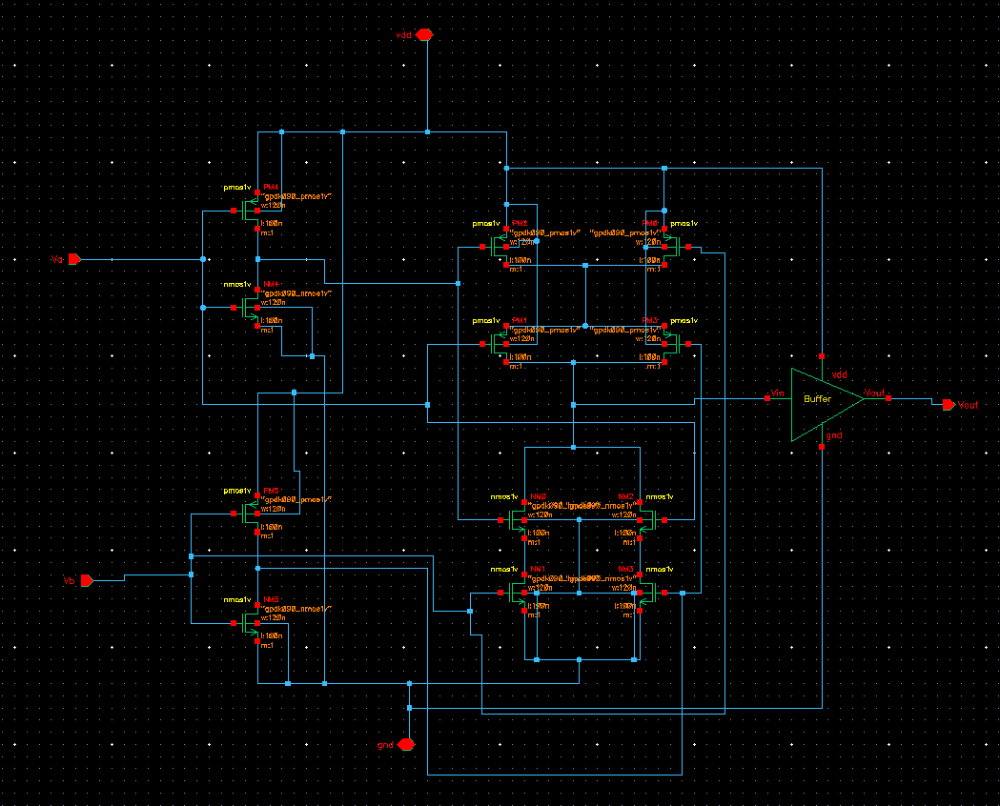
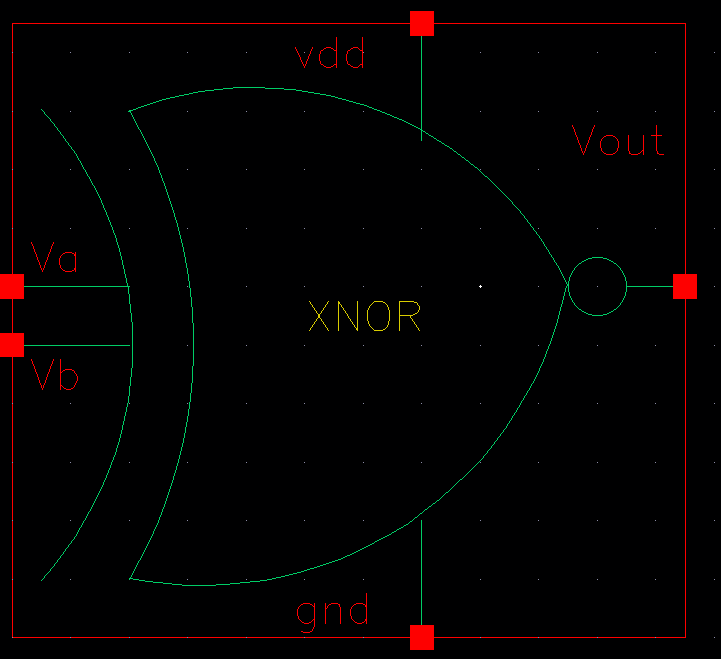
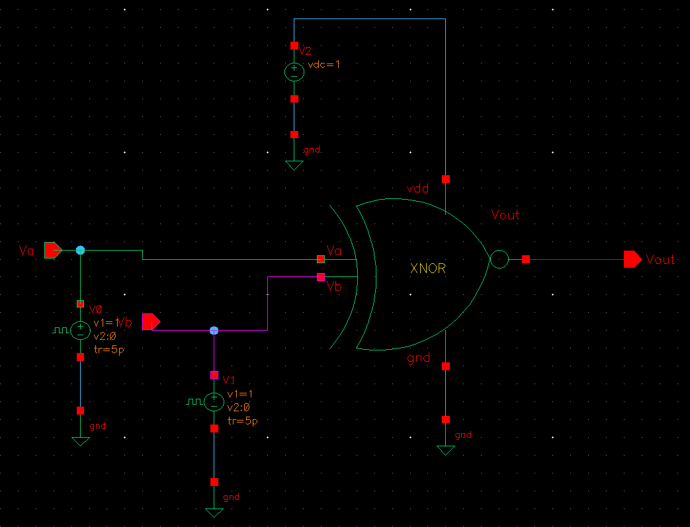
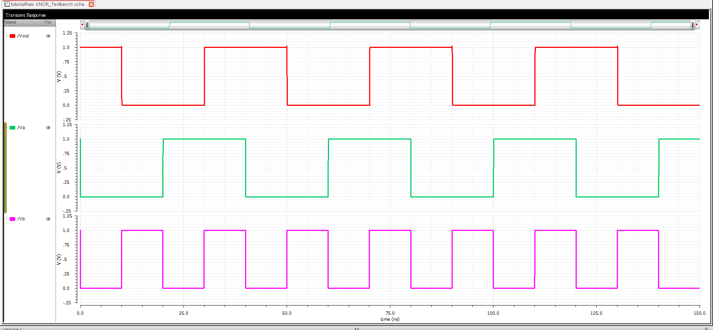
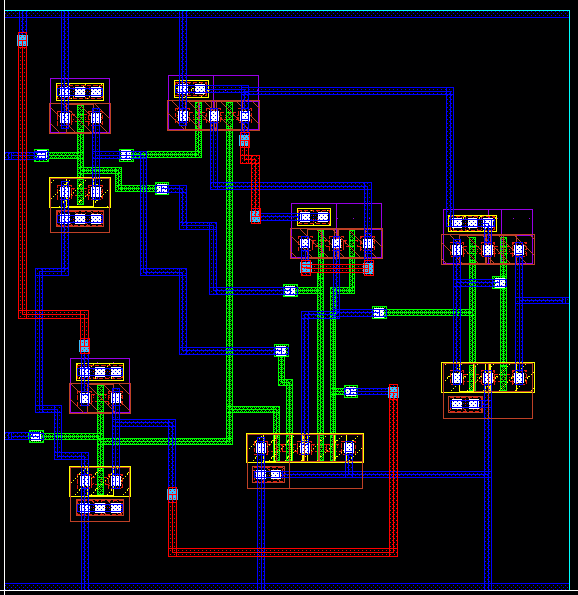
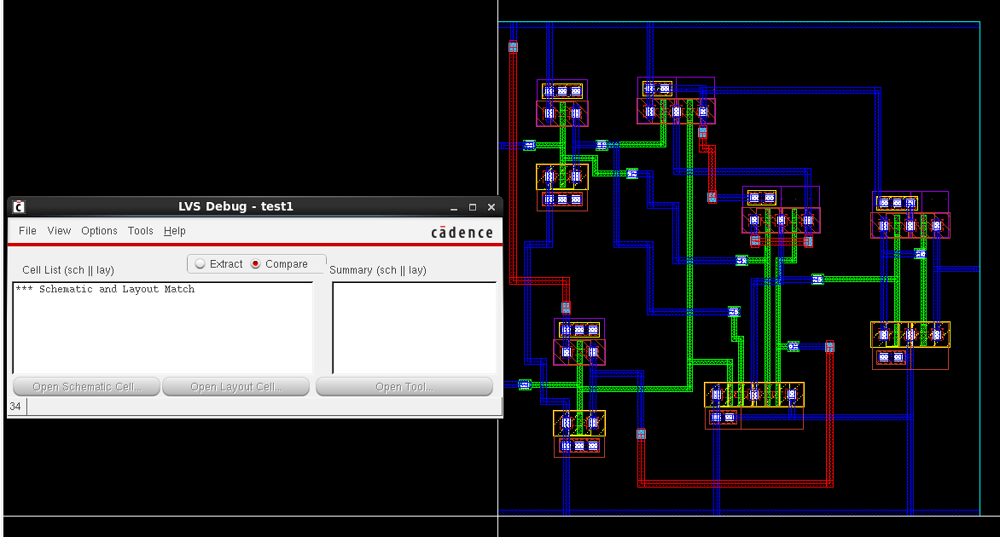
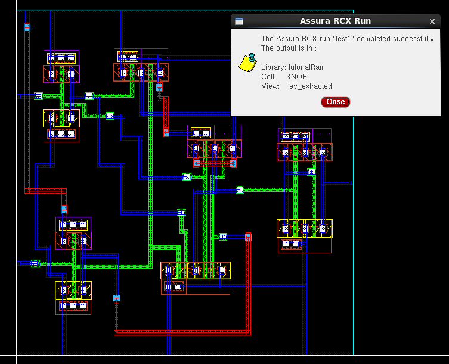

# CMOS 2-Input XNOR Gate Design using Cadence Virtuoso

This repository demonstrates the full custom IC design flow of a **2-input CMOS XNOR Gate** using **Cadence Virtuoso**. The project includes schematic design, symbol creation, testbench simulation, full-custom layout, DRC/LVS verification, parasitic extraction using **Assura RCX**, and final transient simulation using the extracted view.

---

## 📁 Table of Contents
- [🧩 Schematic](#-schematic)
- [🎛️ Symbol View](#-symbol-view)
- [🧪 Testbench](#-testbench)
- [📈 Transient Simulation](#-transient-simulation)
- [🧱 Layout](#-layout)
- [✅ DRC and LVS Checks](#-drc-and-lvs-checks)
- [🔍 Schematic vs Layout Matching](#-schematic-vs-layout-matching)
- [🧠 Parasitic Extraction (RCX)](#-parasitic-extraction-rcx)
- [🧾 AV Extracted View](#-av-extracted-view)
- [🛠️ Tools Used](#-tools-used)
- [👤 Author](#-author)

---

## 🧩 Schematic

The CMOS XNOR gate is implemented using complementary logic. It includes parallel and series combinations of PMOS and NMOS transistors for correct logic levels.

---

## 🎛️ Symbol View

A custom symbol view was created for modular and hierarchical design purposes, easing the process of testbench integration.

---

## 🧪 Testbench

A dedicated testbench was designed to apply all possible input combinations and observe the output waveform for functional verification.

---

## 📈 Transient Simulation

Transient simulation verifies correct functionality of the XNOR gate. Output goes high when both inputs are the same.

---

## 🧱 Layout

The layout was manually drawn in Virtuoso, ensuring matching geometry, connectivity, and layer usage as per the technology design rules.

---

## ✅ DRC and LVS Checks

### ✔️ DRC (Design Rule Check)

The layout is **DRC clean**, verified using **Assura DRC**.

### ✔️ LVS (Layout vs Schematic)

The layout was validated against the schematic using **Assura LVS**, with a successful netlist match.

---

## 🔍 Schematic vs Layout Matching

Graphical layout-vs-schematic comparison showing connectivity and device matching.

---

## 🧠 Parasitic Extraction (RCX)

Resistor-Capacitor parasitic extraction was performed using **Assura RCX** to create a more accurate post-layout netlist.

---

## 🧾 AV Extracted View

The Annotated View includes extracted parasitics and is used for back-annotated simulations to verify real-world behavior.

---

## 🛠️ Tools Used

- **Cadence Virtuoso** – Schematic, Symbol, Layout
- **Assura** – DRC, LVS, RCX
- **Spectre** – Transient Simulation
- **ADE-L** – Analog Design Environment for testbench simulation
- **Technology** – GPDK 90nm

---

## 👤 Author

**Ram Tripathi**  

