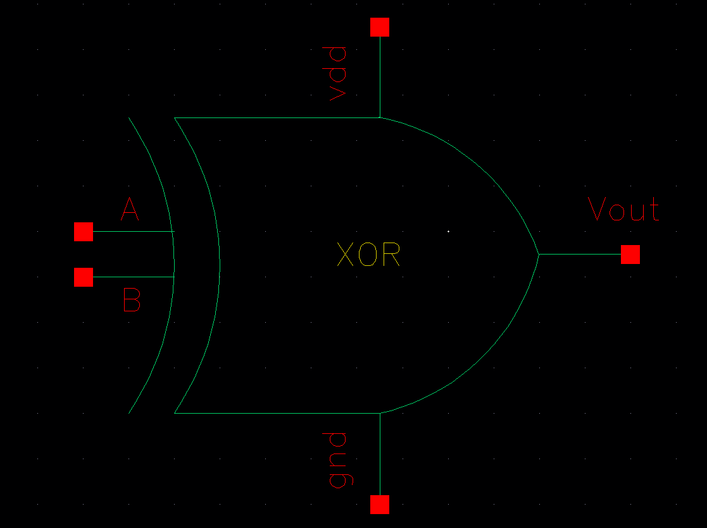
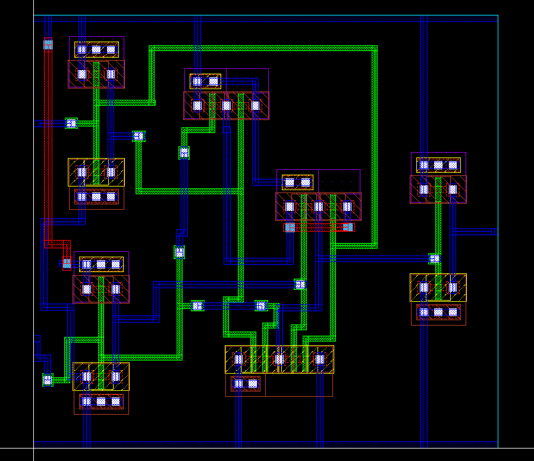
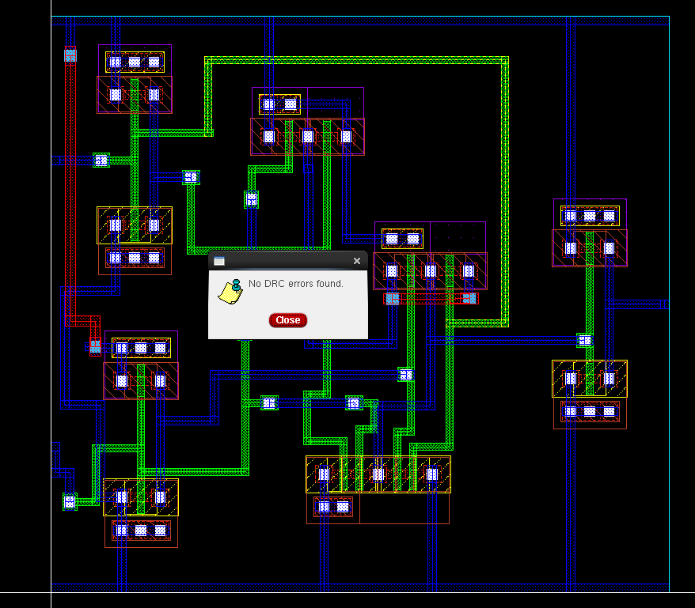
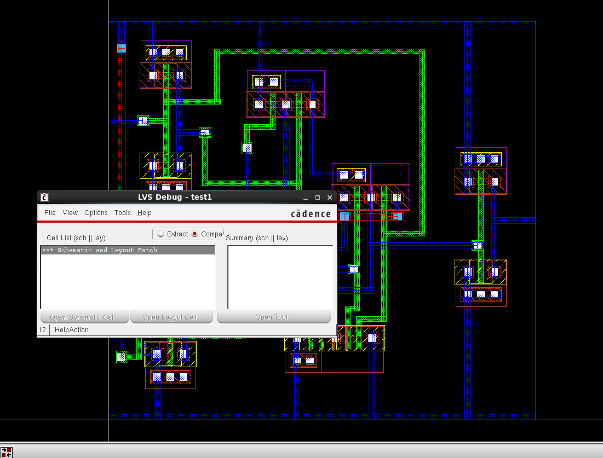

# CMOS XOR Gate Design in Cadence Virtuoso

This repository documents the complete **CMOS XOR Gate** design and verification flow in **Cadence Virtuoso**, including schematic, layout, DRC/LVS verification, RC extraction, and transient simulation.

---

## Table of Contents  
- [Schematic](#schematic)  
- [Symbol View](#symbol-view)  
- [Testbench](#testbench)  
- [Transient Simulation](#transient-simulation)  
- [Layout](#layout)  
- [DRC and LVS Checks](#drc-and-lvs-checks)  
- [Schematic vs Layout Matching](#schematic-vs-layout-matching)  
- [Parasitic Extraction (RCX)](#parasitic-extraction-rcx)  
- [AV Extracted View](#av-extracted-view)  
- [Tools Used](#tools-used)  
- [Author](#author)

---

## Schematic  
The XOR gate is implemented using complementary CMOS logic and verified using a testbench.

---

## Symbol View  
A symbol was generated from the schematic for hierarchical testbench connection.

---

## Testbench  
The testbench applies all logic input combinations to the XOR gate to verify its truth table.

---

## Transient Simulation  
The waveform confirms the XOR gate’s functionality: output is high only when inputs differ.

---

## Layout  
The physical layout of the XOR gate, ensuring proper design and compact area utilization.

---

## DRC and LVS Checks

### DRC: Design Rule Check  
No design rule violations; layout is clean and fabrication-compliant.

### LVS: Layout vs Schematic  
Netlist and connectivity match between schematic and layout.

---

## Schematic vs Layout Matching  
Visual confirmation that the schematic matches the layout at the net and device level.

---

## Parasitic Extraction (RCX)  
Post-layout parasitics are extracted using Assura RCX for accurate timing and performance analysis.

---

## AV Extracted View  
The Annotated View (AV) includes parasitics and interconnect details for back-annotated simulation.

---

## Tools Used  
- **Cadence Virtuoso** – Schematic and Layout Design  
- **Spectre Simulator** – Transient Simulation  
- **Assura** – DRC, LVS, and RCX  
- **ADE L/XL** – Simulation and Analysis Environment

---

## Author  
**Ram Tripathi**
