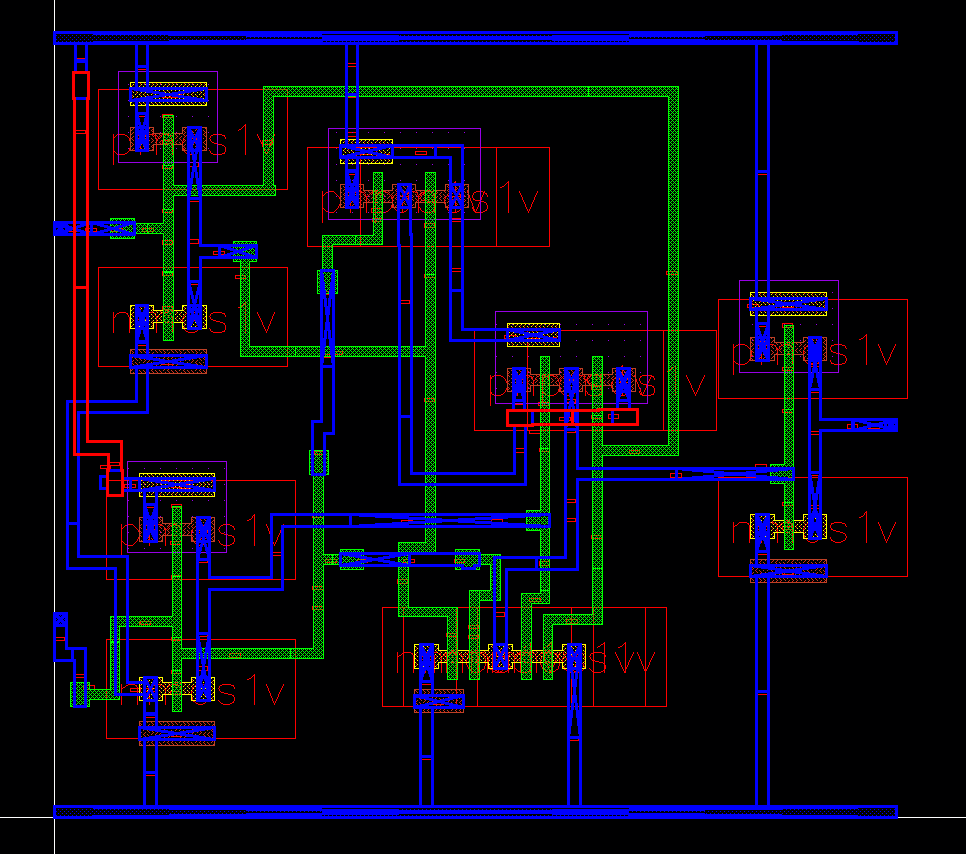

# CMOS XOR Gate Design in Cadence Virtuoso

This repository documents the complete **CMOS XOR Gate** design and verification flow in **Cadence Virtuoso**, including schematic, layout, DRC/LVS verification, RC extraction, and transient simulation.

---

## 📁 Table of Contents  
- [Schematic](#schematic)  
- [Testbench](#testbench)  
- [Transient Simulation](#transient-simulation)  
- [Layout](#layout)  
- [DRC and LVS Checks](#drc-and-lvs-checks)  
- [Schematic vs Layout Matching](#schematic-vs-layout-matching)  
- [Parasitic Extraction (RCX)](#parasitic-extraction-rcx)  
- [AV Extracted View](#av-extracted-view)  
- [Tools Used](#tools-used)  
- [Author](#author)

---

## 🧩 Schematic  
The XOR gate is implemented using complementary CMOS logic and verified using a testbench.

---

## 🧪 Testbench  
The testbench applies all logic input combinations to the XOR gate to verify its truth table.

---

## 📈 Transient Simulation  
The waveform confirms the XOR gate’s functionality: output is high only when inputs differ.

---

## 🧱 Layout  
The physical layout is drawn using standard cells and transistors, conforming to 90nm design rules.

---

## ✅ DRC and LVS Checks  

### ✔️ DRC: Design Rule Check  
No design rule violations; layout is clean and fabrication-compliant.

### ✔️ LVS: Layout vs Schematic  
Netlist and connectivity match between schematic and layout.

---

## 🔍 Schematic vs Layout Matching  
A visual match between schematic connectivity and layout topology.

---

## 🧠 Parasitic Extraction (RCX)  
Parasitic resistances and capacitances were extracted using Assura to enable post-layout simulation.

---

## 🧾 AV Extracted View  
The Annotated View shows extracted parasitics and net interconnects for back-annotation.

---

## 🛠️ Tools Used  
- **Cadence Virtuoso** – Schematic, Layout Design  
- **Spectre Simulator** – Transient Simulation  
- **Assura** – DRC, LVS, and RCX  
- **ADE L/XL** – Simulation and Analysis Environment

---

## 👤 Author  

**Ram Tripathi**  

