# Input Inverter Design in Cadence Virtuoso

This repository demonstrates the **full-custom VLSI design** of an **Input Inverter** using **Cadence Virtuoso**. It includes the **schematic, symbol, layout, extracted view, testbench, LVS, and verification results**.

---
## Table of Contents
- [Schematic](#schematic)
- [Symbol](#symbol)
- [Testbench](#testbench)
- [Prelayout Transient](#prelayout-transient)
- [Layout](#layout)
- [DRC Clean Layout](#drc-clean-layout)
- [Extracted View](#extracted-view)
- [LVS Results](#lvs-results)
- [Waveform Comparison](#waveform-comparison)
- [Design Methodology](#design-methodology)
- [Tools Used](#tools-used)
- [Author](#author)

---
## Schematic
The input inverter schematic designed using **Cadence Virtuoso**.

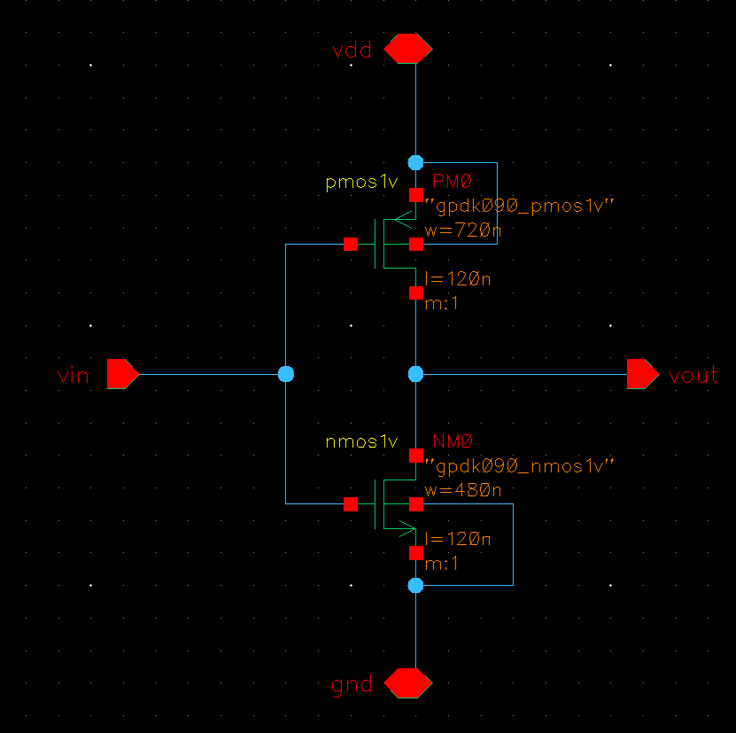

---
## Symbol
Custom symbol created for use in the testbench.

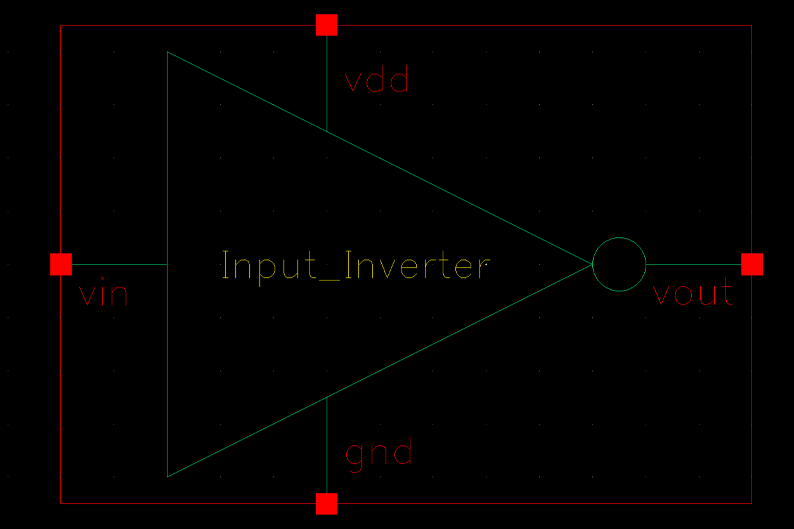

---
## Testbench
Testbench used to verify logic and transient behavior.

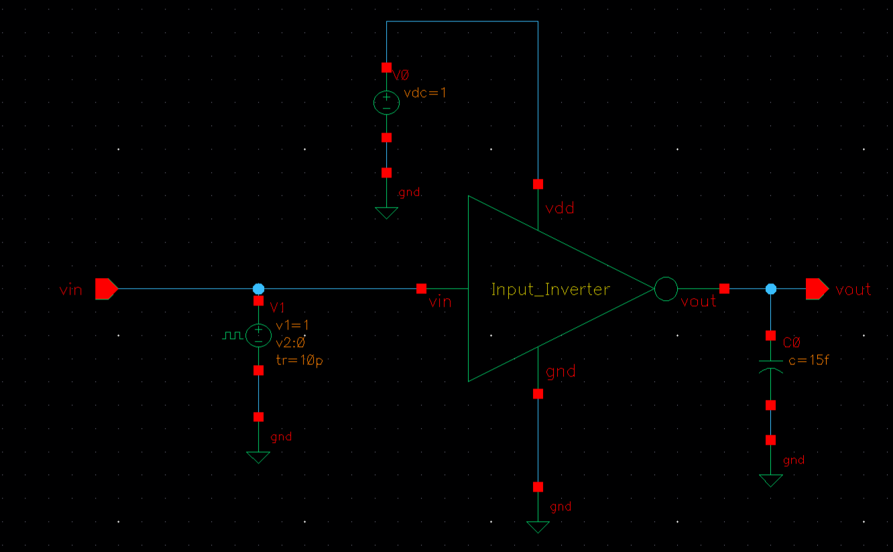

---
## Prelayout Transient
Prelayout transient simulation using Spectre.

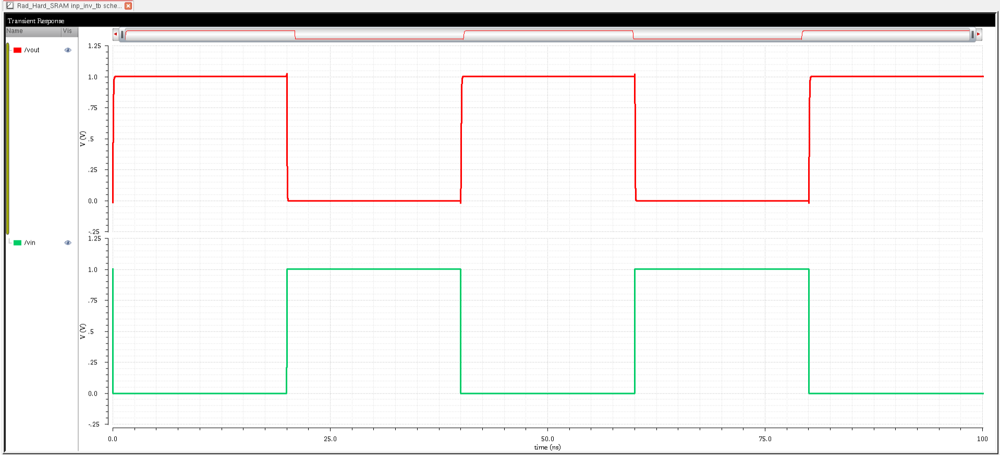

---
## Layout
Initial layout of the input inverter.

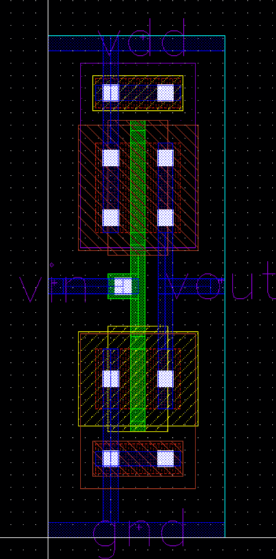

---
## DRC Clean Layout
Layout after fixing all **Design Rule Check (DRC)** violations.

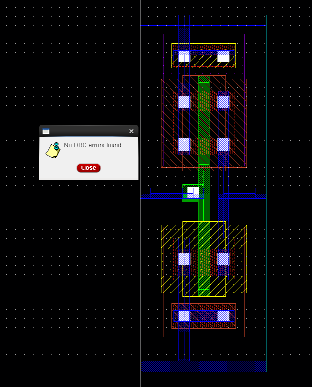

---
## Extracted View
Extracted layout used for post-layout simulation.

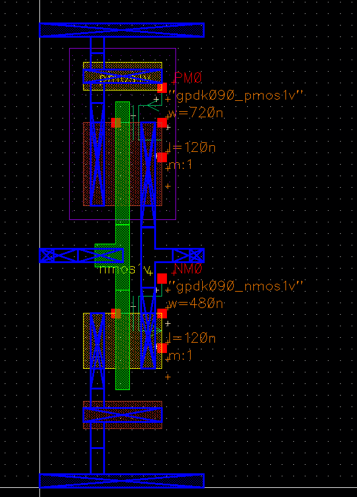

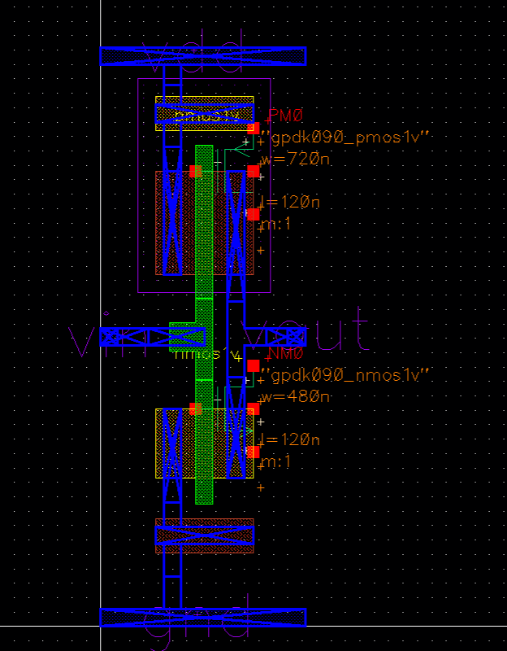

---
## LVS Results
Layout vs Schematic (LVS) verification.

### LVS Comparison Window
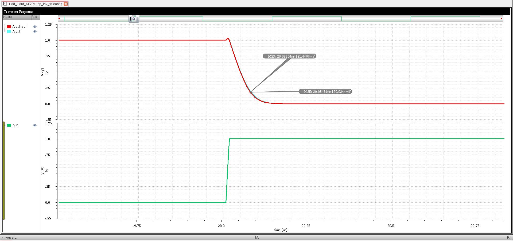

### LVS Match – No Mismatch
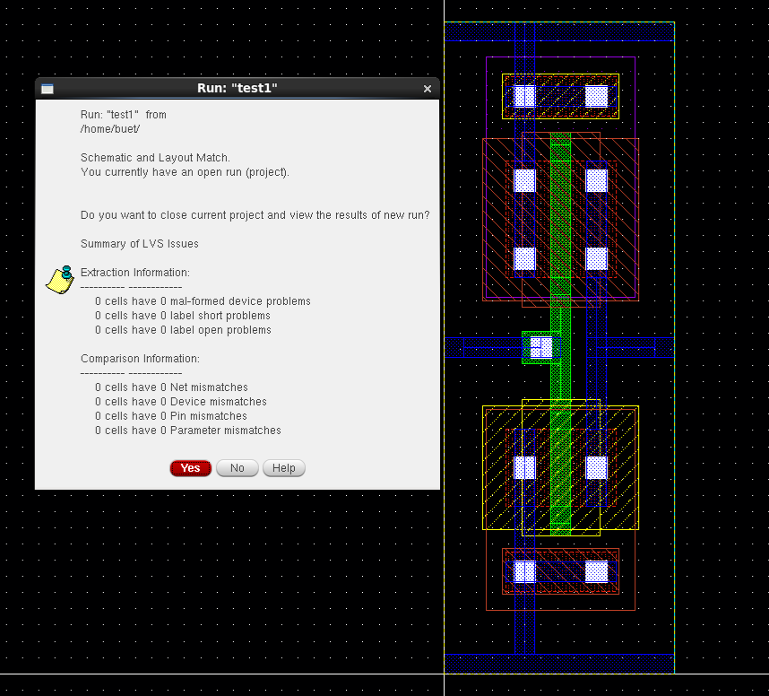

---
## Waveform Comparison
Comparison of schematic and layout simulation waveforms.

### Schematic vs Layout Waveform
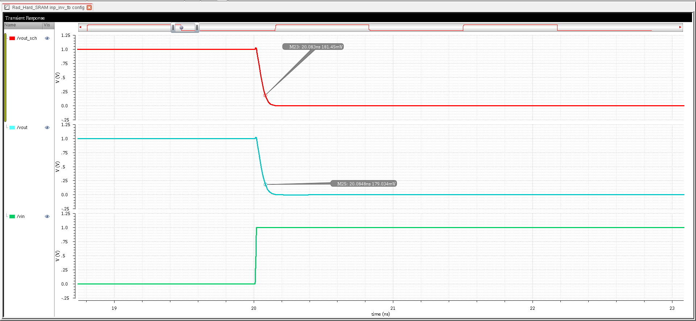

### Delay Estimation
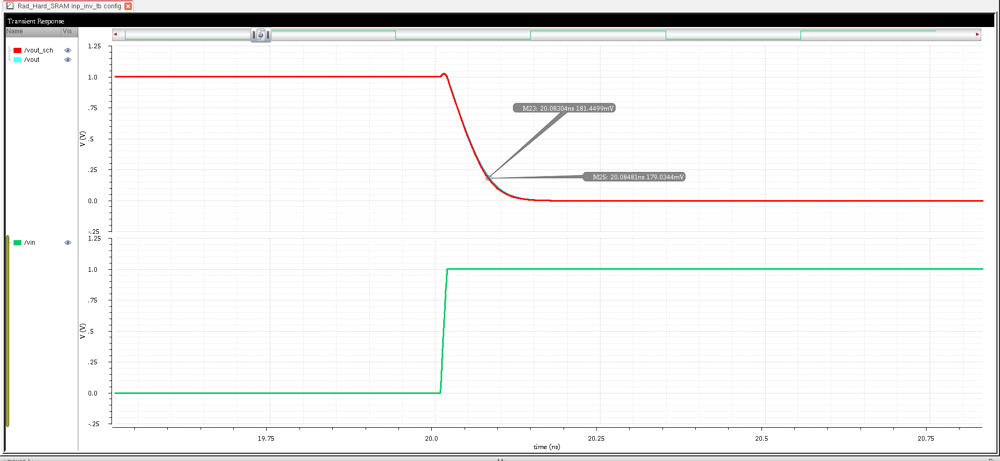

---

## Design Methodology

This input inverter follows proper **full-custom VLSI design principles**, with attention to key device-level and layout-level considerations:

<strong>Transistor Sizing Strategy</strong>

### NMOS and PMOS Sizing
- PMOS width is typically **2-3× NMOS width** to compensate for lower hole mobility
- Balanced sizing ensures symmetric rise and fall times
- Proper sizing provides:
  - Equal propagation delays (tpLH ≈ tpHL)
  - Strong output drive capability
  - Good noise margins
  - Optimal switching threshold (VTH ≈ VDD/2)

<strong>Layout Quality & Optimization</strong>

### Area Efficiency
- **Shared diffusion** between NMOS and PMOS where applicable
- Compact layout minimizes parasitic capacitances
- Efficient device placement reduces overall cell area

### Parasitic Minimization
- Minimal interconnect lengths reduce RC delay
- Strategic contact and via placement
- Short diffusion regions minimize junction capacitance
- Post-layout extraction validates minimal delay degradation

### Design Rule Compliance
- All spacing, width, and enclosure rules strictly followed
- Proper **well contacts** and **substrate ties** prevent latchup
- Symmetric layout ensures predictable performance

<strong>Electrical Robustness</strong>

### Signal Integrity
- Clean input-to-output transition with minimal overshoot/undershoot
- Strong drive capability for capacitive loads
- Low input capacitance for minimal loading on previous stages

### Performance Consistency
- Matched device orientation for reduced mismatch
- Conservative design margins across PVT corners
- Robust operation under supply voltage variations

<strong>Verification Strength</strong>

### Pre-Silicon Validation
- **Prelayout simulation:** Functional verification with ideal components
- **Post-layout (extracted) simulation:** Includes all parasitics (R, C, CC)
- Waveform comparison shows close matching between schematic and layout

### Physical Verification
- **DRC-clean:** Zero design rule violations
- **LVS-matched:** Complete topological equivalence confirmed
- All nets and devices verified for correctness

---

These design choices collectively create a **robust, optimized, and electrically reliable inverter** suitable for input buffering, signal conditioning, or use in digital cell libraries.

---

## Tools Used
- **Cadence Virtuoso** – Schematic & Layout Editor
- **Assura** – DRC & LVS Verification
- **Spectre** – Simulation & Analysis
- **GPDK 90nm** – Process Design Kit

---
## Author
**Ram Tripathi (22HEL2231)**  
BSc (Hons.) Electronics – Final Year Project
